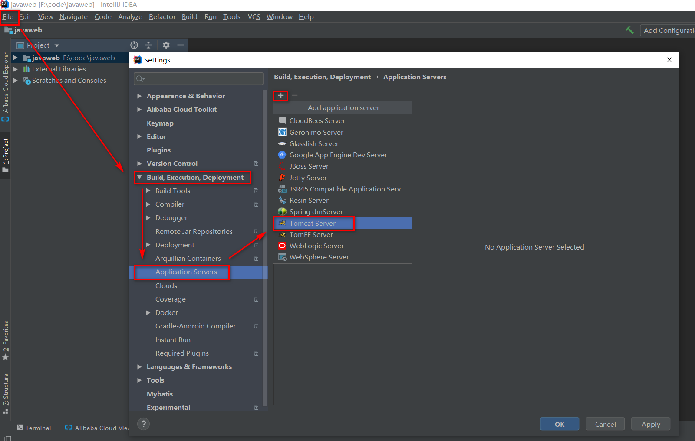
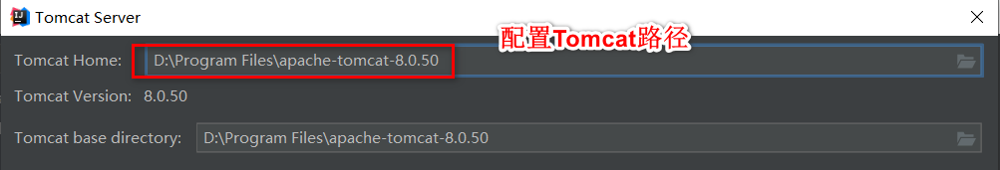
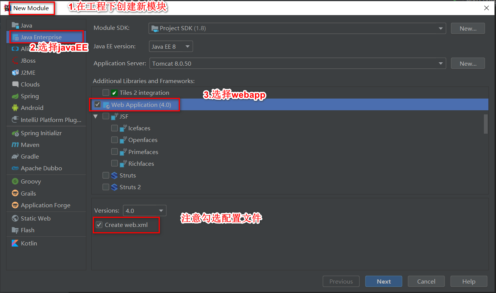
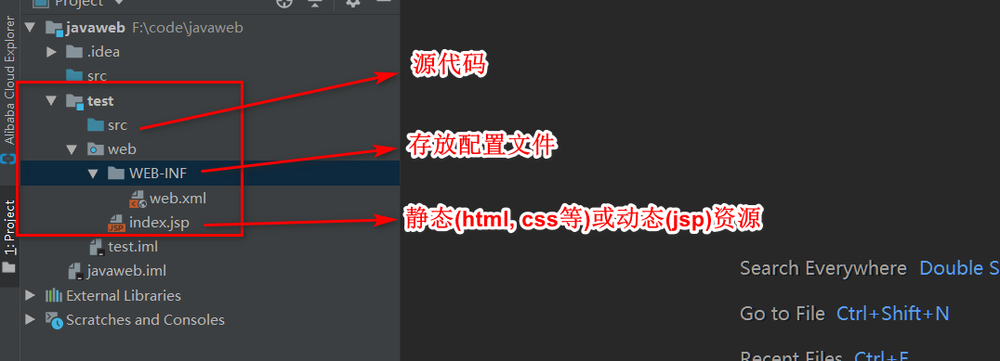
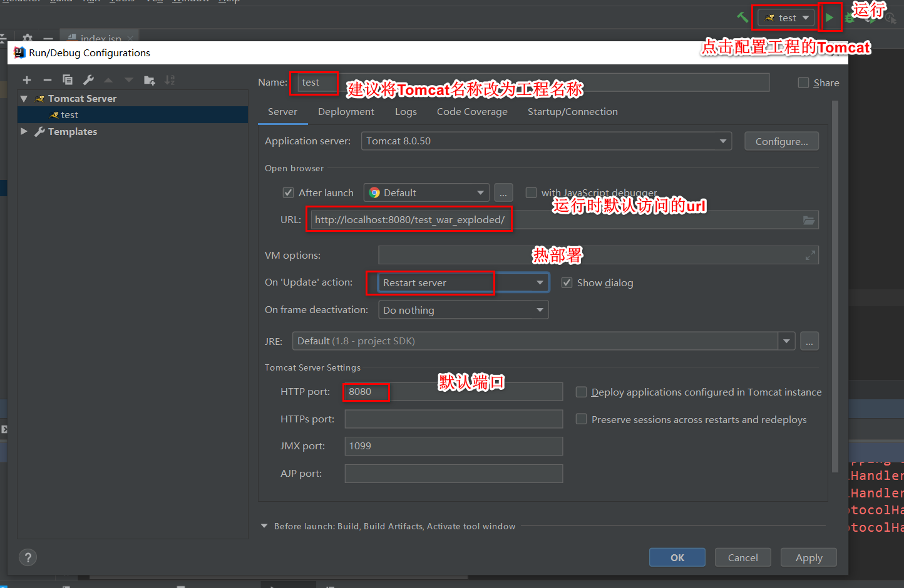

# dec

Tomcat：由 Apache 组织提供的一种 Web 服务器，提供对 jsp 和 Servlet 的支持。
<!--more-->
### 安装
解压即可

|目录|说明|
|-|-|
|bin|服务器的可执行程序. 比如启动程序`startup.bat`,和终止程序`shutdown.bat`
|conf|服务器的配置文件. 比如配置端口号
|lib|服务器自己的jar包
|logs|服务器运行时输出的日记信息
|temp|服务器运行运行时产生的临时数据
|webapps|存放部署的 Web 工程。
|work|运行时jsp翻译为Servlet的源码，和Session钝化的目录。

### 启动和终止
bin目录下的`startup.bat`双击即可启动, 可访问`localhost:8080`, 默认访问的的是`\apache-tomcat-8.0.50\webapps\ROOT`

### 部署工程
把`web工程`的目录拷贝到Tomcat的`webapps`目录下, 访问路径是`http://ip:port/web工程/资源名`

### 配置文件
- 工程目录配置
Tomcat的`\conf\Catalina\localhost`目录, 创建一个`xml`文件, 写入`<Context path="/abc" docBase="E:\book" />`.
    - path 表示工程的访问路径:/abc
    - docBase 表示你的工程目录在哪里

- 端口号配置
Tomcat的`\conf\`的`server.xml`文件, 修改`<Connector port="8080" protocol="HTTP/1.1" connectionTimeout="20000" redirectPort="8443" />`

### 整合idea
1. 添加Tomcat容器

2. 新建工程

