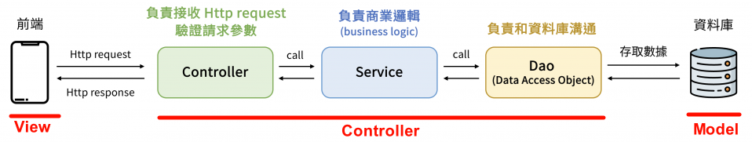

# SpringMVC

MVC，即Model-View-Controller。

- Model层：Model指模型部分，一般在应用中Model层包括业务处理层和数据访问层。
- Controller层：Controller指控制部分，一般是对View层提交的请求为其设置对应的Servlet进行特定功能的处理，这里的进行特定功能的处理一般是编写在Model中的业务处理层中的。Controller一般只是在Web应用中充当一个中介者的作用。
- View层：View指视图部分，这一部分的内容是展示给用户实际进行交互的，通常使用JSP和HTML进行构建（。

在Spring Boot 中，会将「MVC 的架构模式」转化成是「Controller-Service-Dao 的三层式架构」 来实作。

下图中就列出了Controller、Service、Dao 这三层架构之间的关系，以及他们个别负责的功能：

1. 首先Controller 层的用途，是负责去接收前端传过来的Http request，并且去验证请求参数。完成这些后会调用Controller层.
2. Service 层的用途，主要是负责商业逻辑的处理，所以主要的核心商业逻辑，通常都会放在Service 层里面来实作。如果服务需要操作数据库, 这时Service 层就会去调用 Dao 层
3. Dao 层所负责的功能，就是「专门去和资料库进行沟通的」

## 参考
- https://ithelp.ithome.com.tw/articles/10338883

