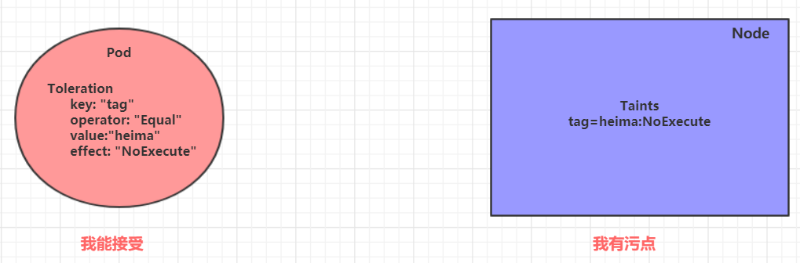

# pod

## 最佳实践

### 考察问

1. ReplicaSet: 支持`()`和`()`
2. Deployment: 继承RS, 并支持`()`和`()`(金丝雀)
3. Horizontal Pod Autoscaler: 继承Deploy, 并支持`()`

### 考察点

1. ReplicaSet: 支持`扩缩容`和`升降级`
2. Deployment: 继承RS, 并支持`发布控制`和`滚动升级`(金丝雀)
3. Horizontal Pod Autoscaler: 继承Deploy, 并支持`自动化`

## pod

每个Pod中都可以包含一个或者多个容器，这些容器可以分为两类：

- 用户程序所需的容器，数量可多可少

- Pause容器，这是每个Pod都会有的一个`根容器`，它的作用有两个：
    - 可以以它为依据，评估整个Pod的`健康`状态
    - 可以在根容器上设置Ip地址，其它容器都此Ip（Pod IP），以实现Pod内部的`网路通信`

## Pod生命周期

将pod对象从创建至终的这段时间范围称为pod的生命周期，它主要包含下面的过程：

1. 运行初始化容器（init container）过程

2. 运行主容器（main container）

  1. 容器启动后钩子（post start）、容器终止前钩子（pre stop）

  2. 容器的存活性探测（liveness probe）、就绪性探测（readiness probe）

3. pod终止过程

在整个生命周期中，Pod会出现5种`状态`（相位），分别如下：

- `挂起`（Pending）：apiserver已经创建了pod资源对象，但它尚未被调度完成或者仍处于下载镜像的过程中
- `运行中`（Running）：pod已经被调度至某节点，并且所有容器都已经被kubelet创建完成
- `成功`（Succeeded）：pod中的所有容器都已经成功终止并且不会被重启
- `失败`（Failed）：所有容器都已经终止，但至少有一个容器终止失败，即容器返回了非0值的退出状态
- `未知`（Unknown）：apiserver无法正常获取到pod对象的状态信息，通常由网络通信失败所导致

### 创建和终止

pod的创建过程:

1. 用户通过kubectl或其他api客户端提交需要创建的pod信息给apiServer

2. apiServer开始生成pod对象的信息，并将信息存入etcd，然后返回确认信息至客户端

3. apiServer开始反映etcd中的pod对象的变化，其它组件使用watch机制来跟踪检查apiServer上的变动

4. scheduler发现有新的pod对象要创建，开始为Pod分配主机并将结果信息更新至apiServer

5. node节点上的kubelet发现有pod调度过来，尝试调用docker启动容器，并将结果回送至apiServer

6. apiServer将接收到的pod状态信息存入etcd中

pod的终止过程:

1. 用户向apiServer发送删除pod对象的命令
2. apiServcer中的pod对象信息会随着时间的推移而更新，在宽限期内（默认30s），pod被视为dead
3. 将pod标记为terminating状态
4. kubelet在监控到pod对象转为terminating状态的同时启动pod关闭过程
5. 端点控制器监控到pod对象的关闭行为时将其从所有匹配到此端点的service资源的端点列表中移除
6. 如果当前pod对象定义了preStop钩子处理器，则在其标记为terminating后即会以同步的方式启动执行
7. pod对象中的容器进程收到停止信号
8. 宽限期结束后，若pod中还存在仍在运行的进程，那么pod对象会收到立即终止的信号
9. kubelet请求apiServer将此pod资源的宽限期设置为0从而完成删除操作，此时pod对于用户已不可见

### 初始化容器

初始化容器是在pod的主容器启动之前要运行的容器，主要是做一些主容器的前置工作，它具有两大特征：

1. 初始化容器必须运行完成直至结束，若某初始化容器运行失败，那么kubernetes需要重启它直到成功完成
2. 初始化容器必须按照定义的顺序执行，当且仅当前一个成功之后，后面的一个才能运行

初始化容器有很多的应用场景，下面列出的是最常见的几个：

- 提供主容器镜像中不具备的工具程序或自定义代码
- 初始化容器要先于应用容器串行启动并运行完成，因此可用于延后应用容器的启动直至其依赖的条件得到满足

### 钩子函数

钩子函数能够感知自身生命周期中的事件，并在相应的时刻到来时运行用户指定的程序代码。

kubernetes在主容器的启动之后和停止之前提供了两个钩子函数：

- post start：容器创建之后执行，如果失败了会重启容器
- pre stop  ：容器终止之前执行，执行完成之后容器将成功终止，在其完成之前会阻塞删除容器的操作

### 容器探测

​容器探测用于检测容器中的应用实例是否正常工作，是保障业务可用性的一种传统机制。如果经过探测，实例的状态不符合预期，那么kubernetes就会把该问题实例"摘除"，不承担业务流量。kubernetes提供了两种探针来实现容器探测，分别是：

- liveness probes：存活性探针，用于检测应用实例当前是否处于正常运行状态，如果不是，k8s会重启容器

- readiness probes：就绪性探针，用于检测应用实例当前是否可以接收请求，如果不能，k8s不会转发流量

✨livenessProbe决定是否`重启`容器，readinessProbe决定是否`将请求转发给`容器。

上面两种探针目前均支持三种探测方式：

- Exec命令：在容器内执行一次命令，如果命令执行的退出码为0，则认为程序正常，否则不正常
- TCPSocket：将会尝试访问一个用户容器的端口，如果能够建立这条连接，则认为程序正常，否则不正常
- HTTPGet：调用容器内Web应用的URL，如果返回的状态码在200和399之间，则认为程序正常，否则不正常

### 重启策略

一旦容器探测出现了问题，kubernetes就会对容器所在的Pod进行重启，其实这是由pod的重启策略决定的，pod的重启策略有3种，分别如下：

- Always：容器失效时，自动重启该容器，这也是默认值。
- OnFailure： 容器终止运行且退出码不为0时重启
- Never： 不论状态为何，都不重启该容器

​重启策略适用于pod对象中的所有容器，首次需要重启的容器，将在其需要时立即进行重启，随后再次需要重启的操作将由kubelet延迟一段时间后进行，且反复的重启操作的延迟时长以此为10s、20s、40s、80s、160s和300s，300s是最大延迟时长。

## Pod调度

​在默认情况下，一个Pod在哪个Node节点上运行，是由Scheduler组件采用相应的算法计算出来的，这个过程是不受人工控制的。但是在实际使用中，这并不满足的需求，因为很多情况下，我们想控制某些Pod到达某些节点上，那么应该怎么做呢？这就要求了解kubernetes对Pod的调度规则，kubernetes提供了四大类调度方式：

- `自动`调度：运行在哪个节点上完全由Scheduler经过一系列的算法计算得出
- `定向`调度：NodeName、NodeSelector
- `亲和性`调度：NodeAffinity、PodAffinity、PodAntiAffinity
- `污点（容忍）`调度：Taints、Toleration

### 定向调度

​定向调度，指的是利用在pod上声明nodeName或者nodeSelector，以此将Pod调度到期望的node节点上。注意，这里的调度是强制的，这就意味着即使要调度的目标Node不存在，也会向上面进行调度，只不过pod运行失败而已。

### 亲和性调度

​上一节，介绍了两种定向调度的方式，使用起来非常方便，但是也有一定的问题，那就是如果没有满足条件的Node，那么Pod将不会被运行，即使在集群中还有可用Node列表也不行，这就限制了它的使用场景。

​基于上面的问题，kubernetes还提供了一种亲和性调度（Affinity）。它在NodeSelector的基础之上的进行了扩展，可以通过配置的形式，实现优先选择满足条件的Node进行调度，如果没有，也可以调度到不满足条件的节点上，使调度更加灵活。

Affinity主要分为三类：

- nodeAffinity(node亲和性）: 以node为目标，解决pod可以调度到哪些node的问题
- podAffinity(pod亲和性) :  以pod为目标，解决pod可以和哪些已存在的pod部署在同一个拓扑域中的问题
- podAntiAffinity(pod反亲和性) :  以pod为目标，解决pod不能和哪些已存在pod部署在同一个拓扑域中的问题

关于亲和性(反亲和性)使用场景的说明：

- `亲和性`：如果两个应用频繁交互，那就有必要利用亲和性让两个应用的尽可能的靠近，这样可以减少因网络通信而带来的性能损耗。
- `反亲和性`：当应用的采用多副本部署时，有必要采用反亲和性让各个应用实例打散分布在各个node上，这样可以提高服务的高可用性。

### 污点和容忍

污点（Taints）:

​前面的调度方式都是站在Pod的角度上，通过在Pod上添加属性，来确定Pod是否要调度到指定的Node上，其实我们也可以站在Node的角度上，通过在Node上添加**污点**属性，来决定是否允许Pod调度过来。

​Node被设置上污点之后就和Pod之间存在了一种相斥的关系，进而拒绝Pod调度进来，甚至可以将已经存在的Pod驱逐出去。

污点的格式为：`key=value:effect`, key和value是污点的标签，effect描述污点的作用，支持如下三个选项：

- PreferNoSchedule：kubernetes将尽量避免把Pod调度到具有该污点的Node上，除非没有其他节点可调度
- NoSchedule：kubernetes将不会把Pod调度到具有该污点的Node上，但不会影响当前Node上已存在的Pod
- NoExecute：kubernetes将不会把Pod调度到具有该污点的Node上，同时也会将Node上已存在的Pod驱离

容忍（Toleration）:

​上面介绍了污点的作用，我们可以在node上添加污点用于拒绝pod调度上来，但是如果就是想将一个pod调度到一个有污点的node上去，这时候应该怎么做呢？这就要使用到**容忍**。

✨污点就是拒绝，容忍就是忽略，Node通过污点拒绝pod调度上去，Pod通过容忍忽略拒绝

