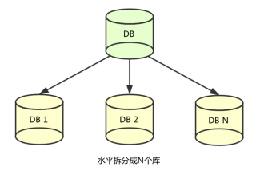
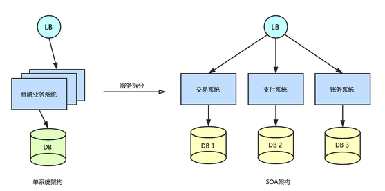
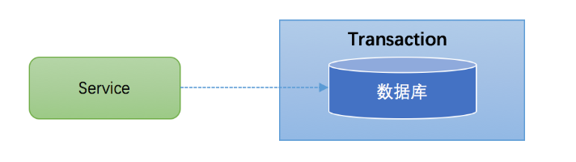
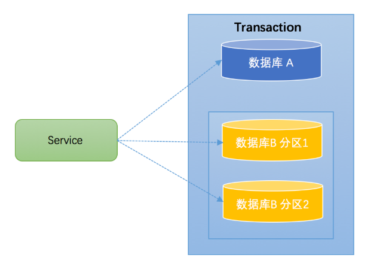
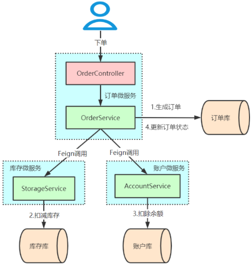

# 分布式事务

## 最佳实践

### 考察问

- 事务的特点: `()`, `()`, `()`, `()`
    - 原子性: 执行单元中的操作
        - 要么`()`执行成功，要么`()`失败。
        - 有一部分成功一部分失败, 那么成功的操作要全部`()`到执行前的状态。
    - 一致性: 数据从一个`()`的状态转换到`()`一个正确的状态, 执行过程是完整的。
    - 隔离性：在该事务执行的过程中，
        - 任何数据的改变只存在于该事务之`()`
        - 只有事务`()`后其它事务才可以查询到最新的数据。
    - 持久性：事务完成后对数据的改变会永久性的`()`起来，即使发生断电宕机数据依然在。

- 本地事务: 一个服务操作一个数据库
- 分布事务:
    - `()`及`()`: 一个服务操作多个数据库
    - `()`架构:
        - 多个服务操作一个数据库
        - 多个服务操作多个数据库

### 考察点

- 事务的特点: `原子性`, `一致性`, `隔离性`, `持久性`
    - 原子性: 执行单元中的操作
        - 要么`全部`执行成功，要么`全部`失败。
        - 有一部分成功一部分失败, 那么成功的操作要全部`回滚`到执行前的状态。
    - 一致性: 数据从一个`正确`的状态转换到`另`一个正确的状态, 执行过程是完整的。
    - 隔离性：在该事务执行的过程中，
        - 任何数据的改变只存在于该事务之`中`
        - 只有事务`提交`后其它事务才可以查询到最新的数据。
    - 持久性：事务完成后对数据的改变会永久性的`存储`起来，即使发生断电宕机数据依然在。

- 本地事务: 一个服务操作一个数据库
- 分布事务:
    - `跨库事务`及`分库分表`: 一个服务操作多个数据库
    - `微服务`架构:
        - 多个服务操作一个数据库
        - 多个服务操作多个数据库

## 应用场景

- 下单扣库存: 电商系统中，订单系统和库存系统是两个系统，一次下单的操作由两个系统协同完成
- 平台充值: 金融系统中, 通过`银行卡向平台充值`需要通过`银行`系统和`金融`系统协同完成。
- 选课业务: 在线教育系统中，用户购买课程，下单支付成功后学生选课成功，此事务由`订单`系统和`选课`系统协同完成。
- SNS系统的消息发送: 在社交系统中发送站内消息同时发送手机短信，一次消息发送由`站内`消息系统和`手机`通信系统协同完成。


## 发展

### 数据库的水平拆分

业务数据库起初是单库单表，但随着业务数据规模的快速发展，数据量越来越大，单库单表逐渐成为瓶颈。所以我们对数据库进行了水平拆分，将原单库单表拆分成多库多表。如下图所示，分库分表之后，原来在一个数据库上就能完成的写操作，可能就会跨多个数据库，这就产生了跨数据库事务问题。



### 业务服务化拆分

在业务发展初期，“一块大饼”的单业务系统架构，能满足基本的业务需求。但是随着业务的快速发展，系统的访问量和业务复杂程度都在快速增长，单系统架构逐渐成为业务发展瓶颈，解决业务系统的高耦合、可伸缩问题的需求越来越强烈。

如下图所示，蚂蚁金服按照面向服务架构（SOA）的设计原则，将单业务系统拆分成多个业务系统，降低了各系统之间的耦合度，使不同的业务系统专注于自身业务，更有利于业务的发展和系统容量的伸缩。



业务系统按照服务拆分之后，一个完整的业务往往需要调用多个服务，如何保证多个服务间的数据一致性成为一个难题。

## 本地事务

大多数场景下，我们的一个服务都只需要操作一个的数据库，这种情况下的事务称之为本地事务(Local Transaction)。本地事务的ACID特性是数据库直接提供支持。本地事务应用架构如下所示：



本地事务就是用关系型数据库来控制事务，关系数据库通常都具有ACID特性。事务是指由一组操作组成的一个工作单元，这个工作单元具有原子性（atomicity）、一致性（consistency）、隔离性（isolation）和持久性（durability），这就是事务的ACID特性。

- 原子性：执行单元中的操作要么`全部`执行成功，要么`全部`失败。如果有一部分成功一部分失败那么成功的操作要全部`回滚`到执行前的状态。🌰一笔从银行的A账户转账到B账户的交易。它由两个操作组成，从A账户扣款然后保存到B账户，以原子事务执行这笔交易保证了数据库中数据一致的状态，也就是说，任何一个事务失败了，钱都不会减少或者增加。
- 一致性：数据从一个`正确`的状态转换到`另`一个`正确`的状态, `执行过程`是完整的。如果不使用事务，那么在数据库执行多条语句的时候，有可能中间会出现问题而导致只执行了部分语句，因此，我们在这多条语句前面加上begintransaction，最后加上endtransaction，这就是很清楚的标明了，在这些语句执行前，系统是处于一致性状态的，而在这些语句执行后，系统也是处于一致性状态的
- 隔离性：在该事务执行的过程中，任何数据的改变只存在于该事务之`中`。只有事务`提交`后其它事务才可以查询到最新的数据。
- 持久性：事务完成后对数据的改变会永久性的`存储`起来，即使发生断电宕机数据依然在。

在JDBC编程中，我们通过java.sql.Connection对象来开启、关闭或者提交事务。代码如下所示：

```java
Connection conn = ... //获取数据库连接
conn.setAutoCommit(false); //开启事务
try{
   //...执行增删改查sql
   conn.commit(); //提交事务
}catch (Exception e) {
  conn.rollback();//事务回滚
}finally{
   conn.close();//关闭链接
}
```

## 分布式事务

- 跨库事务: 一个应用某个功能需要操作多个库，不同的库中存储不同的业务数据。下图演示了一个服务同时操作2个库的情况.

    

- 分库分表: 一个库数据量比较大或者预期未来的数据量比较大，都会进行分库分表。如下图，将数据库B拆分成了2个库：

    一般开发人员都会使用一些数据库中间件来降低sql操作的复杂性。如，对于sql：insert into user(id,name) values (1,"张三"),(2,"李四")。这条sql是操作单库的语法，单库情况下，可以保证事务的一致性。 但是由于现在进行了分库分表，开发人员希望将1号记录插入分库1，2号记录插入分库2。所以数据库中间件要将其改写为2条sql，分别插入两个不同的分库，此时要保证两个库要不都成功，要不都失败，因此基本上所有的数据库中间件都面临着分布式事务的问题。

    

- 微服务架构

    

    ✨不同服务访问同一个数据库也属于分布式事务

    用户下单，整个业务逻辑由三个微服务构成：

    - 库存服务：对给定的商品扣除库存数量。
    - 订单服务：根据采购需求创建订单。
    - 帐户服务：从用户帐户中扣除余额。

    

## 参考

- <https://www.cnblogs.com/likeguang/p/18577392>
