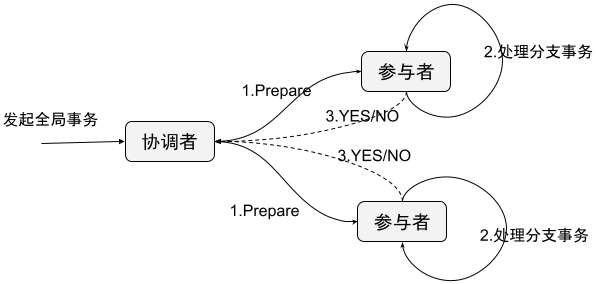
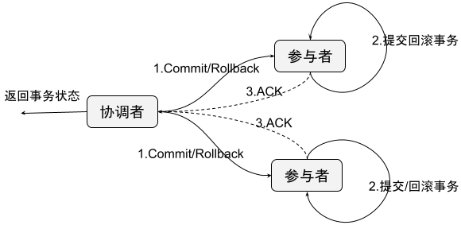
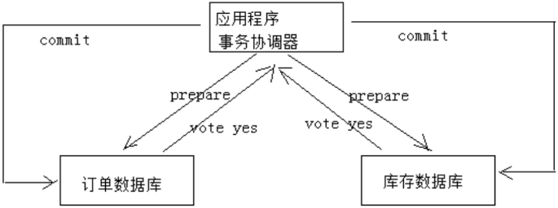

# 两阶段提交协议(2PC, 2 Phase Commitment Protocol)

## 最佳实践

### 考察问

- 两阶段提交由`()`者和`()`者组成，共经过`()`个阶段和`()`个操作，部分`()`数据库如Oracle、MySQL支持两阶段提交协议。

- 定义
    - 第一阶段：`()`阶段

        1. 协调者`()`参与者执行本地事务
        2. 参与者执行本地(分支)事务，但`()`提交，将undo和redo信息记入事务日志中
        3. 参与者完成本地事务后向协调者回应`()`, 既`()`

        

    - 第二阶段：`()`阶段

        

        - 提交事务

            1. 协调者`()`参与者 commit。
            2. 参与者正式执行事务`()`操作，并`()`在整个事务期间内占用的资源。
            3. 参与者完成事务提交后，向协调者节点发送 `()` 消息。
            4. 协调者节点收到所有参与者节点反馈的 ACK 消息后，`()`事务。

        - 回滚事务

            1. 协调者`()`参与者 rollback。
            2. 参与者利用阶段一写入的undo信息执行`()`操作，并`()`在整个事务期间内占用的资源
            3. 参与者在完成事务回滚之后，向协调者发送回滚完成的`()`消息
            4. 协调者收到所有参与者反馈的 ACK 消息后，`()`事务

- 🌰下单减库存

    

    1. 应用程序连接两个数据源。

    2. 应用程序通过事务协调器向两个库发起`()`，两个数据数据库收到消息分别执行本地事务，但`()`提交，如果执行成功则回复`()`，否则回复`()`。

    3. 事务协调器收到回复

        - 只要有`()`方回复no则分别向参与者发起`()`事务，参与者开始回滚事务。
        - `()`回复yes，此时向参与者发起`()`事务。如果参与者有一方提交事务失败则由事务协调器发起`()`事务。

- 优缺点:

    - 优点：`()`一致性的`()`协议，事务执⾏过程中需要将所需资源全部`()`，也就是俗称的`()`事务。
    - 缺点：整体性能比较`()`。
    - 适用: 比较适⽤于执⾏时间`()`, `()`, 一致性要求`()`的事务。

### 考察点

- 两阶段提交由`协调`者和`参与`者组成，共经过`两`个阶段和`三`个操作，部分`关系`数据库如Oracle、MySQL支持两阶段提交协议。

- 定义
    - 第一阶段：`准备(prepare)`阶段

        1. 协调者`通知`参与者执行本地事务
        2. 参与者执行本地(分支)事务，但`不`提交，将undo和redo信息记入事务日志中
        3. 参与者完成本地事务后向协调者回应`Yes(成功)或No(失败)`, 既`Vote(投票)`

        

    - 第二阶段：`提交(commit)/回滚(rollback)`阶段

        

        - 提交事务

            1. 协调者`通知`参与者 commit。
            2. 参与者正式执行事务`提交`操作，并`释放`在整个事务期间内占用的资源。
            3. 参与者完成事务提交后，向协调者节点发送 `ACK` 消息。
            4. 协调者节点收到所有参与者节点反馈的 ACK 消息后，`完成`事务。

        - 回滚事务

            1. 协调者`通知`参与者 rollback。
            2. 参与者利用阶段一写入的undo信息执行`回滚`操作，并`释放`在整个事务期间内占用的资源
            3. 参与者在完成事务回滚之后，向协调者发送回滚完成的`ACK`消息
            4. 协调者收到所有参与者反馈的 ACK 消息后，`完成`事务

- 🌰下单减库存

    

    1. 应用程序连接两个数据源。

    2. 应用程序通过事务协调器向两个库发起`prepare`，两个数据数据库收到消息分别执行本地事务，但`不`提交，如果执行成功则回复`yes`，否则回复`no`。

    3. 事务协调器收到回复

        - 只要有`一`方回复no则分别向参与者发起`回滚`事务，参与者开始回滚事务。
        - `全部`回复yes，此时向参与者发起`提交`事务。如果参与者有一方提交事务失败则由事务协调器发起`回滚`事务。

- 优缺点:

    - 优点：`强`一致性的`同步阻塞`协议，事务执⾏过程中需要将所需资源全部`锁定`，也就是俗称的`刚性`事务。
    - 缺点：整体性能比较`差`。
    - 适用: 比较适⽤于执⾏时间`确定的`, `短`, 一致性要求`高`的事务。

## 两阶段提交协议

为解决分布式系统的数据一致性问题出现了两阶段提交协议（2 Phase Commitment Protocol），两阶段提交由`协调`者和`参与`者组成，共经过`两`个阶段和`三`个操作，部分`关系`数据库如Oracle、MySQL支持两阶段提交协议。

## 协议过程

- 第一阶段：`准备(prepare)`阶段

    1. 协调者`通知`参与者执行本地事务
    2. 参与者执行本地(分支)事务，但`不`提交， 将undo和redo信息记入事务日志中
    3. 参与者完成本地事务后向协调者回应`Yes(成功)或No(失败)`, 既`Vote(投票)`

    

- 第二阶段：`提交(commit)/回滚(rollback)`阶段

    - 提交事务

        1. 协调者`通知`参与者 commit。
        2. 参与者正式执行事务`提交`操作，并`释放`在整个事务期间内占用的资源。
        3. 参与者完成事务提交后，向协调者节点发送 `ACK` 消息。
        4. 协调者节点收到所有参与者节点反馈的 ACK 消息后，`完成`事务。

    - 回滚事务

        1. 协调者`通知`参与者 rollback。
        2. 参与者利用阶段一写入的 undo 信息执行`回滚`操作，并`释放`在整个事务期间内占用的资源
        3. 参与者在完成事务回滚之后，向协调者发送回滚完成的`ACK`消息
        4. 协调者收到所有参与者反馈的 ACK 消息后，`完成`事务

    

## 🌰下单减库存

1. 应用程序连接两个数据源。

2. 应用程序通过事务协调器向两个库发起`prepare`，两个数据数据库收到消息分别执行本地事务（记录日志），但`不`提交，如果执行成功则回复`yes`，否则回复`no`。

3. 事务协调器收到回复

    - 只要有`一`方回复no则分别向参与者发起`回滚`事务，参与者开始回滚事务。
    - `全部`回复yes，此时向参与者发起`提交`事务。如果参与者有一方提交事务失败则由事务协调器发起`回滚`事务。

## 优缺点

- 优点：`强`一致性的`同步阻塞`协议，事务执⾏过程中需要将所需资源全部`锁定`，也就是俗称的`刚性`事务。
- 缺点：整体性能比较`差`。
- 适用: 比较适⽤于执⾏时间`确定的`, `短`, 一致性要求`高`的事务。
