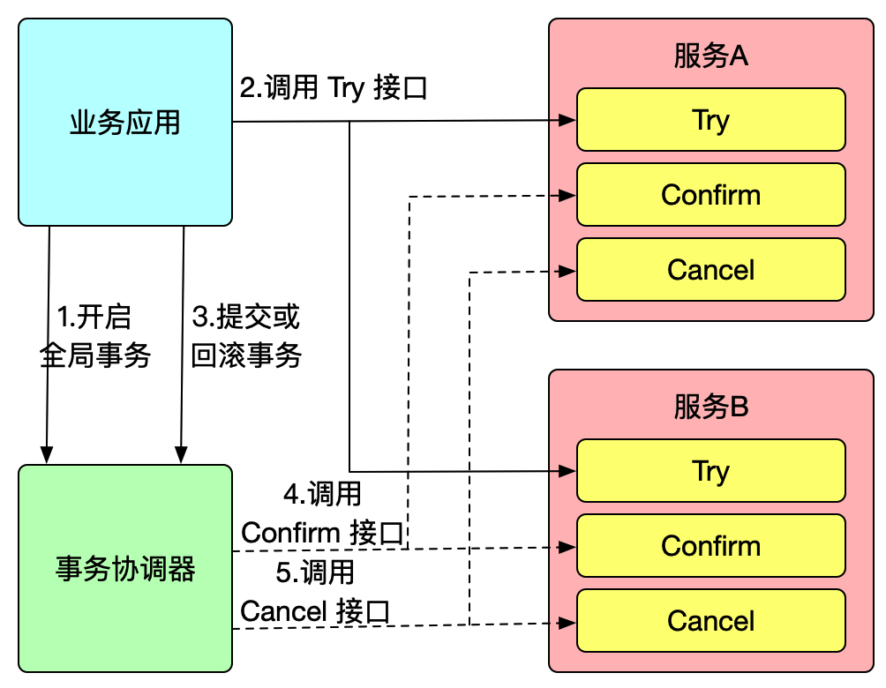
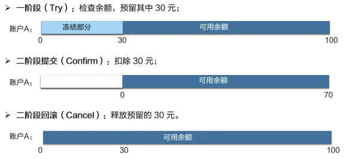
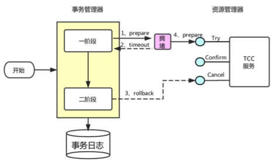

# TCC协议

## 最佳实践


### 考察问

- TCC事务补偿协议

    1. 一阶段执行 Try 方式: `()`，并`()`资源。
    2. 二阶段:
        - 提交执行 Confirm 方法: `()`, 并`()`。要求 Try 成功 Confirm `()`要能成功；
        - 回滚执行 Cancel 方法: `()`, 并`()`资源。

- TCC把两阶段拆分成了两个独立的阶段，通过`()`的方式进行关联。资源业务锁定方式的好处在于，既不会`()`其他事务在第一阶段对于相同资源的继续使用，也不会影响本事务第二阶段的正确执行, 既`()`功能。

    - 第一阶段独立: 将锁的`()`降到最低，以最大限度的提高分布式事务的`()`性, 不`()`其他事务。🌰在一阶段 Try 操作中，分布式事务 T1 和分布式事务 T2 分别冻结资金的那一部分资金，相互之间无干扰；这样在分布式事务的二阶段，无论 T1 是提交还是回滚，都不会对 T2 产生影响，这样 T1 和 T2 在同一笔业务数据上并行执行。
    - 第二阶段独立: `()`🌰假设只有一个中间账户的情况下，每次调用支付服务的 Commit 接口，都会锁定中间账户，中间账户存在热点性能问题。 但是，在担保交易场景中，七天以后才需要将资金从中间账户划拨给商户，中间账户并不需要对外展示。因此，在执行完支付服务的第一阶段后，就可以认为本次交易的支付环节已经完成，并向用户和商户返回支付成功的结果，并不需要马上执行支付服务二阶段的 Commit 接口，等到低锋期时，再慢慢消化，异步地执行。

- 业务拆分成两阶段完成

    在接入 TCC 之前，用户编写 SQL：“update 账户表 set 余额 = 余额 - 30 where 账户 = A”，便能一步完成扣款操作。

    在接入 TCC 之后，就需要考虑如何将扣款操作分成 2 步完成：

    - Try 操作：资源的检查和预留；

        在扣款场景，Try 操作要做的事情就是先检查 A 账户余额是否足够(检查)，再冻结要扣款的 30 元（预留）, Try 方法执行之后，账号 A 余额虽然还是 100，但是其中 30 元已经被冻结了，不能被其他事务使用。此阶段不会发生真正的扣款。

    - Confirm 操作：执行真正业务的提交；

        在扣款场景下，Confirm 阶段走的事情就是发生真正的扣款，Confirm 会使用 Try 阶段冻结的资金，执行账号扣款。Confirm 方法执行之后，账号 A 在一阶段中冻结的 30 元已经被扣除，账号 A 余额变成 70 元 。保证一阶段 Try 成功的话 二阶段 Confirm 一定能成功。

    - Cancel 操作：预留资源的释放；

        在扣款场景下，扣款取消，Cancel 操作执行的任务是释放 Try 操作冻结的 30 元钱，是 A 账户回到初始状态, 100 元全部可用。


- 空回滚与悬挂

    - 空回滚: TCC服务在未收到`()`请求的情况下收到`()`请求
    - 业务悬挂: `()`请求比`()`请求先执行的情况
    - 空回滚和业务悬挂的解决方案

        通过记录当前事务 ID 和执行状态，解决空回滚和业务悬挂问题：


        `()``sql
        CREATE TABLE `()` (
          `()` varchar(128) NOT NULL,
          `()` varchar(255) DEFAULT NULL COMMENT '用户id',
          `()` int(11) unsigned DEFAULT '0' COMMENT '冻结金额',
          `()` int(1) DEFAULT NULL COMMENT '事务状态，0:try，1:confirm，2:cancel',
          PRIMARY KEY (`()`) USING BTREE
        ) ENGINE=InnoDB DEFAULT CHARSET=utf8 ROW_FORMAT=COMPACT;

        `()``

        字段说明:

        - xid：是全局事务id
        - freeze_money：用来记录用户冻结金额
        - state：用来记录事务状态

        业务流程:

        1. Try业务
            - 修改account_freeze表, 记录冻结记录, 修改state为0
            - 修改account表, 扣减可用金额
        2. Confirm业务
            - 修改account_freeze表, 根据xid, 修改state为1
        3. Cancel业务
            - 修改account_freeze表，冻结金额为0，state为2
            - 修改account表，恢复可用金额
        4. 如何判断是否空回滚
            - `()`业务中，根据`()`查询account_freeze，如果`()`则说明try还没做，需要空回滚
        5. 如何避免业务悬挂
            - `()`业务中，根据`()`查询account_freeze，如果`()`则证明cancel已经执行，拒绝执行try业务

- 幂等控制: 幂等性是指对同一`()`，使用同样的`()`，`()`的多次请求对系统资源的影响是`()`的。实现方式是操作之前在业务方法进行判断:

    - 如果执行过了就`()`执行, `()`结果。
    - 判断`()`时再处理。

- 优缺点
    - 优点：
        - `()`依赖数据库，能够实现跨数据库、跨应用资源管理，在`()`层实现事务控制，`()`好，更好地解决了在各种复杂业务场景下的分布式事务问题。
        - TCC 模式无 AT 模式的全局行锁，TCC 性能会比 AT 模式`()`。

    - 缺点：
        - 对业务系统有着非常大的`()`性，设计实现相对`()`, 每个事务操作每个参与者都需要实现try/confirm/cancel三个接口。
        - 仅保证`()`一致性
### 考察点

- TCC事务补偿协议

    1. 一阶段执行 Try 方式: `检查`，并`预留`资源。
    2. 二阶段:
        - 提交执行 Confirm 方法: `执行`, 并`提交`。要求 Try 成功 Confirm `一定`要能成功；
        - 回滚执行 Cancel 方法: `回滚`, 并`释放`资源。

- TCC把两阶段拆分成了两个独立的阶段，通过`资源业务锁定`的方式进行关联。资源业务锁定方式的好处在于，既不会`阻塞`其他事务在第一阶段对于相同资源的继续使用，也不会影响本事务第二阶段的正确执行, 既`二阶段异步化`功能。

    - 第一阶段独立: 将锁的`粒度`降到最低，以最大限度的提高分布式事务的`并发`性, 不`阻塞`其他事务。🌰在一阶段 Try 操作中，分布式事务 T1 和分布式事务 T2 分别冻结资金的那一部分资金，相互之间无干扰；这样在分布式事务的二阶段，无论 T1 是提交还是回滚，都不会对 T2 产生影响，这样 T1 和 T2 在同一笔业务数据上并行执行。
    - 第二阶段独立: `二阶段异步化`🌰假设只有一个中间账户的情况下，每次调用支付服务的 Commit 接口，都会锁定中间账户，中间账户存在热点性能问题。 但是，在担保交易场景中，七天以后才需要将资金从中间账户划拨给商户，中间账户并不需要对外展示。因此，在执行完支付服务的第一阶段后，就可以认为本次交易的支付环节已经完成，并向用户和商户返回支付成功的结果，并不需要马上执行支付服务二阶段的 Commit 接口，等到低锋期时，再慢慢消化，异步地执行。

- 业务拆分成两阶段完成

    在接入 TCC 之前，用户编写 SQL：“update 账户表 set 余额 = 余额 - 30 where 账户 = A”，便能一步完成扣款操作。

    在接入 TCC 之后，就需要考虑如何将扣款操作分成 2 步完成：

    - Try 操作：资源的检查和预留；

        在扣款场景，Try 操作要做的事情就是先检查 A 账户余额是否足够(检查)，再冻结要扣款的 30 元（预留）, Try 方法执行之后，账号 A 余额虽然还是 100，但是其中 30 元已经被冻结了，不能被其他事务使用。此阶段不会发生真正的扣款。

    - Confirm 操作：执行真正业务的提交；

        在扣款场景下，Confirm 阶段走的事情就是发生真正的扣款，Confirm 会使用 Try 阶段冻结的资金，执行账号扣款。Confirm 方法执行之后，账号 A 在一阶段中冻结的 30 元已经被扣除，账号 A 余额变成 70 元 。保证一阶段 Try 成功的话 二阶段 Confirm 一定能成功。

    - Cancel 操作：预留资源的释放；

        在扣款场景下，扣款取消，Cancel 操作执行的任务是释放 Try 操作冻结的 30 元钱，是 A 账户回到初始状态, 100 元全部可用。


- 空回滚与悬挂

    - 空回滚: TCC服务在未收到`Try`请求的情况下收到`Cancel`请求
    - 业务悬挂: `Cancel`请求比`Try`请求先执行的情况
    - 空回滚和业务悬挂的解决方案

        通过记录当前事务 ID 和执行状态，解决空回滚和业务悬挂问题：


        ```sql
        CREATE TABLE `account_freeze_tbl` (
          `xid` varchar(128) NOT NULL,
          `user_id` varchar(255) DEFAULT NULL COMMENT '用户id',
          `freeze_money` int(11) unsigned DEFAULT '0' COMMENT '冻结金额',
          `state` int(1) DEFAULT NULL COMMENT '事务状态，0:try，1:confirm，2:cancel',
          PRIMARY KEY (`xid`) USING BTREE
        ) ENGINE=InnoDB DEFAULT CHARSET=utf8 ROW_FORMAT=COMPACT;

        ```

        字段说明:

        - xid：是全局事务id
        - freeze_money：用来记录用户冻结金额
        - state：用来记录事务状态

        业务流程:

        1. Try业务
            - 修改account_freeze表, 记录冻结记录, 修改state为0
            - 修改account表, 扣减可用金额
        2. Confirm业务
            - 修改account_freeze表, 根据xid, 修改state为1
        3. Cancel业务
            - 修改account_freeze表，冻结金额为0，state为2
            - 修改account表，恢复可用金额
        4. 如何判断是否空回滚
            - `cancel`业务中，根据`xid`查询account_freeze，如果`null`则说明try还没做，需要空回滚
        5. 如何避免业务悬挂
            - `try`业务中，根据`xid`查询account_freeze，如果`state==2`则证明cancel已经执行，拒绝执行try业务

- 幂等控制: 幂等性是指对同一`系统`，使用同样的`条件`，`重复`的多次请求对系统资源的影响是`一致`的。实现方式是操作之前在业务方法进行判断:

    - 如果执行过了就`不再`执行, `直接返回`结果。
    - 判断`未处理`时再处理。

- 优缺点
    - 优点：
        - `不`依赖数据库，能够实现跨数据库、跨应用资源管理，在`业务`层实现事务控制，`灵活性`好，更好地解决了在各种复杂业务场景下的分布式事务问题。
        - TCC 模式无 AT 模式的全局行锁，TCC 性能会比 AT 模式`高`。

    - 缺点：
        - 对业务系统有着非常大的`入侵`性，设计实现相对`复杂`, 每个事务操作每个参与者都需要实现try/confirm/cancel三个接口。
        - 仅保证`最终`一致性


## TCC事务补偿协议


TCC事务补偿协议是基于`2PC`实现的业务层事务控制方案，TCC 模式需要用户根据自己的业务场景实现 Try、Confirm 和 Cancel 三个操作；事务发起方在

1. 一阶段执行 Try 方式: `检查`，并`预留`资源。
2. 二阶段:
    - 提交执行 Confirm 方法: `执行`, 并`提交`。要求 Try 成功 Confirm `一定`要能成功；
    - 回滚执行 Cancel 方法: `回滚`, 并`释放`资源。




## 两阶段独立

TCC把两阶段拆分成了两个独立的阶段，通过`资源业务锁定`的方式进行关联。资源业务锁定方式的好处在于，既不会`阻塞`其他事务在第一阶段对于相同资源的继续使用，也不会影响本事务第二阶段的正确执行, 既`二阶段异步化`功能。


### 第一阶段独立

用户在实现 TCC 时，应当考虑并发性问题，将锁的粒度降到最低，以最大限度的提高分布式事务的并发性。

以下还是以A账户扣款为例，“账户 A 上有 100 元，事务 T1 要扣除其中的 30 元，事务 T2 也要扣除 30 元，出现并发”。

在一阶段 Try 操作中，分布式事务 T1 和分布式事务 T2 分别冻结资金的那一部分资金，相互之间无干扰；这样在分布式事务的二阶段，无论 T1 是提交还是回滚，都不会对 T2 产生影响，这样 T1 和 T2 在同一笔业务数据上并行执行。


### 第二阶段独立

拿支付宝的担保交易场景来说，简化情况下，只需要涉及两个服务，交易服务和账务服务。交易作为主业务服务，账务作为从业务服务，提供 Try、Commit、Cancel 接口：

1. Try 接口扣除用户可用资金，转移到预冻结资金。预冻结资金就是业务锁定方案，每个事务第二阶段只能使用本事务的预冻结资金，在第一阶段执行结束后，其他并发事务也可以继续处理用户的可用资金。
2. Commit 接口扣除预冻结资金，增加中间账户可用资金（担保交易不能立即把钱打给商户，需要有一个中间账户来暂存）

假设只有一个中间账户的情况下，每次调用支付服务的 Commit 接口，都会锁定中间账户，中间账户存在热点性能问题。 但是，在担保交易场景中，七天以后才需要将资金从中间账户划拨给商户，中间账户并不需要对外展示。因此，在执行完支付服务的第一阶段后，就可以认为本次交易的支付环节已经完成，并向用户和商户返回支付成功的结果，并不需要马上执行支付服务二阶段的 Commit 接口，等到低锋期时，再慢慢消化，异步地执行。

这就是 TCC 分布式事务模型的`二阶段异步化`功能，从业务服务的第一阶段执行成功，主业务服务就可以提交完成，然后再由框架异步的执行各从业务服务的第二阶段。


## 业务拆分成两阶段完成

接入 TCC 前，业务操作只需要一步就能完成，但是在接入 TCC 之后，需要考虑如何将其分成 2 阶段完成，

1. 把资源的检查和预留放在一阶段的 Try 操作中进行
2. 把真正的业务操作的执行放在二阶段的 Confirm 操作中进行。

🌰举例场景：“账户A的余额中有 100 元，需要扣除其中 30 元”；

在接入 TCC 之前，用户编写 SQL：“update 账户表 set 余额 = 余额 - 30 where 账户 = A”，便能一步完成扣款操作。

在接入 TCC 之后，就需要考虑如何将扣款操作分成 2 步完成：

- Try 操作：资源的检查和预留；

    在扣款场景，Try 操作要做的事情就是先检查 A 账户余额是否足够(检查)，再冻结要扣款的 30 元（预留）, Try 方法执行之后，账号 A 余额虽然还是 100，但是其中 30 元已经被冻结了，不能被其他事务使用。此阶段不会发生真正的扣款。

- Confirm 操作：执行真正业务的提交；

    在扣款场景下，Confirm 阶段走的事情就是发生真正的扣款，Confirm 会使用 Try 阶段冻结的资金，执行账号扣款。Confirm 方法执行之后，账号 A 在一阶段中冻结的 30 元已经被扣除，账号 A 余额变成 70 元 。保证一阶段 Try 成功的话 二阶段 Confirm 一定能成功。

- Cancel 操作：预留资源的释放；

    在扣款场景下，扣款取消，Cancel 操作执行的任务是释放 Try 操作冻结的 30 元钱，是 A 账户回到初始状态, 100 元全部可用。

具体如下图所示: 




用户接入 TCC 模式，最重要的事情就是考虑如何将业务模型拆成 2 阶段，实现成 TCC 的 3 个方法，并且保证 Try 成功 Confirm 一定能成功。相对于 AT 模式，TCC 模式对业务代码有一定的侵入性，但是 TCC 模式无 AT 模式的全局行锁，TCC 性能会比 AT 模式高很多。


## 空回滚与悬挂

### 空回滚

事务协调器在调用 TCC 服务的一阶段 Try 操作时，可能会出现因为丢包而导致的网络超时，此时事务管理器会触发二阶段回滚，调用 TCC 服务的 Cancel 操作，TCC 服务在未收到 Try 请求的情况下收到 Cancel 请求，这种场景被称为空回滚. 用户在实现TCC服务时，应允许允许空回滚的执行，即收到空回滚时返回成功。


### TCC模式业务悬挂

空回滚, 之后，拥堵在网络上的一阶段 Try 数据包被 TCC 服务收到，出现了二阶段 Cancel 请求比一阶段 Try 请求先执行的情况，此 TCC 服务在执行晚到的 Try 之后，将永远不会再收到二阶段的 Confirm 或者 Cancel ，造成 TCC 服务悬挂。

用户在实现 TCC 服务时，要允许空回滚，但是要拒绝执行空回滚之后 Try 请求，要避免出现悬挂。


在 Cancel 空回滚返回成功之前先记录该条事务 xid 或业务主键，标识这条记录已经回滚过，Try 接口先检查这条事务xid或业务主键如果已经标记为回滚成功过，则不执行 Try 的业务操作。


### 空回滚和业务悬挂的解决方案

通过记录当前事务 ID 和执行状态，解决空回滚和业务悬挂问题：


```sql
CREATE TABLE `account_freeze_tbl` (
  `xid` varchar(128) NOT NULL,
  `user_id` varchar(255) DEFAULT NULL COMMENT '用户id',
  `freeze_money` int(11) unsigned DEFAULT '0' COMMENT '冻结金额',
  `state` int(1) DEFAULT NULL COMMENT '事务状态，0:try，1:confirm，2:cancel',
  PRIMARY KEY (`xid`) USING BTREE
) ENGINE=InnoDB DEFAULT CHARSET=utf8 ROW_FORMAT=COMPACT;

```

字段说明:

- xid：是全局事务id
- freeze_money：用来记录用户冻结金额
- state：用来记录事务状态

业务流程:

1. Try业务
    - 修改account_freeze表, 记录冻结记录, 修改state为0
    - 修改account表, 扣减可用金额
2. Confirm业务
    - 修改account_freeze表, 根据xid, 修改state为1
3. Cancel业务
    - 修改account_freeze表，冻结金额为0，state为2
    - 修改account表，恢复可用金额
4. 如何判断是否空回滚
    - `cancel`业务中，根据`xid`查询account_freeze，如果`null`则说明try还没做，需要空回滚
5. 如何避免业务悬挂
    - `try`业务中，根据`xid`查询account_freeze，如果`state==2`则证明cancel已经执行，拒绝执行try业务

## 幂等控制

无论是网络数据包重传，还是异常事务的补偿执行，都会导致 TCC 服务的 Try、Confirm 或者 Cancel 操作被重复执行；用户在实现 TCC 服务时，需要考虑幂等控制，即 Try、Confirm、Cancel 执行一次和执行多次的业务结果是一样的。

幂等性是指对同一`系统`，使用同样的`条件`，`重复`的多次请求对系统资源的影响是`一致`的。实现方式是操作之前在业务方法进行判断:

- 如果执行过了就`不再`执行, `直接返回`结果。
- 判断`未处理`时再处理。





## 优缺点

- 优点：
    - `不`依赖数据库，能够实现跨数据库、跨应用资源管理，在`业务`层实现事务控制，`灵活性`好，更好地解决了在各种复杂业务场景下的分布式事务问题。
    - TCC 模式无 AT 模式的全局行锁，TCC 性能会比 AT 模式`高`。

- 缺点：
    - 对业务系统有着非常大的`入侵`性，设计实现相对`复杂`, 每个事务操作每个参与者都需要实现try/confirm/cancel三个接口。
    - 仅保证`最终`一致性


## 参考

- https://seata.apache.org/zh-cn/blog/seata-at-tcc-saga/
- https://seata.apache.org/zh-cn/blog/tcc-mode-design-principle/
- https://seata.apache.org/zh-cn/blog/seata-tcc-fence/
- https://seata.apache.org/zh-cn/blog/seata-tcc/
- https://www.cnblogs.com/vic-tory/p/17980860
- https://www.echo.cool/docs/middleware/seata/seata-tcc-mode/seata-tcc-best-practices/