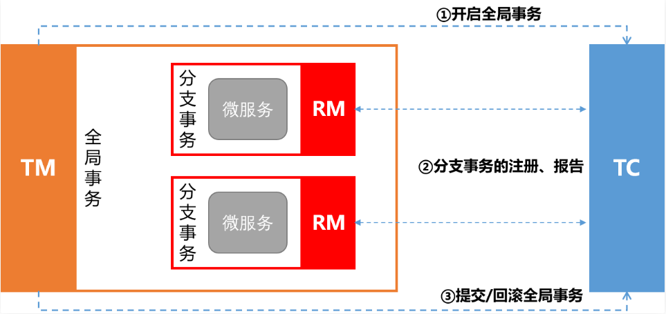
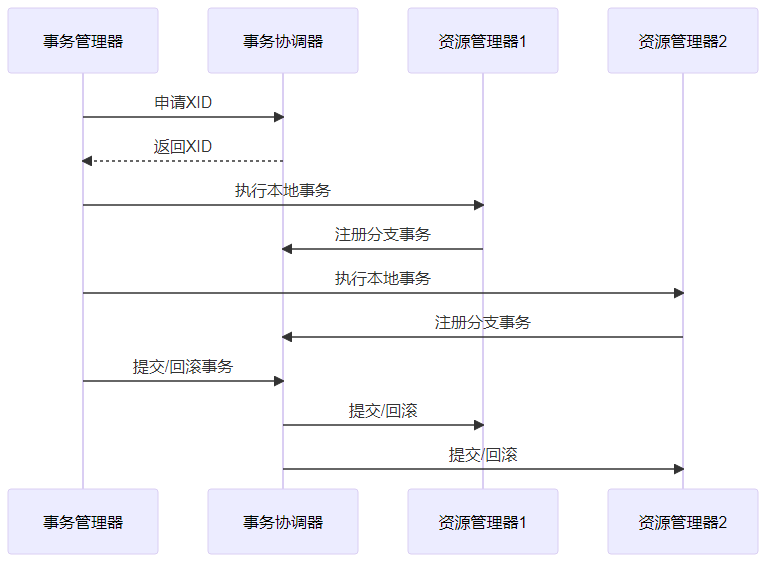

# Seata

## 考察问

- Seata有3个基本组成部分：
    - `()`：维护全局事务和分支事务的状态，驱动全局提交或回滚
    - `()`：定义全局事务的范围：开始全局事务，提交或回滚全局事务
    - `()`：管理正在处理的分支事务的资源，与TC对话以注册分支事务并报告分支事务的状态，并驱动分支事务的提交或回滚
- XA和AT模式的区别
    - XA模式一阶段`()`事务，`()`资源；AT模式一阶段`()`事务，`()`资源。✨执行SQL, 提交事务是两个概念
    - XA模式依赖`()`实现回滚；AT模式利用`()`实现数据回滚。
    - XA模式`()`；AT模式`()`

## 考察点

- Seata有3个基本组成部分：
    - `事务协调器（TC，Transaction Coordinator）`：维护全局事务和分支事务的状态，驱动全局提交或回滚
    - `事务管理器（TM，Transaction Manager）`：定义全局事务的范围：开始全局事务，提交或回滚全局事务
    - `资源管理器（RM，Resource Manager）`：管理正在处理的分支事务的资源，与TC对话以注册分支事务并报告分支事务的状态，并驱动分支事务的提交或回滚
- XA和AT模式的区别
    - XA模式一阶段`不提交`事务，`锁定`资源；AT模式一阶段`提交`事务，`不锁定`资源。✨执行SQL, 提交事务是两个概念
    - XA模式依赖`数据库机制`实现回滚；AT模式利用`数据快照`实现数据回滚。
    - XA模式`强一致`；AT模式`最终一致`

## [Seata](https://github.com/seata/seata)

### Seata有3个基本组成部分

- TC，Transaction Coordinator，事务协调者，用来协调全局和各个分支事务（不同服务）的状态， 驱动它们的回滚或提交。
- TM，Transaction Manager，事务管理者，业务层中用来开启/提交/回滚一个整体事务（在调用服务的方法中用注解开启事务）。
- RM，Resource Manager，资源管理者，管理分支事务，与 TC 进行协调注册分支事务，并且汇报分支事务的状态，驱动分支事务的提交或回滚。

### Seata有3个过程

1. TM开启全局事务
2. RM注册报告状态
3. TM提交/回滚全局事务

Seata详细工作流程

1. 事务发起

    TM 向 TC 申请全局事务 ID（XID），并将其传播到各个分布式服务中。

2. 本地事务执行

    各个服务通过 RM 执行本地事务，并将 XID 传播到数据库中。

3. 事务提交/回滚

    - 如果所有分支事务成功，TC 通知所有 RM 提交事务。
    - 如果某个分支事务失败，TC 通知所有 RM 回滚事务。

以下是工作流程的时序图：

✨执行本地事务是TM直接通知RM, 其他均是通过TC通知RM

## 4种模式介绍

1. XA模式（两阶段提交）：XA模式是一种经典的分布式事务模式，基于XA协议实现。
2. AT模式（补偿性事务）：AT模式是一种基于补偿机制的分布式事务模式，也称为补偿性事务（Compensating Transaction）
3. TCC模式：TCC模式是一种基于“Try/Confirm/Cancel”操作的分布式事务模式。
4. SAGA模式：SAGA模式是一种基于本地事务的分布式事务模式，也称为事务性流程（Transactional Saga）

## 参考

- <https://developer.aliyun.com/article/1529234>
- <https://edu.51cto.com/article/note/14623.html>
- <https://edu.51cto.com/article/note/14623.html>
- <https://zhuanlan.zhihu.com/p/28214033893>
- <https://jishuzhan.net/article/1960229044963815426>
- <https://seata.apache.org/zh-cn/blog/seata-xa-introduce/>
