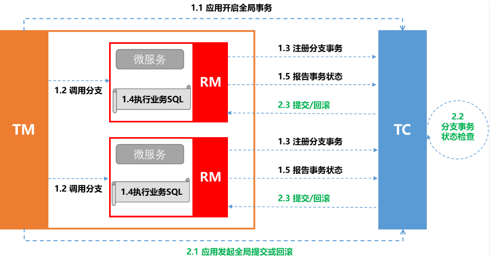

# Seata_XA模式

## 最佳实践

### 考察问

- 优缺点

    |  |XA|AT|TCC|SAGA|
    |--|--|--|--|--|
    |一致性|`()`|`()`|`()`|`()`|
    |隔离性|`()`隔离|基于`()`隔离|基于`()`隔离|`()`隔离|
    |代码侵入|`()`|`()`|`()`|`()`|
    |性能|`()`|`()`|`()`|`()`|
    |关系型数据库|`()`|`()`|`()`|`()`|
    |场景|对`()`性、`()`性有高要求的业务, `()`场景, `()`型数据库, 典型的银行系统 |基于`()`型数据库的大多数分布式事务场景都可以|•对`()`要求较高的事务。 •有`()`型数据库要参与的事务。|•业务`()`长、业务`()`多 •参与者包含`()`服务，无法提供`()`接口|

    ✨提交过程:

    1. 在一阶段本地提交: `()`, `()`, `()`. 释放数据库资源，性能比较好；
    2. 在二阶段本地提交: `()`

    ✨隔离性:

    1. XA: 基于数据库的2PC, 完全隔离
    2. AT: 使用全局锁, 使用快照补偿
    3. TCC: 相比AT，无需生成快照和使用全局锁，自定义业务补偿(空回滚, 悬挂, 幂等处理), 性能最好
    4. Saga: 无隔离

### 考察点

- 优缺点

    |  |XA|AT|TCC|SAGA|
    |--|--|--|--|--|
    |一致性|`强`|`弱(最终)`|`弱(最终)`|`弱(最终)`|
    |隔离性|`完全`隔离|基于`全局锁`隔离|基于`资源业务锁定`隔离|`无`隔离|
    |代码侵入|`无`|`无`|`有，要编写三个接口`|`有，要编写状态机和补偿业务`|
    |性能|`差`|`中`|`好`|`好`|
    |关系型数据库|`依赖`|`依赖`|`不依赖`|`不依赖`|
    |场景|对`一致`性、`隔离`性有高要求的业务, `单机多库`场景, `关系`型数据库, 典型的银行系统 |基于`关系`型数据库的大多数分布式事务场景都可以|•对`性能`要求较高的事务。 •有`非关系`型数据库要参与的事务。|•业务`流程`长、业务`流程`多 •参与者包含`其它公司或遗留系统`服务，无法提供`TCC模式要求的三个`接口|

    ✨提交过程:

    1. 在一阶段本地提交: `AT`, `TCC`, `Saga`. 释放数据库资源，性能比较好；
    2. 在二阶段本地提交: `XA`

    ✨隔离性:

    1. XA: 基于数据库的2PC, 完全隔离
    2. AT: 使用全局锁, 使用快照补偿
    3. TCC: 相比AT，无需生成快照和使用全局锁，自定义业务补偿(空回滚, 悬挂, 幂等处理), 性能最好
    4. Saga: 无隔离

## XA模式

Seata的XA模式完全按照2PC事务设计, 保证所有资源同时提交或回滚任何特定的事务。

1. 第一阶段：

    1. RM 注册分支事务到 TC；
    2. RM 执行分支业务的 SQL, 但`不`提交；
    3. RM 报告执行状态到 TC；

2. 第二阶段：

    1. TC 检测检测各分支事务状态，判断整体事务提交或回滚；

        - 如果都成功，通知所有RM提交事务
        - 如果有失败，通知所有RM回滚事务

    2. RM 接受 TC 的指令，进行统一的提交或回滚操作。

## XA的优缺点

### 补偿型事务模式的问题

Seata 已经支持的 3 大事务模式：AT、TCC、Saga 都是 补偿型 的。

补偿型 事务处理机制构建在 事务资源 之上（要么在中间件层面，要么在应用层面），事务资源 本身对分布式事务是无感知的。

事务资源 对分布式事务的无感知存在一个根本性的问题：无法做到真正的 全局一致性 。

比如，一条库存记录，处在 补偿型 事务处理过程中，由 100 扣减为 50。此时，仓库管理员连接数据库，查询统计库存，就看到当前的 50。之后，事务因为异外回滚，库存会被补偿回滚为 100。显然，仓库管理员查询统计到的 50 就是 脏 数据。

可以看到，补偿型 分布式事务机制因为不要求 事务资源 本身（如数据库）的机制参与，所以无法保证从事务框架之外的全局视角的数据一致性。

### XA 的价值

与 补偿型 不同，XA 协议 要求 事务资源 本身提供对规范和协议的支持。

因为 事务资源 感知并参与分布式事务处理过程，所以 事务资源（如数据库）可以保障从任意视角对数据的访问有效隔离，满足全局数据一致性。

比如，上一节提到的库存更新场景，XA 事务处理过程中，中间态数据库存 50 由数据库本身保证，是不会仓库管理员的查询统计 看 到的。（当然隔离级别需要 读已提交 以上）

除了 全局一致性 这个根本性的价值外，支持 XA 还有如下几个方面的好处：

- 业务无侵入：和 AT 一样，XA 模式将是业务无侵入的，不给应用设计和开发带来额外负担。
- 数据库的支持广泛：XA 协议被主流关系型数据库广泛支持，不需要额外的适配即可使用。
- 多语言支持容易：因为不涉及 SQL 解析，XA 模式对 Seata 的 RM 的要求比较少，为不同语言开发 SDK 较之 AT 模式将更 薄，更容易。
- 传统基于 XA 应用的迁移：传统的，基于 XA 协议的应用，迁移到 Seata 平台，使用 XA 模式将更平滑。

### XA 广泛被质疑的问题

不存在某一种分布式事务机制可以完美适应所有场景，满足所有需求。现在，无论 AT 模式、TCC 模式还是 Saga 模式，这些模式的提出，本质上都源自 XA 规范对某些场景需求的无法满足。

- 数据锁定：数据在整个事务处理过程结束前，都被锁定，读写都按隔离级别的定义约束起来。

    数据锁定是获得更高隔离性和全局一致性所要付出的代价。

    补偿型 的事务处理机制，在 执行阶段 即完成分支（本地）事务的提交，（资源层面）不锁定数据。而这是以牺牲 隔离性 为代价的。

    另外，AT 模式使用 全局锁 保障基本的 写隔离，实际上也是锁定数据的，只不过锁在 TC 侧集中管理，解锁效率高且没有阻塞的问题。

- 协议阻塞：XA prepare 后，分支事务进入阻塞阶段，收到 XA commit 或 XA rollback 前必须阻塞等待。

    协议的阻塞机制本身并不是问题，关键问题在于 协议阻塞 遇上 数据锁定。

    如果一个参与全局事务的资源 “失联” 了（收不到分支事务结束的命令），那么它锁定的数据，将一直被锁定。进而，甚至可能因此产生死锁。基本思路是两个方面：避免 “失联” 和 增加 “自解锁” 机制。

- 性能差：性能的损耗主要来自两个方面：一方面，事务协调过程，增加单个事务的 RT；另一方面，并发事务数据的锁冲突，降低吞吐。

    AT 模式性能优势主要在于：集中管理全局数据锁，锁的释放不需要 RM 参与，释放锁非常快；另外，全局提交的事务，完成阶段 异步化。

### 优缺点

|  |XA|AT|TCC|SAGA|
|--|--|--|--|--|
|一致性|`强`|`弱(最终)`|`弱(最终)`|`弱(最终)`|
|隔离性|`完全`隔离|基于`全局锁`隔离|基于`资源业务锁定`隔离|`无`隔离|
|代码侵入|`无`|`无`|`有，要编写三个接口`|`有，要编写状态机和补偿业务`|
|性能|`差`|`中`|`好`|`好`|
|关系型数据库|`依赖`|`依赖`|`不依赖`|`不依赖`|
|场景|对`一致`性、`隔离`性有高要求的业务, `单机多库`场景, `关系`型数据库, 典型的银行系统 |基于`关系`型数据库的大多数分布式事务场景都可以|•对`性能`要求较高的事务。 •有`非关系`型数据库要参与的事务。|•业务`流程`长、业务`流程`多 •参与者包含`其它公司或遗留系统`服务，无法提供`TCC模式要求的三个`接口|

✨提交过程:

1. 在一阶段本地提交: `AT`, `TCC`, `Saga`. 释放数据库资源，性能比较好；
2. 在二阶段本地提交: `XA`

✨隔离性:

1. XA: 基于数据库的2PC, 完全隔离
2. AT: 使用全局锁, 使用快照补偿
3. TCC: 相比AT，无需生成快照和使用全局锁，自定义业务补偿(空回滚, 悬挂, 幂等处理), 性能最好
4. Saga: 无隔离

## 参考

- <https://www.cnblogs.com/vitochen/p/18722088>
- <https://seata.apache.org/zh-cn/blog/seata-xa-introduce/>
