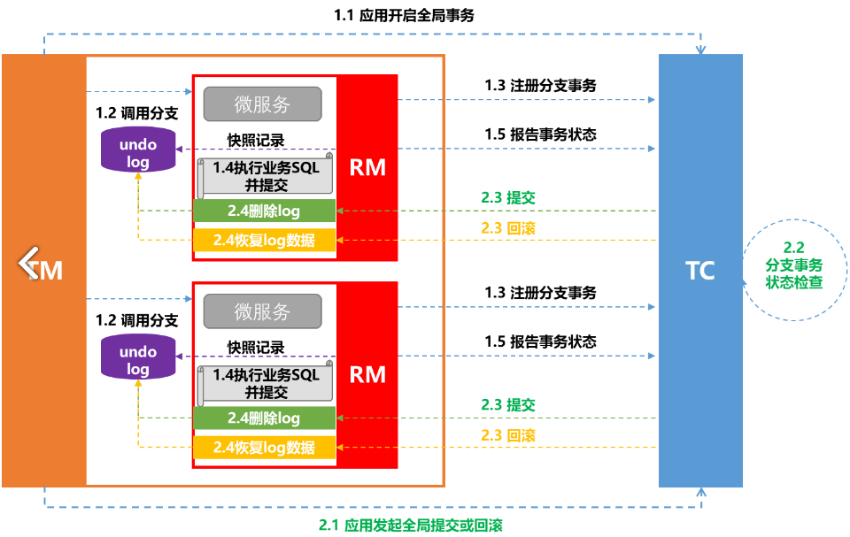
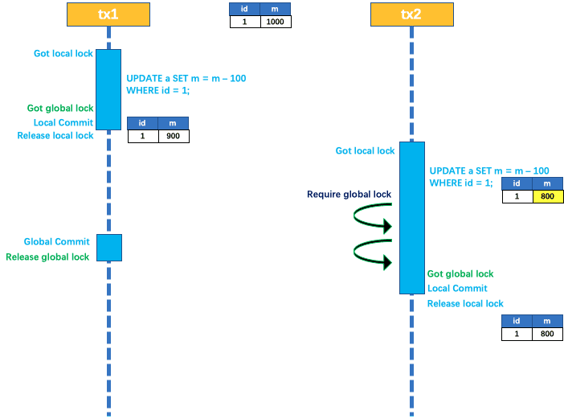
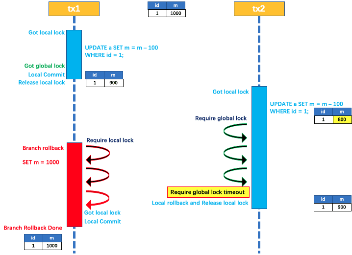
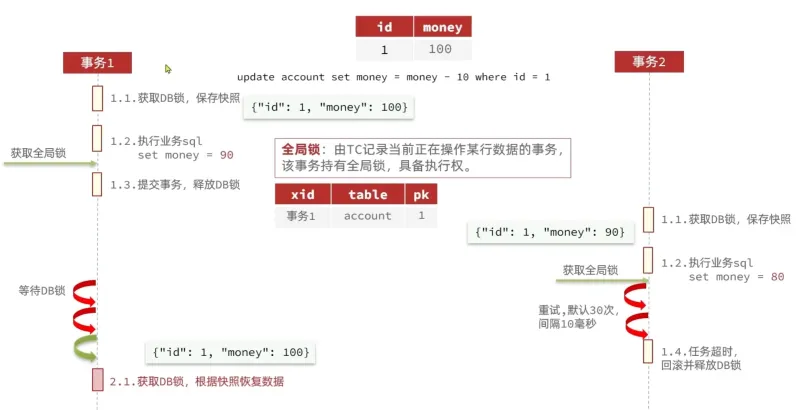
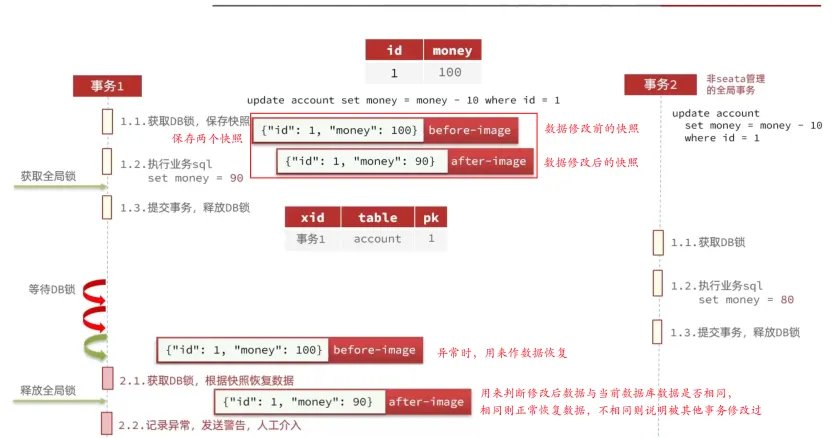
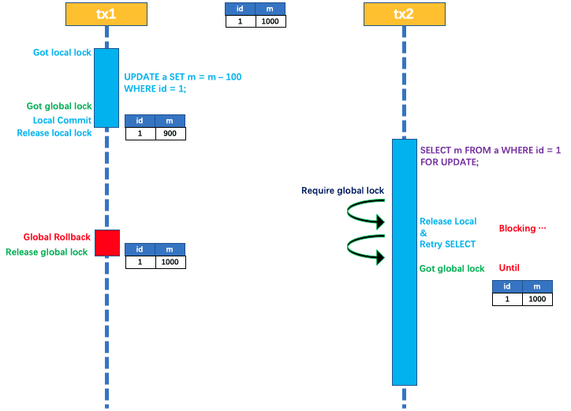
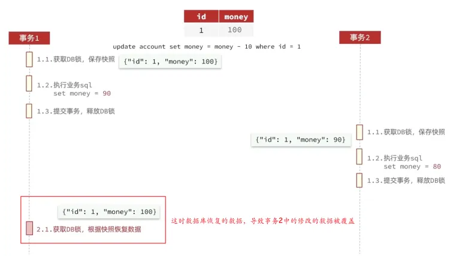
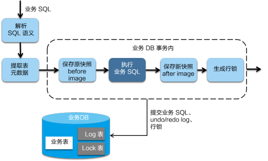
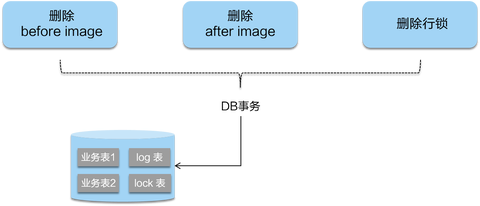
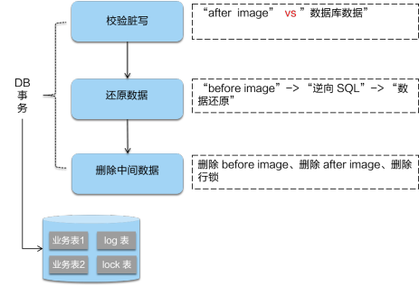

# Seata_AT模式

## 最佳实践

### 考察问

- AT流程

    1. 第一阶段：`()`和`()`日志记录在同一个本地事务中提交，释放`()`和连接资源。

        1. RM 注册分支事务到 TC；
        2. 解析SQL语义
        3. 记录 `()`；
        4. RM 执行分支业务的 SQL , `()`提交；
        5. 记录 `()`
        6. RM 报告执行状态到 TC；

    2. 第二阶段：提交`()`化，非常快速地完成; 回滚通过一阶段的回滚日志进行`()`。

        1. TC 检测检测各分支事务状态，判断整体事务提交或回滚；
        2. RM 接受 TC 的指令，进行统一的提交或回滚操作。
            - 提交时，异步`()`相应分支的`()`；
            - 回滚时，对比`()`和 `()`
                - 如果两份数据`()`就说明没有脏写，就根据`()`生成`()`，执行分支回滚并返回结果给 TC；
                - 如果`()`就说明有脏写，出现脏写就需要转人工处理。

    

- 数据库事务的隔离级别一共有 4 种，由低到高分别为：

    1. `()`
    2. `()`
    3. `()`
    4. `()`

- 写隔离

    - Seata事务脏写

        🌰两个全局事务 tx1 和 tx2，分别对 a 表的 m 字段进行更新操作，m 的初始值 1000。

        1. 一阶段

            1. tx1 先开始:
                1. 开启本地事务，拿到`()`
                2. `()` m = 1000 - 100 = 900
                3. 拿到该记录的`()`
                4. 本地提交释放`()`, 结束本地事务
            2. tx2 后开始:
                1. 开启本地事务，拿到`()`
                2. `()` m = 900 - 100 = 800。
                3. 尝试拿该记录的 `()`: tx1 全局提交前，该记录的全局锁被 tx1 持有，tx2 需要重试等待 全局锁 。

        2. 二阶段

            - tx1 二阶段全局提交，释放`()` 。tx2 拿到 全局锁 提交本地事务。

                

            - 如果 tx1 的二阶段全局回滚，则 tx1 需要重新获取该数据的`()`，进行`()`的更新操作，实现分支的回滚。

                此时，如果 tx2 仍在等待该数据的 全局锁，同时持有本地锁，则 tx1 的分支回滚会失败。分支的回滚会一直重试，直到 tx2 的 `()`，放弃 全局锁 并`()`释放`()`，tx1 的分支回滚最终成功。

                因为整个过程 全局锁 在 tx1 结束前一直是被 tx1 持有的，所以不会发生 脏写 的问题。

                
                

    - 非Seata事务脏写

        当发生异常时: after-image用来判断修改后数据于当前数据是否相同，相同则通过before-image做`()`，不同则说明被其他非Seata事务修改过，记录异常，`()`。

        

- 读隔离

    Seata AT默认全局隔离级别就是读未提交，即容忍可这种脏读行为。

    对于需要读提交的事务, 可以使用`()`语句的执行会申请 全局锁

    

- 优缺点

    |  |XA|AT|TCC|SAGA|
    |--|--|--|--|--|
    |一致性|`()`|`()`|`()`|`()`|
    |隔离性|`()`隔离|基于`()`隔离|基于`()`隔离|`()`隔离|
    |代码侵入|`()`|`()`|`()`|`()`|
    |性能|`()`|`()`|`()`|`()`|
    |关系型数据库|`()`|`()`|`()`|`()`|
    |场景|对`()`性、`()`性有高要求的业务, `()`场景, `()`型数据库, 典型的银行系统 |基于`()`型数据库的大多数分布式事务场景都可以|•对`()`要求较高的事务。 •有`()`型数据库要参与的事务。|•业务`()`长、业务`()`多 •参与者包含`()`服务，无法提供`()`接口|

    ✨提交过程:

    1. 在一阶段本地提交: `()`, `()`, `()`. 释放数据库资源，性能比较好；
    2. 在二阶段本地提交: `()`

    ✨隔离性:

    1. XA: 基于数据库的2PC, 完全隔离
    2. AT: 使用全局锁, 使用快照补偿
    3. TCC: 相比AT，无需生成快照和使用全局锁，自定义业务补偿(空回滚, 悬挂, 幂等处理), 性能最好
    4. Saga: 无隔离

- XT和AT的区别

    - XA模式一阶段`()`, `()`资源；AT模式一阶段`()`, `()`资源, 性能更高。
    - XA模式依赖`()`实现回滚；AT模式利用`()`实现数据回滚。
    - XA模式`()`一致；AT模式`()`一致

### 考察点

- AT流程

    1. 第一阶段：`业务数据`和`回滚`日志记录在同一个本地事务中提交，释放`本地锁`和连接资源。

        1. RM 注册分支事务到 TC；
        2. 解析SQL语义
        3. 记录 `before image`；
        4. RM 执行分支业务的 SQL , `并`提交；
        5. 记录 `after image`
        6. RM 报告执行状态到 TC；

    2. 第二阶段：提交`异步`化，非常快速地完成; 回滚通过一阶段的回滚日志进行`反向补偿`。

        1. TC 检测检测各分支事务状态，判断整体事务提交或回滚；
        2. RM 接受 TC 的指令，进行统一的提交或回滚操作。
            - 提交时，异步`删除`相应分支的`before image`；
            - 回滚时，对比`“数据库当前业务数据”`和 `“after image”`
                - 如果两份数据`一致`就说明没有脏写，就根据`before image`生成`补偿回滚的 SQL`，执行分支回滚并返回结果给 TC；
                - 如果`不一致`就说明有脏写，出现脏写就需要转人工处理。

    

- 数据库事务的隔离级别一共有 4 种，由低到高分别为：

    1. `读未提交(Read uncommitted)`
    2. `读已提交(Read committed)`
    3. `可重复读(Repeatable read)`
    4. `序列化(Serializable)`

- 写隔离

    - Seata事务脏写

        🌰两个全局事务 tx1 和 tx2，分别对 a 表的 m 字段进行更新操作，m 的初始值 1000。

        1. 一阶段

            1. tx1 先开始:
                1. 开启本地事务，拿到`本地锁`
                2. `更新操作` m = 1000 - 100 = 900
                3. 拿到该记录的`全局锁(释放本地锁前拿到)`
                4. 本地提交释放`本地锁`, 结束本地事务
            2. tx2 后开始:
                1. 开启本地事务，拿到`本地锁`
                2. `更新操作` m = 900 - 100 = 800。
                3. 尝试拿该记录的 `全局锁`: tx1 全局提交前，该记录的全局锁被 tx1 持有，tx2 需要重试等待 全局锁 。

        2. 二阶段

            - tx1 二阶段全局提交，释放`全局锁` 。tx2 拿到 全局锁 提交本地事务。

                

            - 如果 tx1 的二阶段全局回滚，则 tx1 需要重新获取该数据的`本地锁`，进行`反向补偿`的更新操作，实现分支的回滚。

                此时，如果 tx2 仍在等待该数据的 全局锁，同时持有本地锁，则 tx1 的分支回滚会失败。分支的回滚会一直重试，直到 tx2 的 `全局锁等锁超时`，放弃 全局锁 并`回滚本地事务`释放`本地锁`，tx1 的分支回滚最终成功。

                因为整个过程 全局锁 在 tx1 结束前一直是被 tx1 持有的，所以不会发生 脏写 的问题。

                
                

    - 非Seata事务脏写

        当发生异常时: after-image用来判断修改后数据于当前数据是否相同，相同则通过before-image做`数据回滚`，不同则说明被其他非Seata事务修改过，记录异常，`人工介入`。

        

- 读隔离

    Seata AT默认全局隔离级别就是读未提交，即容忍可这种脏读行为。

    对于需要读提交的事务, 可以使用`SELECT FOR UPDATE`语句的执行会申请 全局锁

    

- 优缺点

    |  |XA|AT|TCC|SAGA|
    |--|--|--|--|--|
    |一致性|`强`|`弱(最终)`|`弱(最终)`|`弱(最终)`|
    |隔离性|`完全`隔离|基于`全局锁`隔离|基于`资源业务锁定`隔离|`无`隔离|
    |代码侵入|`无`|`无`|`有，要编写三个接口`|`有，要编写状态机和补偿业务`|
    |性能|`差`|`中`|`好`|`好`|
    |关系型数据库|`依赖`|`依赖`|`不依赖`|`不依赖`|
    |场景|对`一致`性、`隔离`性有高要求的业务, `单机多库`场景, `关系`型数据库, 典型的银行系统 |基于`关系`型数据库的大多数分布式事务场景都可以|•对`性能`要求较高的事务。 •有`非关系`型数据库要参与的事务。|•业务`流程`长、业务`流程`多 •参与者包含`其它公司或遗留系统`服务，无法提供`TCC模式要求的三个`接口|

    ✨提交过程:

    1. 在一阶段本地提交: `AT`, `TCC`, `Saga`. 释放数据库资源，性能比较好；
    2. 在二阶段本地提交: `XA`

    ✨隔离性:

    1. XA: 基于数据库的2PC, 完全隔离
    2. AT: 使用全局锁, 使用快照补偿
    3. TCC: 相比AT，无需生成快照和使用全局锁，自定义业务补偿(空回滚, 悬挂, 幂等处理), 性能最好
    4. Saga: 无隔离

- XT和AT的区别

    - XA模式一阶段`不提交`, `锁定`资源；AT模式一阶段`提交`, `不锁定`资源, 性能更高。
    - XA模式依赖`数据库机制`实现回滚；AT模式利用`数据快照`实现数据回滚。
    - XA模式`强`一致；AT模式`最终`一致

## Seata_AT模式

AT（Auto Transaction）是Seata的默认模式，基于XA和2PC模式演进而来。AT模式依旧依赖数据库事务，但有效解决了XA`长期资源锁定`导致的性能问题。

AT模式是一种`无侵入`的分布式事务解决方案，该模式下，用户只需关注自己的业务SQL，Seata框架会在第一阶段拦截并`解析SQL`，生成undo log，并自动生成事务二阶段的提交和回滚操作。

AT模式下，是利用`快照`实现数据回滚，属于`弱`一致。

使用AT模式的条件:

- 基于支持本地 ACID 事务的关系型数据库。
- Java 应用，通过 JDBC 访问数据库。

## 流程

1. 第一阶段：`业务数据`和`回滚`日志记录在同一个本地事务中提交，释放`本地锁`和连接资源。

    1. RM 注册分支事务到 TC；
    2. 解析SQL语义
    3. 记录 `before image`；
    4. RM 执行分支业务的 SQL , `并`提交；
    5. 记录 `after image`
    6. RM 报告执行状态到 TC；

2. 第二阶段：提交`异步`化，非常快速地完成; 回滚通过一阶段的回滚日志进行`反向补偿`。

    1. TC 检测检测各分支事务状态，判断整体事务提交或回滚；
    2. RM 接受 TC 的指令，进行统一的提交或回滚操作。
        - 提交时，异步`删除`相应分支的`before image`；
        - 回滚时，对比`“数据库当前业务数据”`和 `“after image”`
            - 如果两份数据`一致`就说明没有脏写，就根据`before image`生成`补偿回滚的 SQL`，执行分支回滚并返回结果给 TC；
            - 如果`不一致`就说明有脏写，出现脏写就需要转人工处理。

## Seata 事务隔离级别

数据库事务的隔离级别一共有 4 种，由低到高分别为：

1. `读未提交(Read uncommitted)`
2. `读已提交(Read committed)`
3. `可重复读(Repeatable read)`
4. `序列化(Serializable)`

数据库一般默认的隔离级别为读已提交，比如 Oracle，也有一些数据的默认隔离级别为可重复读，比如 Mysql，一般而言，数据库的读已提交能够满足业务绝大部分场景了。

Seata 的事务是一个全局事务，它包含了若干个分支本地事务，在全局事务执行过程中（全局事务还没执行完），某个本地事务提交了，如果 Seata 没有采取任务措施，则会导致已提交的本地事务被读取，造成脏读，如果数据在全局事务提交前已提交的本地事务被修改，则会造成脏写。

传统意义的脏读是读到了未提交的数据，Seata 脏读是读到了全局事务下未提交的数据，全局事务可能包含多个本地事务，某个本地事务提交了不代表全局事务提交了。

应用如果需要达到全局的读已提交，Seata 也提供了全局锁机制实现全局事务读已提交。但是默认情况下，Seata 的全局事务是工作在读未提交隔离级别的，保证绝大多数场景的高效性。

## 写隔离

### Seata事务脏写

因为AT模式下第一阶段数据会提交，如果第二阶段要回滚前，有另一个事务也修改了这条数据，那么回滚就导致另一个事务修改的数据被覆盖，导致数据丢失。

AT模式中通过全局锁来解决脏写问题，只有持有全局锁的事务才有执行SQL的权限。

🌰两个全局事务 tx1 和 tx2，分别对 a 表的 m 字段进行更新操作，m 的初始值 1000。

1. 一阶段

    1. tx1 先开始:
        1. 开启本地事务，拿到`本地锁`
        2. `更新操作` m = 1000 - 100 = 900
        3. 拿到该记录的`全局锁(释放本地锁前拿到)`
        4. 本地提交释放`本地锁`, 结束本地事务
    2. tx2 后开始:
        1. 开启本地事务，拿到`本地锁`
        2. `更新操作` m = 900 - 100 = 800。
        3. 尝试拿该记录的 `全局锁`: tx1 全局提交前，该记录的全局锁被 tx1 持有，tx2 需要重试等待 全局锁 。

2. 二阶段

    - tx1 二阶段全局提交，释放`全局锁` 。tx2 拿到 全局锁 提交本地事务。

        

    - 如果 tx1 的二阶段全局回滚，则 tx1 需要重新获取该数据的`本地锁`，进行`反向补偿`的更新操作，实现分支的回滚。

        此时，如果 tx2 仍在等待该数据的 全局锁，同时持有本地锁，则 tx1 的分支回滚会失败。分支的回滚会一直重试，直到 tx2 的 `全局锁等锁超时`，放弃 全局锁 并`回滚本地事务`释放`本地锁`，tx1 的分支回滚最终成功。

        因为整个过程 全局锁 在 tx1 结束前一直是被 tx1 持有的，所以不会发生 脏写 的问题。

        
        

### 非Seata事务脏写

全局锁可以阻止Seata其他事务对本事务的数据修改，但无法阻止非Seata事务的修改。

为了防止非Seata事务脏写，RM 在第一阶段将分支事务注册到 TC 时，会在 undo log 保存两个数据快照，分别是：

- before-image：数据修改前的快照
- after-image：数据修改后的快照

当发生异常时: after-image用来判断修改后数据于当前数据是否相同，相同则通过before-image做`数据回滚`，不同则说明被其他非Seata事务修改过，记录异常，`人工介入`。

## 读隔离

AT模式的脏读是指，在全局事务未提交前，被其它业务读到已提交的分支事务的数据，即读未提交。Seata AT默认全局隔离级别就是读未提交，即容忍可这种脏读行为。

对于需要读提交的事务, 可以使用`SELECT FOR UPDATE`语句的执行会申请 全局锁 ，如果 全局锁 被其他事务持有，则释放本地锁（回滚 SELECT FOR UPDATE 语句的本地执行）并重试。这个过程中，查询是被 block 住的，直到 全局锁 拿到，即读取的相关数据是 已提交 的，才返回。

出于总体性能上的考虑，Seata 目前的方案并没有对所有 SELECT 语句都进行代理，仅针对 FOR UPDATE 的 SELECT 语句。

## AT 模式如何做到对业务的无侵入

### 一阶段流程

在一阶段，Seata 会拦截“业务 SQL”，首先解析`SQL语义`，找到“业务 SQL”要更新的业务数据，在业务数据被更新前，将其`保存成“before image”`，然后`执行“业务SQL”`更新业务数据，在业务数据更新之后，再将其`保存成“after image”`，最后生成行锁。以上操作全部在一个数据库事务内完成，这样保证了一阶段操作的原子性。

### 二阶段 - 提交流程

在二阶段，如果是提交的话，因为“业务 SQL”在一阶段已经提交至数据库， 所以Seata 框架只需将`一阶段保存的快照数据删掉`，完成数据清理即可。

### 二阶段 - 回滚流程

在二阶段，如果是回滚的话，Seata 就需要回滚一阶段已经执行的“业务 SQL”，还原业务数据，回滚方式便是`用“before image”`还原业务数据。但在还原前要首先要校验脏写，对比`“数据库当前业务数据”`和 `“after image”`:

- 如果两份数据`一致`就说明没有脏写，可以还原业务数据，
- 如果`不一致`就说明有脏写，出现脏写就需要转人工处理。

AT 模式的一阶段、二阶段均由 Seata 框架自动生成，用户只需编写“业务 SQL”，便能轻松接入分布式事务，因此大家普遍认为 AT 模式是一种对业务无任何侵入的分布式事务解决方案，就像开启本地事务操作一样简单。

## 优缺点

|  |XA|AT|TCC|SAGA|
|--|--|--|--|--|
|一致性|`强`|`弱(最终)`|`弱(最终)`|`弱(最终)`|
|隔离性|`完全`隔离|基于`全局锁`隔离|基于`资源业务锁定`隔离|`无`隔离|
|代码侵入|`无`|`无`|`有，要编写三个接口`|`有，要编写状态机和补偿业务`|
|性能|`差`|`中`|`好`|`好`|
|关系型数据库|`依赖`|`依赖`|`不依赖`|`不依赖`|
|场景|对`一致`性、`隔离`性有高要求的业务, `单机多库`场景, `关系`型数据库, 典型的银行系统 |基于`关系`型数据库的大多数分布式事务场景都可以|•对`性能`要求较高的事务。 •有`非关系`型数据库要参与的事务。|•业务`流程`长、业务`流程`多 •参与者包含`其它公司或遗留系统`服务，无法提供`TCC模式要求的三个`接口|

✨提交过程:

1. 在一阶段本地提交: `AT`, `TCC`, `Saga`. 释放数据库资源，性能比较好；
2. 在二阶段本地提交: `XA`

✨隔离性:

1. XA: 基于数据库的2PC, 完全隔离
2. AT: 使用全局锁, 使用快照补偿
3. TCC: 相比AT，无需生成快照和使用全局锁，自定义业务补偿(空回滚, 悬挂, 幂等处理), 性能最好
4. Saga: 无隔离

## XT和AT的区别

- XA模式一阶段`不提交`, `锁定`资源；AT模式一阶段`提交`, `不锁定`资源, 性能更高。
- XA模式依赖`数据库机制`实现回滚；AT模式利用`数据快照`实现数据回滚。
- XA模式`强`一致；AT模式`最终`一致

## 参考

- <https://seata.apache.org/zh-cn/docs/overview/what-is-seata>
- <https://www.pzblog.cn/springcloud/two/springcloud-alibaba-seata-1.html>
- <https://www.cnblogs.com/vitochen/p/18722088>
- <https://seata.apache.org/zh-cn/blog/seata-at-lock/>
