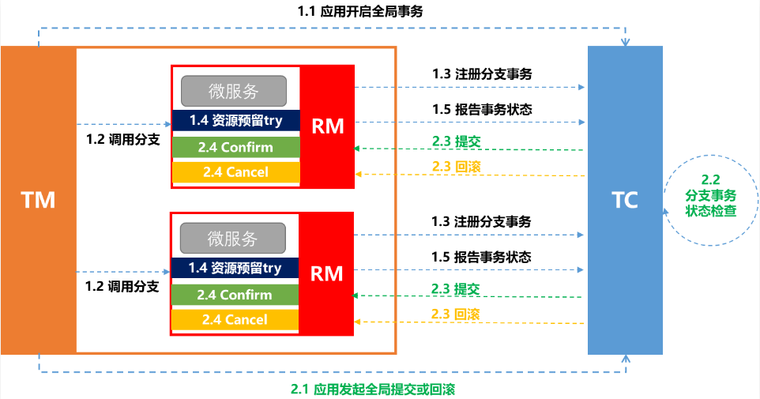
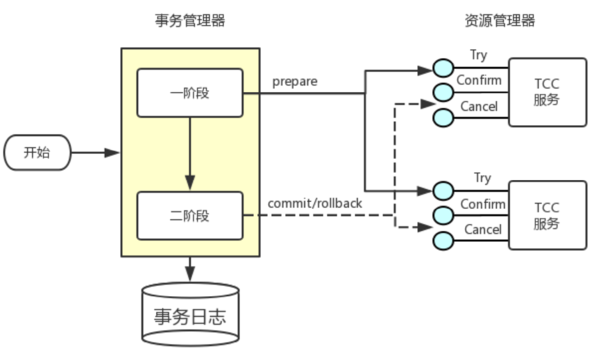

# Seata_TCC

## 最佳实践

### 考察问

- 优缺点

    |  |XA|AT|TCC|SAGA|
    |--|--|--|--|--|
    |一致性|`()`|`()`|`()`|`()`|
    |隔离性|`()`隔离|基于`()`隔离|基于`()`隔离|`()`隔离|
    |代码侵入|`()`|`()`|`()`|`()`|
    |性能|`()`|`()`|`()`|`()`|
    |关系型数据库|`()`|`()`|`()`|`()`|
    |场景|对`()`性、`()`性有高要求的业务, `()`场景, `()`型数据库, 典型的银行系统 |基于`()`型数据库的大多数分布式事务场景都可以|•对`()`要求较高的事务。 •有`()`型数据库要参与的事务。|•业务`()`长、业务`()`多 •参与者包含`()`服务，无法提供`()`接口|

    ✨提交过程:

    1. 在一阶段本地提交: `()`, `()`, `()`. 释放数据库资源，性能比较好；
    2. 在二阶段本地提交: `()`

    ✨隔离性:

    1. XA: 基于数据库的2PC, 完全隔离
    2. AT: 使用全局锁, 使用快照补偿
    3. TCC: 相比AT，无需生成快照和使用全局锁，自定义业务补偿(空回滚, 悬挂, 幂等处理), 性能最好
    4. Saga: 无隔离

### 考察点

- 优缺点

    |  |XA|AT|TCC|SAGA|
    |--|--|--|--|--|
    |一致性|`强`|`弱(最终)`|`弱(最终)`|`弱(最终)`|
    |隔离性|`完全`隔离|基于`全局锁`隔离|基于`资源业务锁定`隔离|`无`隔离|
    |代码侵入|`无`|`无`|`有，要编写三个接口`|`有，要编写状态机和补偿业务`|
    |性能|`差`|`中`|`好`|`好`|
    |关系型数据库|`依赖`|`依赖`|`不依赖`|`不依赖`|
    |场景|对`一致`性、`隔离`性有高要求的业务, `单机多库`场景, `关系`型数据库, 典型的银行系统 |基于`关系`型数据库的大多数分布式事务场景都可以|•对`性能`要求较高的事务。 •有`非关系`型数据库要参与的事务。|•业务`流程`长、业务`流程`多 •参与者包含`其它公司或遗留系统`服务，无法提供`TCC模式要求的三个`接口|

    ✨提交过程:

    1. 在一阶段本地提交: `AT`, `TCC`, `Saga`. 释放数据库资源，性能比较好；
    2. 在二阶段本地提交: `XA`

    ✨隔离性:

    1. XA: 基于数据库的2PC, 完全隔离
    2. AT: 使用全局锁, 使用快照补偿
    3. TCC: 相比AT，无需生成快照和使用全局锁，自定义业务补偿(空回滚, 悬挂, 幂等处理), 性能最好
    4. Saga: 无隔离

## Seata_TCC

TCC 分布式事务模型直接作用于服务层。不与具体的服务框架耦合，与底层 RPC 协议无关，与底层存储介质无关，可以灵活选择业务资源的锁定粒度，减少资源锁持有时间，可扩展性好，可以说是为独立部署的 SOA 服务而设计的。

TCC（Try-Confirm-Cancel） 实际上是服务化的两阶段提交协议，业务开发者需要实现这三个服务接口，第一阶段服务由业务代码编排来调用 Try 接口进行资源预留，所有参与者的 Try 接口都成功了，事务管理器会提交事务，并调用每个参与者的 Confirm 接口真正提交业务操作，否则调用每个参与者的 Cancel 接口回滚事务。

TCC模式也可以看做2PC的一个变种，与AT模式一样在每一阶段都直接进行事务提交，不同的是，TCC模式的每一步都需要业务代码实现，对业务是强侵入性的。

AT 模式基于 支持本地 ACID 事务 的 关系型数据库：

- 一阶段 prepare 行为：在本地事务中，一并提交业务数据更新和相应回滚日志记录。
- 二阶段 commit 行为：马上成功结束，自动 异步批量清理回滚日志。
- 二阶段 rollback 行为：通过回滚日志，自动 生成补偿操作，完成数据回滚。

相应的，TCC 模式，不依赖于底层数据资源的事务支持：

- 一阶段 prepare 行为：调用 自定义 的 prepare 逻辑。
- 二阶段 commit 行为：调用 自定义 的 commit 逻辑。
- 二阶段 rollback 行为：调用 自定义 的 rollback 逻辑。
所谓 TCC 模式，是指支持把 自定义 的分支事务纳入到全局事务的管理中。

## 优缺点

|  |XA|AT|TCC|SAGA|
|--|--|--|--|--|
|一致性|`强`|`弱(最终)`|`弱(最终)`|`弱(最终)`|
|隔离性|`完全`隔离|基于`全局锁`隔离|基于`资源业务锁定`隔离|`无`隔离|
|代码侵入|`无`|`无`|`有，要编写三个接口`|`有，要编写状态机和补偿业务`|
|性能|`差`|`中`|`好`|`好`|
|关系型数据库|`依赖`|`依赖`|`不依赖`|`不依赖`|
|场景|对`一致`性、`隔离`性有高要求的业务, `单机多库`场景, `关系`型数据库, 典型的银行系统 |基于`关系`型数据库的大多数分布式事务场景都可以|•对`性能`要求较高的事务。 •有`非关系`型数据库要参与的事务。|•业务`流程`长、业务`流程`多 •参与者包含`其它公司或遗留系统`服务，无法提供`TCC模式要求的三个`接口|

✨提交过程:

1. 在一阶段本地提交: `AT`, `TCC`, `Saga`. 释放数据库资源，性能比较好；
2. 在二阶段本地提交: `XA`

✨隔离性:

1. XA: 基于数据库的2PC, 完全隔离
2. AT: 使用全局锁, 使用快照补偿
3. TCC: 相比AT，无需生成快照和使用全局锁，自定义业务补偿(空回滚, 悬挂, 幂等处理), 性能最好
4. Saga: 无隔离

## 参考

- <https://www.cnblogs.com/vitochen/p/18722088>
- <https://developer.aliyun.com/article/1529234>
- https://seata.apache.org/zh-cn/blog/tcc-mode-design-principle/
- https://www.cnblogs.com/vic-tory/p/17980860

