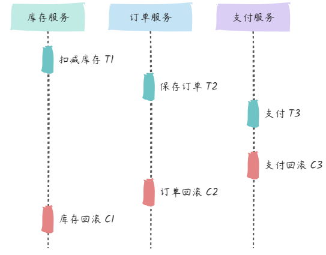

# Seata_Saga模式

## 最佳实践

### 考察问

- Saga流程:

    1. 一阶段： 直接`()`本地事务
    2. 二阶段：
        - 成功则什么都不做；
        - 失败则通过`()`来回滚

- 优缺点

    |  |XA|AT|TCC|SAGA|
    |--|--|--|--|--|
    |一致性|`()`|`()`|`()`|`()`|
    |隔离性|`()`隔离|基于`()`隔离|基于`()`隔离|`()`隔离|
    |代码侵入|`()`|`()`|`()`|`()`|
    |性能|`()`|`()`|`()`|`()`|
    |关系型数据库|`()`|`()`|`()`|`()`|
    |场景|对`()`性、`()`性有高要求的业务, `()`场景, `()`型数据库, 典型的银行系统 |基于`()`型数据库的大多数分布式事务场景都可以|•对`()`要求较高的事务。 •有`()`型数据库要参与的事务。|•业务`()`长、业务`()`多 •参与者包含`()`服务，无法提供`()`接口|

    ✨提交过程:

    1. 在一阶段本地提交: `()`, `()`, `()`. 释放数据库资源，性能比较好；
    2. 在二阶段本地提交: `()`

    ✨隔离性:

    1. XA: 基于数据库的2PC, 完全隔离
    2. AT: 使用全局锁, 使用快照补偿
    3. TCC: 相比AT，无需生成快照和使用全局锁，自定义业务补偿(空回滚, 悬挂, 幂等处理), 性能最好
    4. Saga: 无隔离

### 考察点

- Saga流程:

    1. 一阶段： 直接`提交`本地事务
    2. 二阶段：
        - 成功则什么都不做；
        - 失败则通过`编写补偿业务`来回滚

- 优缺点

    |  |XA|AT|TCC|SAGA|
    |--|--|--|--|--|
    |一致性|`强`|`弱(最终)`|`弱(最终)`|`弱(最终)`|
    |隔离性|`完全`隔离|基于`全局锁`隔离|基于`资源业务锁定`隔离|`无`隔离|
    |代码侵入|`无`|`无`|`有，要编写三个接口`|`有，要编写状态机和补偿业务`|
    |性能|`差`|`中`|`好`|`好`|
    |关系型数据库|`依赖`|`依赖`|`不依赖`|`不依赖`|
    |场景|对`一致`性、`隔离`性有高要求的业务, `单机多库`场景, `关系`型数据库, 典型的银行系统 |基于`关系`型数据库的大多数分布式事务场景都可以|•对`性能`要求较高的事务。 •有`非关系`型数据库要参与的事务。|•业务`流程`长、业务`流程`多 •参与者包含`其它公司或遗留系统`服务，无法提供`TCC模式要求的三个`接口|

    ✨提交过程:

    1. 在一阶段本地提交: `AT`, `TCC`, `Saga`. 释放数据库资源，性能比较好；
    2. 在二阶段本地提交: `XA`

    ✨隔离性:

    1. XA: 基于数据库的2PC, 完全隔离
    2. AT: 使用全局锁, 使用快照补偿
    3. TCC: 相比AT，无需生成快照和使用全局锁，自定义业务补偿(空回滚, 悬挂, 幂等处理), 性能最好
    4. Saga: 无隔离

## Seata_Saga

Saga其核心思想是将长事务拆分为多个本地短事务并依次正常提交，如果所有短事务均执行成功，那么分布式事务提交；如果出现某个参与者执行本地事务失败，则由 Saga 事务协调器协调根据相反顺序调用补偿操作，回滚已提交的参与者，使分布式事务回到最初始的状态。Saga 理论出自 Hector & Kenneth 1987发表的论文 Sagas。

与TCC事务补偿机制相比，TCC有一个预留(Try)动作，相当于先报存一个草稿，然后才提交。Saga事务没有预留动作，直接提交。

1. 一阶段： 直接`提交`本地事务
2. 二阶段：
    - 成功则什么都不做；
    - 失败则通过`编写补偿业务`来回滚

## 优缺点

|  |XA|AT|TCC|SAGA|
|--|--|--|--|--|
|一致性|`强`|`弱(最终)`|`弱(最终)`|`弱(最终)`|
|隔离性|`完全`隔离|基于`全局锁`隔离|基于`资源业务锁定`隔离|`无`隔离|
|代码侵入|`无`|`无`|`有，要编写三个接口`|`有，要编写状态机和补偿业务`|
|性能|`差`|`中`|`好`|`好`|
|关系型数据库|`依赖`|`依赖`|`不依赖`|`不依赖`|
|场景|对`一致`性、`隔离`性有高要求的业务, `单机多库`场景, `关系`型数据库, 典型的银行系统 |基于`关系`型数据库的大多数分布式事务场景都可以|•对`性能`要求较高的事务。 •有`非关系`型数据库要参与的事务。|•业务`流程`长、业务`流程`多 •参与者包含`其它公司或遗留系统`服务，无法提供`TCC模式要求的三个`接口|

✨提交过程:

1. 在一阶段本地提交: `AT`, `TCC`, `Saga`. 释放数据库资源，性能比较好；
2. 在二阶段本地提交: `XA`

✨隔离性:

1. XA: 基于数据库的2PC, 完全隔离
2. AT: 使用全局锁, 使用快照补偿
3. TCC: 相比AT，无需生成快照和使用全局锁，自定义业务补偿(空回滚, 悬挂, 幂等处理), 性能最好
4. Saga: 无隔离

## 实现原理

Seata 目前是采用事件驱动的机制来实现的, 该状态机引擎的基本原理是，它基于事件驱动架构，每个步骤都是异步执行的，步骤与步骤之间通过事件队列流转，

## Saga设计原则

和TCC类似

- 允许空补偿: 原服务未执行，补偿服务执行了；

    - 原因:

        1. 原服务 超时（丢包）；
        2. Saga 事务触发 回滚；
        3. 未收到原服务请求，先收到补偿请求；

    - 方案:

        没有找到要补偿的业务主键时返回补偿成功并将原业务主键记录下来。

- 防悬挂控制: 补偿服务 比 原服务 先执行；

    - 原因：
        1. 原服务 超时（拥堵）；
        2. Saga 事务回滚，触发 回滚；
        3. 拥堵的原服务到达；

    - 方案:

        要检查当前业务主键是否已经在空补偿记录下来的业务主键中存在，如果存在则要拒绝服务的执行。

- 幂等控制

    原服务与补偿服务都需要保证幂等性, 由于网络可能超时，可以设置重试策略，重试发生时要通过幂等控制避免业务数据重复更新。

- 自定义事务恢复策略

    前面讲到 Saga 模式不保证事务的隔离性，在极端情况下可能出现脏写。比如在分布式事务未提交的情况下，前一个服务的数据被修改了，而后面的服务发生了异常需要进行回滚，可能由于前面服务的数据被修改后无法进行补偿操作。这时的一种处理办法可以是“重试”继续往前完成这个分布式事务。由于整个业务流程是由状态机编排的，即使是事后恢复也可以继续往前重试。所以用户可以根据业务特点配置该流程的事务处理策略是优先“回滚”还是“重试”，当事务超时的时候，Server 端会根据这个策略不断进行重试。

    由于 Saga 不保证隔离性，所以我们在业务设计的时候需要做到“宁可长款，不可短款”的原则，长款是指在出现差错的时候站在我方的角度钱多了的情况，钱少了则是短款，因为如果长款可以给客户退款，而短款则可能钱追不回来了，也就是说在业务设计的时候，一定是先扣客户帐再入帐，如果因为隔离性问题造成覆盖更新，也不会出现钱少了的情况。

## 参考

- <https://www.cnblogs.com/vitochen/p/18722088>
- <https://developer.aliyun.com/article/1529234>
- <https://seata.apache.org/zh-cn/blog/seata-at-tcc-saga/>
- <https://seata.apache.org/zh-cn/blog/design-more-flexable-application-by-saga/>
