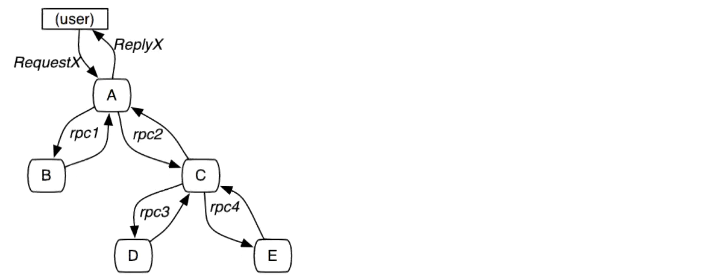

# 分布式链路追踪

微服务架构是通过业务来划分服务，各个服务之间使用REST调用。对于复杂的业务可能需要很多个服务协同才能完成某个业务功能，如下图所示：

如果调用链路上任何一个服务出现问题或者网络超时，都会导致接口调用失败。随着业务的不断扩张，服务之间互相调用会越来越复杂，程序出现任何问题都少不了查看日志。由于调用关系非常复杂，导致日志排查困难。

分布式链路追踪就是要解决多个服务调用导致日志排查困难的问题，它可以将一个完整的调用链整合为一个完整有序的日志，然后根据时间排序就可以清晰的看到这个业务中全部日志以及执行顺序，从而轻松定位问题。

## Spring Cloud Sleuth介绍
Spring Cloud Sleuth是Spring Cloud体系中的一个模块，用于在整个分布式系统中跟踪一个用户请求的过程(包括数据采集，数据传输，数据存储，数据分析，数据可视化)。捕获这些跟踪数据，就能构建微服务的整个调用链的视图，这是调试和监控微服务的关键工具。

Spring Cloud Sleuth有4个特点：
- 提供链路追踪：通过sleuth可以很清楚的看出一个请求经过了哪些服务，可以方便的理清服务间的调用关系
- 性能分析：通过sleuth可以很方便的看到每个请求的耗时，分析出哪些服务调用比较耗时，当服务调用耗时随着请求量的增大而增大时，也可以对服务的扩容提供一定的提醒作用
- 数据分析优化链路：对于频繁地调用一个服务，或者并行地调用等，可以针对业务做一些优化措施
- 可视化：对于程序未捕获的异常，可以在zipkpin界面上看到

Zipkin是一个开放源代码的分布式跟踪系统，每个服务向zipkin报告计时数据，zipkin会根据调用关系通过Zipkin UI生成依赖关系图。github地址：https://github.com/openzipkin/zipkin
Zipkin提供了可插拔数据存储方式：In-Memory、MySql、Cassandra以及Elasticsearch。
在企业应用中一般是Sleuth和zipkin一起使用。

