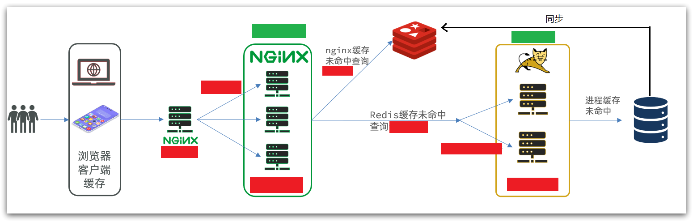
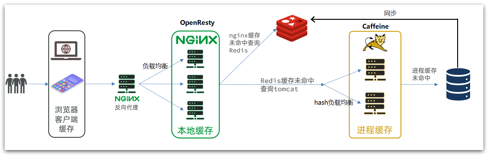

# 多级缓存

## 最佳实践

### 考察问

- 多级缓存就是充分利用请求处理的每个环节，分别添加缓存，减轻Tomcat压力，提升服务性能：

    1. 浏览器访问静态资源时
        1. 优先读取`()`缓存
        2. 访问非静态资源（ajax查询数据）时，访问`()`
    2. 请求到达Nginx后
        1. 优先读取`()`
        2. 如果Nginx本地缓存未命中，则去`()`
        3. 如果Redis查询未命中，则查询`()`
    3. 请求进入Tomcat后
        1. 优先查询`()`进程缓存
        2. 如果JVM进程缓存未命中，则查询`()`

    

    ✨注意:

    - 在多级缓存架构中，Nginx内部需要编写本地缓存查询、Redis查询、Tomcat查询的业务逻辑，因此这样的nginx服务不再是一个`()`，而是一个编写`()`。因此这样的业务Nginx服务也需要搭建集群来提高并发，再有专门的nginx服务来做反向代理.

    - Tomcat服务将来也会部署为集群模式

### 考察点

- 多级缓存就是充分利用请求处理的每个环节，分别添加缓存，减轻Tomcat压力，提升服务性能：

    1. 浏览器访问静态资源时
        1. 优先读取`浏览器本地`缓存
        2. 访问非静态资源（ajax查询数据）时，访问`服务端`
    2. 请求到达Nginx后
        1. 优先读取`Nginx本地缓存`
        2. 如果Nginx本地缓存未命中，则去`直接查询Redis（不经过Tomcat）`
        3. 如果Redis查询未命中，则查询`Tomcat`
    3. 请求进入Tomcat后
        1. 优先查询`JVM`进程缓存
        2. 如果JVM进程缓存未命中，则查询`数据库`

    

    ✨注意:

    - 在多级缓存架构中，Nginx内部需要编写本地缓存查询、Redis查询、Tomcat查询的业务逻辑，因此这样的nginx服务不再是一个`反向代理服务器`，而是一个编写`业务的Web服务器了`。因此这样的业务Nginx服务也需要搭建集群来提高并发，再有专门的nginx服务来做反向代理.

    - Tomcat服务将来也会部署为集群模式

## 多级缓存概念

传统的缓存策略一般是请求到达Tomcat后，先查询Redis，如果未命中则查询数据库

存在下面的问题：

- 请求要经过Tomcat处理，Tomcat的性能成为整个系统的瓶颈
- Redis缓存失效时，会对数据库产生冲击

多级缓存就是充分利用请求处理的每个环节，分别添加缓存，减轻Tomcat压力，提升服务性能：

1. 浏览器访问静态资源时
    1. 优先读取`浏览器本地`缓存
    2. 访问非静态资源（ajax查询数据）时，访问`服务端`
2. 请求到达Nginx后
    1. 优先读取`Nginx本地缓存`
    2. 如果Nginx本地缓存未命中，则去`直接查询Redis（不经过Tomcat）`
    3. 如果Redis查询未命中，则查询`Tomcat`
3. 请求进入Tomcat后
    1. 优先查询`JVM`进程缓存
    2. 如果JVM进程缓存未命中，则查询`数据库`

✨注意:

- 在多级缓存架构中，Nginx内部需要编写本地缓存查询、Redis查询、Tomcat查询的业务逻辑，因此这样的nginx服务不再是一个`反向代理服务器`，而是一个编写`业务的Web服务器了`。因此这样的业务Nginx服务也需要搭建集群来提高并发，再有专门的nginx服务来做反向代理.

- Tomcat服务将来也会部署为集群模式
