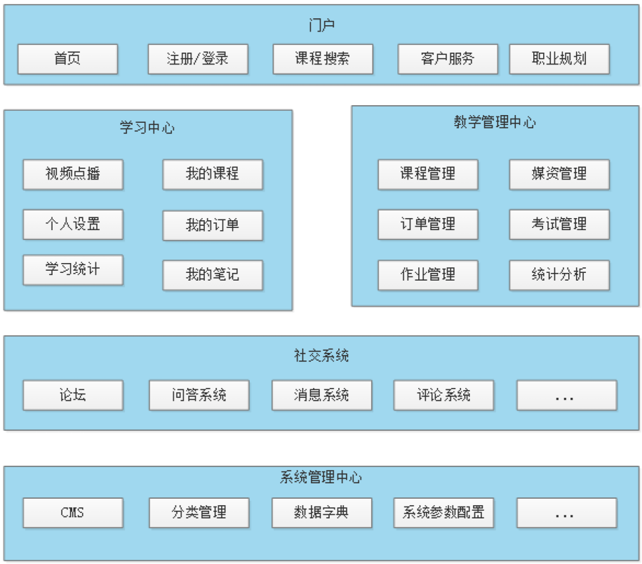
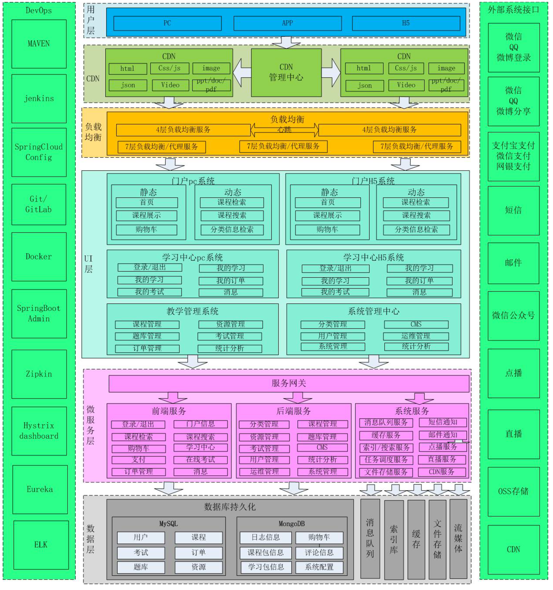

# 学成在线

当前市场的在线教育模式多种多样，包括：B2C、C2C、B2B2C等业务模式，学成在线采用B2B2C业务模式，即向企业或个人提供在线教育平台提供教学服务，老师和学生通过平台完成整个教学和学习的过程，市场上类似的平台有：网易云课堂、腾讯课堂等，学成在线的特点是IT职业课程在线教学。

## 项目功能架构

学成在线包括门户、学习中心、教学管理中、社交系统、系统管理等功能模块。

- 门户: 在首页、活动页、专题页等页面提供课程学习入口。
- 学习中心: 学生登录学习中心在线学习课程。
- 社交系统: 社交系统为老师和学生交流搭建沟通的平台，包括：问答系统、评论系统、论坛等，学生和老师通过问答系统提问问题、回答问题，通过评论系统对老师授课进行评论。
- 教学管理中心: 教师登录教学管理中心进行课程管理、资源管理、考试管理等教学活动。
- 系统管理中心: 系统管理员登录系统管理中心进行分类管理、运维管理等功能。

## 项目的技术架构

学成在线采用当前流行的前后端分离架构开发，由用户层、UI层、微服务层、数据层等部分组成，为PC、App、H5等客户端用户提供服务。下图是系统的技术架构图：

业务流程举例：
1. 用户可以通过pc、手机等客户端访问系统进行在线学习。
2. 系统应用CDN技术，对一些图片、CSS、视频等资源从CDN调度访问。
3. 所有的请求全部经过负载均衡器。
4. 对于PC、H5等客户端请求，首先请求UI层，渲染用户界面。
5. 客户端UI请求服务层获取进行具体的业务操作。
6. 服务层将数据持久化到数据库。

各模块说明如下：
1. 用户层: 用户层描述了本系统所支持的用户类型包括：pc用户、app用户、h5用户。pc用户通过浏览器访问系统、app用户通过android、ios手机访问系统，H5用户通过h5页面访问系统。
2. CDN: CDN全称Content Delivery Network，即内容分发网络，本系统所有静态资源全部通过CDN加速来提高访问速度。系统静态资源包括：html页面、js文件、css文件、image图片、pdf和ppt及doc教学文档、video视频等。

