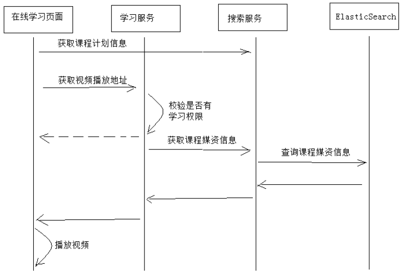
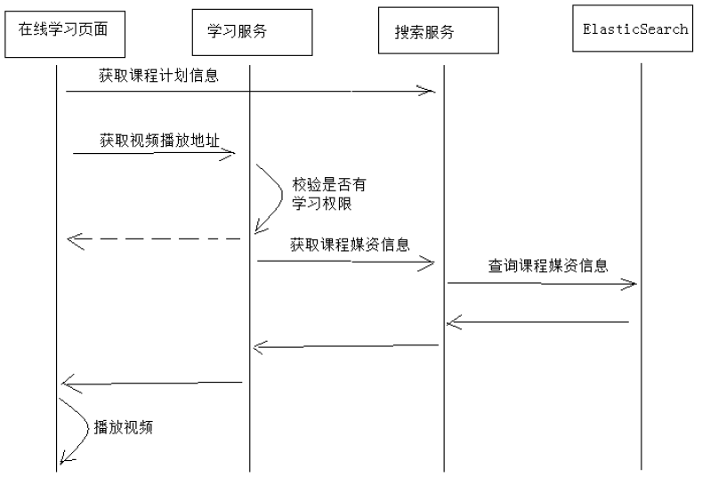

# 媒资管理系统集成

##  学习页面查询课程计划
要实现在线学习页面动态读取章节对应的视频并进行播放。在线学习页面所需要的信息有两类：一类是课程计划信息、一类是课程学习信息（视频地址、学习进度等）

在线学习集成媒资管理的需求如下：

1. 在线学习页面显示课程计划
2. 点击课程计划播放该课程计划对应的视频

## 学习页面获取视频播放地址

用户进入在线学习页面，点击课程计划将播放该课程计划对应的教学视频。业务流程如下：

业务流程说明：
1、用户进入在线学习页面，页面请求搜索服务获取课程信息（包括课程计划信息）并且在页面展示。
2、在线学习请求学习服务获取视频播放地址。
3、学习服务校验当前用户是否有权限学习，如果没有权限学习则提示用户。
4、学习服务校验通过，请求搜索服务获取课程媒资信息。
5、搜索服务请求ElasticSearch获取课程媒资信息。

课程发布存储媒资信息

课程媒资信息是在课程发布的时候存入ElasticSearch索引库，因为课程发布后课程信息将基本不再修改，具体的业务流程如下。

业务流程如下：
1、课程发布，向课程媒资信息表写入数据。
1）根据课程id删除teachplanMediaPub中的数据
2）根据课程id查询teachplanMedia数据
3）将查询到的teachplanMedia数据插入到teachplanMediaPub中
2、Logstash定时扫描课程媒资信息表，并将课程媒资信息写入索引库。

## 在线学习接口

根据下边的业务流程，本章节完成前端学习页面请求学习服务获取课程视频地址，并自动播放视频。

