# 用户


## 用户认证需求分析

什么是用户身份认证？

用户身份认证即用户去访问系统资源时系统要求验证用户的身份信息，身份合法方可继续访问。常见的用户身份认证表现形式有：用户名密码登录，指纹打卡等方式。

什么是用户授权？

用户认证通过后去访问系统的资源，系统会判断用户是否拥有访问资源的权限，只允许访问有权限的系统资源，没有权限的资源将无法访问，这个过程叫用户授权。


### 单点登录需求


本项目包括多个子项目，如：学习系统，教学管理中心、系统管理中心等，为了提高用户体验性需要实现用户只认证一次便可以在多个拥有访问权限的系统中访问，这个功能叫做单点登录(Single Sign On)。用户登录学成网一次即可访问多个系统。

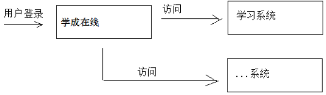


### 第三方认证需求

一个微信用户没有在学成在线注册，本系统可以通过请求微信系统来验证该用户的身份，验证通过后该用户便可在本系统学习，它的基本流程如下：

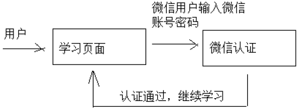

微信不属于本系统，本系统并没有存储微信用户的账号、密码等信息，本系统如果要获取该用户的基本信息则需要首先通过微信的认证系统（微信认证）进行认证，微信认证通过后本系统便可获取该微信用户的基本信息，从而在本系统将该微信用户的头像、昵称等信息显示出来，该用户便不用在本系统注册却可以直接学习。


第三方认证（跨平台认证）

当需要访问第三方系统的资源时需要首先通过第三方系统的认证（例如：微信认证），由第三方系统对用户认证通过，并授权资源的访问权限。

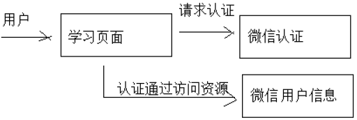


## 用户认证技术方案

### 单点登录技术方案

分布式系统要实现单点登录，通常将认证系统独立抽取出来，并且将用户身份信息存储在单独的存储介质，比如：MySQL、Redis，考虑性能要求，通常存储在Redis中，如下图：

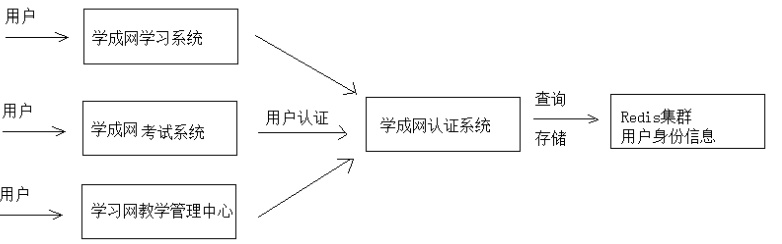


单点登录的特点是：
1、认证系统为独立的系统。
2、各子系统通过Http或其它协议与认证系统通信，完成用户认证。
3、用户身份信息存储在Redis集群。


## Oauth2认证


第三方认证技术方案最主要是解决认证协议的通用标准 问题，因为要实现 跨系统认证，各系统之间要遵循一定的接口协议。

OAUTH协议为用户资源的授权提供了一个安全的、开放而又简易的标准。同时，任何第三方都可以使用OAUTH认证服务，任何服务提供商都可以实现自身的OAUTH认证服务，因而OAUTH是开放的。业界提供了OAUTH的多种实现如PHP、JavaScript，Java，Ruby等各种语言开发包，大大节约了程序员的时间，因而OAUTH是简易的。Oauth协议目前发展到2.0版本，1.0版本过于复杂，2.0版本已得到广泛应用。


下边分析一个Oauth2认证的例子，黑马程序员网站使用微信认证的过程：

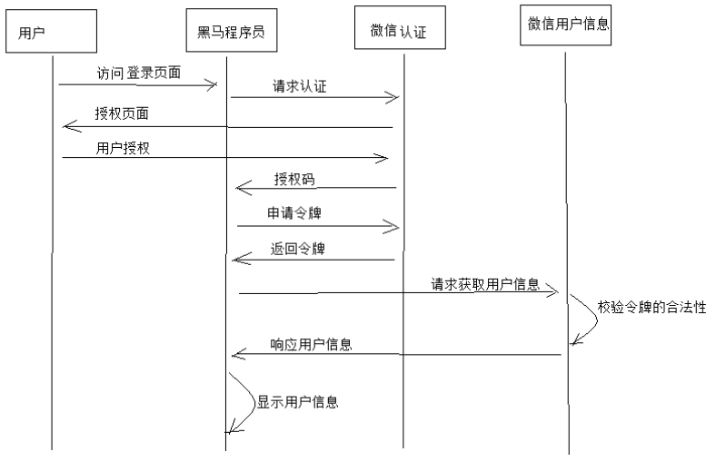


1. 客户端请求第三方授权

    用户进入黑马程序的登录页面，点击微信的图标以微信账号登录系统，用户是自己在微信里信息的资源拥有者。点击“微信”出现一个二维码，此时用户扫描二维码，开始给黑马程序员授权。

2. 资源拥有者同意给客户端授权

    资源拥有者扫描二维码表示资源拥有者同意给客户端授权，微信会对资源拥有者的身份进行验证， 验证通过后，微信会询问用户是否给授权黑马程序员访问自己的微信数据，用户点击“确认登录”表示同意授权，微信认证服务器会颁发一个授权码，并重定向到黑马程序员的网站。

3. 客户端获取到授权码，请求认证服务器申请令牌

    此过程用户看不到，客户端应用程序请求认证服务器，请求携带授权码。

4. 认证服务器向客户端响应令牌

    认证服务器验证了客户端请求的授权码，如果合法则给客户端颁发令牌，令牌是客户端访问资源的通行证。此交互过程用户看不到，当客户端拿到令牌后，用户在黑马程序员看到已经登录成功。

5. 客户端请求资源服务器的资源

    客户端携带令牌访问资源服务器的资源。
    黑马程序员网站携带令牌请求访问微信服务器获取用户的基本信息。

6. 资源服务器返回受保护资源

    资源服务器校验令牌的合法性，如果合法则向用户响应资源信息内容。

    注意：资源服务器和认证服务器可以是一个服务也可以分开的服务，如果是分开的服务资源服务器通常要请求认证服务器来校验令牌的合法性。


Oauth2.0认证流程如下：

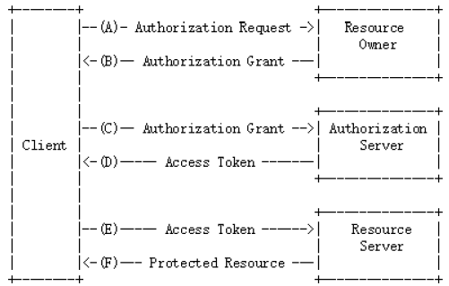


Oauth2包括以下角色：

1. 客户端

    本身不存储资源，需要通过资源拥有者的授权去请求资源服务器的资源，比如：学成在线Android客户端、学成在线Web客户端（浏览器端）、微信客户端等。

2. 资源拥有者

    通常为用户，也可以是应用程序，即该资源的拥有者。

3. 授权服务器（也称认证服务器）

    用来对资源拥有的身份进行认证、对访问资源进行授权。客户端要想访问资源需要通过认证服务器由资源拥有者授权后方可访问。

4. 资源服务器

    存储资源的服务器，比如，学成网用户管理服务器存储了学成网的用户信息，学成网学习服务器存储了学生的学习信息，微信的资源服务存储了微信的用户信息等。客户端最终访问资源服务器获取资源信息。
 


### Oauth2在本项目的应用


Oauth2是一个标准的开放的授权协议，应用程序可以根据自己的要求去使用Oauth2，本项目使用Oauth2实现如下目标：
1. 学成在线访问第三方系统的资源
2. 外部系统访问学成在线的资源
3. 学成在线前端（客户端） 访问学成在线微服务的资源。
4. 学成在线微服务之间访问资源，例如：微服务A访问微服务B的资源，B访问A的资源。


###  Spring security Oauth2认证解决方案

本项目采用 Spring security + Oauth2完成用户认证及用户授权，Spring security 是一个强大的和高度可定制的身份验证和访问控制框架，Spring security 框架集成了Oauth2协议，下图是项目认证架构图：

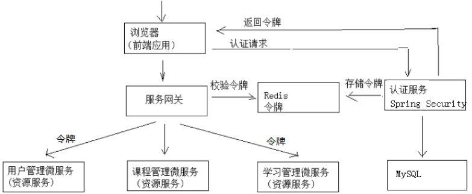

1、用户请求认证服务完成认证。
2、认证服务下发用户身份令牌，拥有身份令牌表示身份合法。
3、用户携带令牌请求资源服务，请求资源服务必先经过网关。
4、网关校验用户身份令牌的合法，不合法表示用户没有登录，如果合法则放行继续访问。
5、资源服务获取令牌，根据令牌完成授权。
6、资源服务完成授权则响应资源信息。


### 资源服务授权流程

资源服务拥有要访问的受保护资源，客户端携带令牌访问资源服务，如果令牌合法则可成功访问资源服务中的资源，如下图：

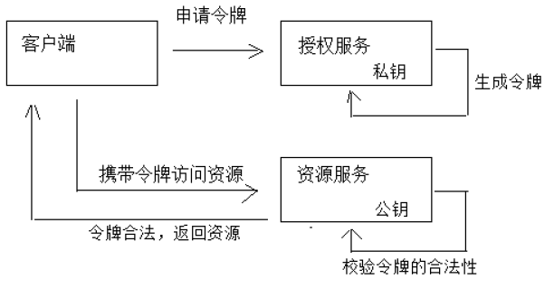

上图的业务流程如下：


1、客户端请求认证服务申请令牌
2、认证服务生成令牌: 认证服务采用非对称加密算法，使用私钥生成令牌。
3、客户端携带令牌访问资源服务: 客户端在Http header 中添加： Authorization：Bearer 令牌。
4、资源服务请求认证服务校验令牌的有效性: 资源服务接收到令牌，使用公钥校验令牌的合法性。
5、令牌有效，资源服务向客户端响应资源信息


## JWT研究


在介绍JWT之前先看一下传统校验令牌的方法，如下图：

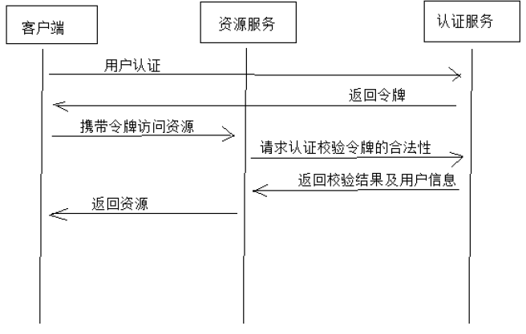

问题：

传统授权方法的问题是用户每次请求资源服务，资源服务都需要携带令牌访问认证服务去校验令牌的合法性，并根据令牌获取用户的相关信息，性能低下。

解决：

使用JWT的思路是，用户认证通过会得到一个JWT令牌，JWT令牌中已经包括了用户相关的信息，客户端只需要携带JWT访问资源服务，资源服务根据事先约定的算法自行完成令牌校验，无需每次都请求认证服务完成授权。


JWT令牌授权过程如下图：

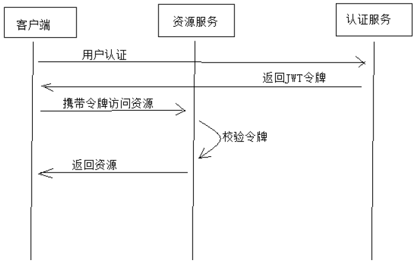

什么是JWT？

JSON Web Token（JWT）是一个开放的行业标准（RFC 7519），它定义了一种简介的、自包含的协议格式，用于在通信双方传递json对象，传递的信息经过数字签名可以被验证和信任。JWT可以使用HMAC算法或使用RSA的公钥/私钥对来签名，防止被篡改。


###  令牌结构

JWT令牌由三部分组成，每部分中间使用点（.）分隔，比如：xxxxx.yyyyy.zzzzz

1. Header

    头部包括令牌的类型（即JWT）及使用的哈希算法（如HMAC SHA256或RSA）, 下边是Header部分的内容：

    ```json
    {
      "alg": "HS256",
      "typ": "JWT"
    }
    ```
    将上边的内容使用Base64Url编码，得到一个字符串就是JWT令牌的第一部分。

2. Payload


    第二部分是负载，内容也是一个json对象，它是存放有效信息的地方，它可以存放jwt提供的现成字段，比如：iss（签发者）,exp（过期时间戳）, sub（面向的用户）等，也可自定义字段。


    此部分不建议存放敏感信息，因为此部分可以解码还原原始内容

    最后将第二部分负载使用Base64Url编码，得到一个字符串就是JWT令牌的第二部分。一个例子：

    ```json
    {
      "sub": "1234567890",
      "name": "456",
      "admin": true
    }
    ```

3. Signature


    第三部分是签名，此部分用于防止jwt内容被篡改。

    这个部分使用base64url将前两部分进行编码，编码后使用点（.）连接组成字符串，最后使用header中声明签名算法进行签名。一个例子：


    ```json
    HMACSHA256(
      base64UrlEncode(header) + "." +
      base64UrlEncode(payload),
      secret)
    ```


    base64UrlEncode(header)：jwt令牌的第一部分。
    base64UrlEncode(payload)：jwt令牌的第二部分。
    secret：签名所使用的密钥。


## 认证接口开发
用户登录的流程图如下：

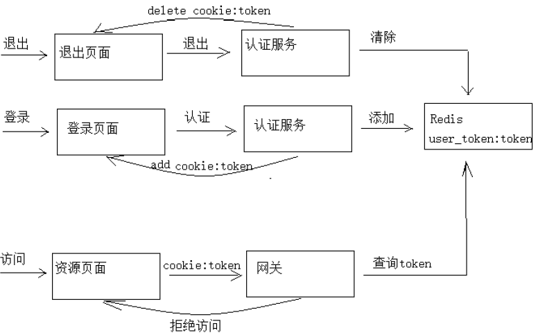


执行流程：

1、用户登录，请求认证服务
2、认证服务认证通过，生成jwt令牌，将jwt令牌及相关信息写入Redis，并且将身份令牌写入cookie
3、用户访问资源页面，带着cookie到网关
4、网关从cookie获取token，并查询Redis校验token,如果token不存在则拒绝访问，否则放行
5、用户退出，请求认证服务，清除redis中的token，并且删除cookie中的token

使用redis存储用户的身份令牌有以下作用：
1、实现用户退出注销功能，服务端清除令牌后，即使客户端请求携带token也是无效的。
2、由于jwt令牌过长，不宜存储在cookie中，所以将jwt令牌存储在redis，由客户端请求服务端获取并在客户端存储。


## 用户认证


### 用户认证流程分析

用户认证流程如下：

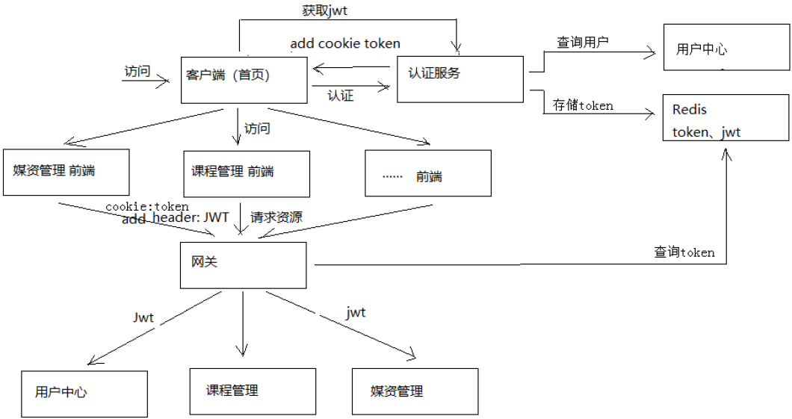


业务流程说明如下：
1、客户端请求认证服务进行认证。
2、认证服务认证通过向浏览器cookie写入token(身份令牌)
认证服务请求用户中心查询用户信息。
认证服务请求Spring Security申请令牌。
认证服务将token(身份令牌)和jwt令牌存储至redis中。
认证服务向cookie写入 token(身份令牌)。
3、前端携带token请求认证服务获取jwt令牌
前端获取到jwt令牌并存储在sessionStorage。
前端从jwt令牌中解析中用户信息并显示在页面。
4、前端携带cookie中的token身份令牌及jwt令牌访问资源服务
前端请求资源服务需要携带两个token，一个是cookie中的身份令牌，一个是http header中的jwt令牌
前端请求资源服务前在http header上添加jwt请求资源
5、网关校验token的合法性
用户请求必须携带token身份令牌和jwt令牌
网关校验redis中token是否合法，已过期则要求用户重新登录
6、资源服务校验jwt的合法性并完成授权
资源服务校验jwt令牌，完成授权，拥有权限的方法正常执行，没有权限的方法将拒绝访问。


## Zuul网关


网关的作用相当于一个过虑器、拦截器，它可以拦截多个系统的请求。本章节要使用网关校验用户的身份是否合法。


Spring Cloud Zuul是整合Netflix公司的Zuul开源项目实现的微服务网关，它实现了请求路由、负载均衡、校验过虑等 功能。

什么是网关？

服务网关是在微服务前边设置一道屏障，请求先到服务网关，网关会对请求进行过虑、校验、路由等处理。有了服务网关可以提高微服务的安全性，网关校验请求的合法性，请求不合法将被拦截，拒绝访问。

Zuul与Nginx怎么配合使用？

Zuul与Nginx在实际项目中需要配合使用，如下图，Nginx的作用是反向代理、负载均衡，Zuul的作用是保障微服
务的安全访问，拦截微服务请求，校验合法性及负载均衡。


Zuul网关具有代理的功能，根据请求的url转发到微服务，如下图：

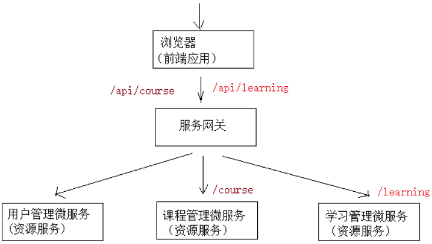


- 客户端请求网关/api/learning，通过路由转发到/learning
- 客户端请求网关/api/course，通过路由转发到/course


### 过虑器


Zuul的核心就是过虑器，通过过虑器实现请求过虑，身份校验等。

本小节实现网关连接Redis校验令牌：
1、从cookie查询用户身份令牌是否存在，不存在则拒绝访问
2、从http header查询jwt令牌是否存在，不存在则拒绝访问
3、从Redis查询user_token令牌是否过期，过期则拒绝访问


## 用户授权业务流程


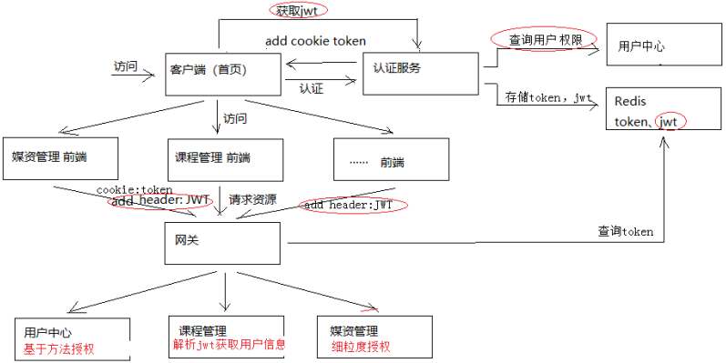


业务流程说明如下：
1、用户认证通过，认证服务向浏览器cookie写入token（ 身份令牌）
2、前端携带token请求用户中心服务获取jwt令牌
  前端获取到jwt令牌解析，并存储在sessionStorage
3、前端携带cookie中的身份令牌及jwt令牌访问资源服务
  前端请求资源服务需要携带两个token，一个是cookie中的身份令牌，一个是http header中的jwt
  前端请求资源服务前在http header上添加jwt请求资源
4、网关校验token的合法性
  用户请求必须携带身份令牌和jwt令牌
  网关校验redis中user_token的有效期，已过期则要求用户重新登录
5、资源服务校验jwt的合法性并进行授权
  资源服务校验jwt令牌，完成授权，拥有权限的方法正常执行，没有权限的方法将拒绝访问。


