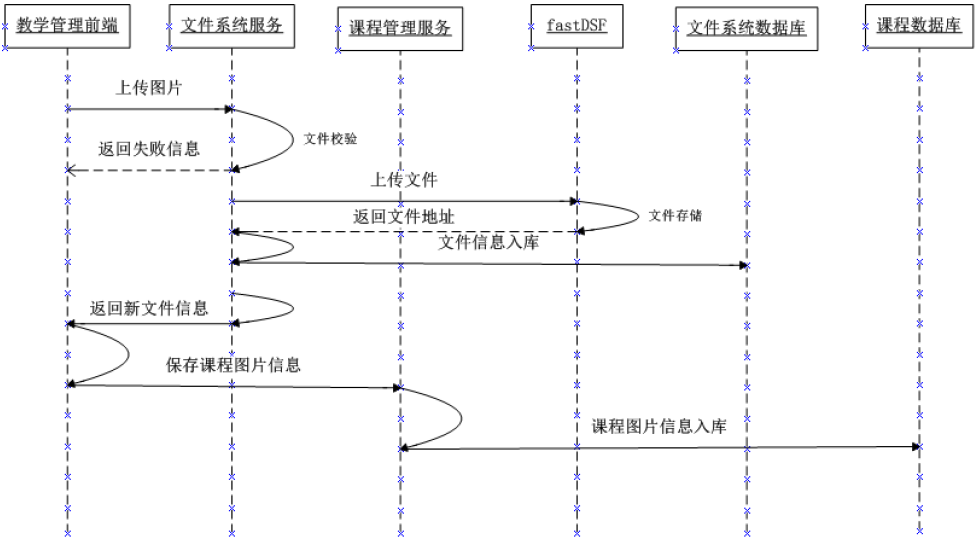
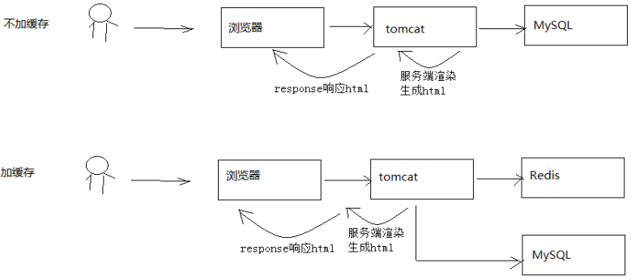
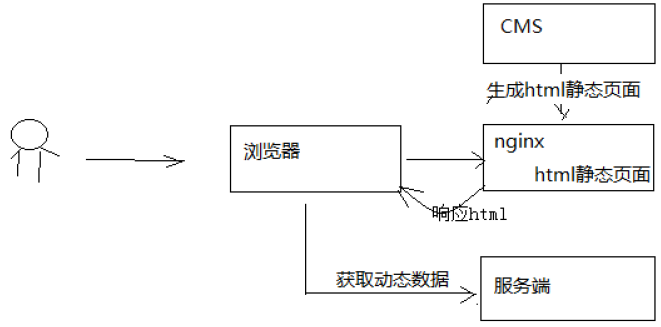
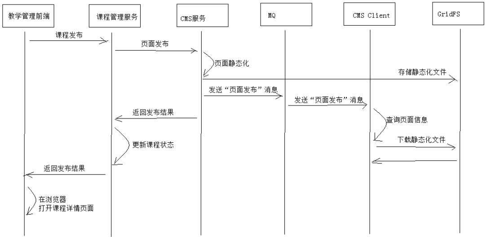
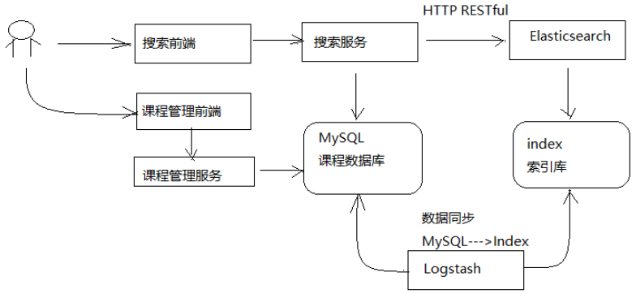
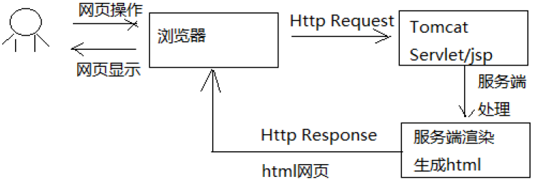
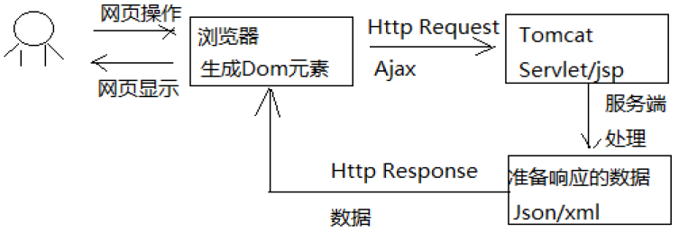
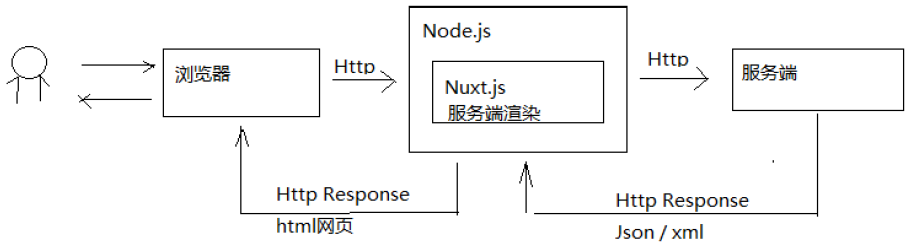

# 课程管理

## 需求分析

课程管理包括如下功能需求：
1、分类管理
2、新增课程
3、修改课程
4、预览课程
5、发布课程
用户的操作流程如下：
1、进入我的课程
2、点击“添加课程”，进入添加课程界面
3、输入课程基本信息，点击提交
4、课程基本信息提交成功，自动进入“管理课程”界面，点击“管理课程”也可以进入“管理课程”界面
5、编辑图片
6、编辑课程营销信息: 营销信息主要是设置课程的收费方式及价格。
7、编辑课程计划

## 技术
1）持久层技术介绍：
课程管理服务使用MySQL数据库存储课程信息，持久层技术如下：
1、spring data jpa：用于表的基本CRUD。
2、mybatis：用于复杂的查询操作。
3、druid：使用阿里巴巴提供的spring boot 整合druid包druid-spring-boot-starter管理连接池。

## 课程计划

课程计划定义了课程的章节内容，学生通过课程计划进行在线学习，下图中右侧显示的就是课程计划。
课程计划包括两级，第一级是课程的大章节、第二级是大章节下属的小章节，每个小章节通常是一段视频，学生点击小章节在线学习。

教学管理人员的功能包括：添加课程计划、删除课程计划、修改课程计划等。

### 课程计划查询

课程计划查询是将某个课程的课程计划内容完整的显示出来

### 添加课程计划
用户操作流程：
1、进入课程计划页面，点击“添加课程计划”
2、打开添加课程计划页面，输入课程计划信息

### 我的课程

课程添加完成后可通过我的课程进入课程修改页面，此页面显示我的课程列表

### 新增课程

用户操作流程如下：
1、用户进入“我的课程”页面，点击“新增课程”，进入新增课程页面
2、填写课程信息，选择课程分类、课程等级、学习模式等。
3、信息填写完毕，点击“提交”，课程添加成功或课程添加失败并提示失败原因。

### 数据字典  

在新增课程界面需要选择课程等级、课程状态等，这些信息统一采用数据字典管理的方式。

本项目对一些业务的分类配置信息，比如：课程等级、课程状态、用户类型、用户状态等进行统一管理，通过在数据库创建数据字典表来维护这些分类信息。

数据字典对系统的业务分类进行统一管理，并且也可以解决硬编码问题，比如添加课程时选择课程等级，下拉框中的课程等级信息如果在页面硬编码将造成不易修改维护的问题，所以从数据字典表中获取，如果要修改名称则在数

据字典修改即可，提高系统的可维护性。

### 课程信息修改

课程添加成功进入课程管理页面，通过课程管理页面修改课程的基本信息、编辑课程图片、编辑课程营销信息等。

### 课程营销

课程营销信息包括课程价格、课程有效期等信息。

## 课程图片管理 分布式文件系统

### 课程管理中上传图片处理流程

执行流程如下：

1. 管理员进入教学管理前端，点击上传图片
2. 图片上传至文件系统服务，文件系统请求fastDFS上传文件
3. 文件系统将文件入库，存储到文件系统服务数据库中。
4. 文件系统服务向前端返回文件上传结果，如果成功则包括文件的Url路径。
5. 课程管理前端请求课程管理进行保存课程图片信息到课程数据库。
6. 课程管理服务将课程图片保存在课程数据库。

## 课程预览 Eureka Feign

1、微服务数量众多，要进行远程调用就需要知道服务端的ip地址和端口，注册中心帮助我们管理这些服务的ip和端口。
2、微服务会实时上报自己的状态，注册中心统一管理这些微服务的状态，将存在问题的服务踢出服务列表，客户端获取到可用的服务进行调用。

## Feign远程调用

Feign是Netflix公司开源的轻量级rest客户端，使用Feign可以非常方便的实现Http 客户端。Spring Cloud引入Feign并且集成了Ribbon实现客户端负载均衡调用。

## 课程预览技术方案

课程预览是为了保证课程发布后的正确性，通过课程预览可以直观的通过课程详情页面看到课程的信息是否正确，通过课程预览看到的页面内容和课程发布后的页面内容是一致的。

## 课程详情页面技术方案

课程详情页面是向用户展示课程信息的窗口，课程相当于网站的商品，本页面的访问量会非常大。此页面的内容设计不仅要展示出课程核心重要的内容而且用户访问页面的速度要有保证，有统计显示打开一个页面超过4秒用户就走掉了，所以本页面的性能要求是本页面的重要需求。

本页面另一个需求就是SEO，要非常有利于爬虫抓取页面上信息，并且生成页面快照，利于用户通过搜索引擎搜索课程信息。

### 解决方案

如何在保证SEO的前提下提高页面的访问速度 ：

方案1：
对于信息获取类的需求，要想提高页面速度就要使用缓存来减少或避免对数据库的访问，从而提高页面的访问速度。下图是使用缓存与不使用缓存的区别

此页面为动态页面，会根据课程的不同而不同，方案一采用传统的JavaEE Servlet/jsp的方式在Tomcat完成页面渲染，相比不加缓存速度会有提升。
优点：使用redis作为缓存，速度有提升。
缺点：采用Servlet/jsp动态页面渲染技术，服务器使用Tomcat，面对高并发量的访问存在性能瓶颈。

方案2：
对于不会频繁改变的信息可以采用页面静态化的技术，提前让页面生成html静态页面存储在nginx服务器，用户直接访问nginx即可，对于一些动态信息可以访问服务端获取json数据在页面渲染。

优点：使用Nginx作为web服务器，并且直接访问html页面，性能出色。
缺点：需要维护大量的静态页面，增加了维护的难度。
 
选择方案2作为课程详情页面的技术解决方案，将课程详情页面生成Html静态化页面，并发布到Nginx上。

## 课程发布

课程发布后将生成正式的课程详情页面，课程发布后用户即可浏览课程详情页面，并开始课程的学习。课程发布生成课程详情页面的流程与课程预览业务流程相同，如下：

1. 用户进入教学管理中心，进入某个课程的管理界面
2. 点击课程发布，前端请求到课程管理服务
3. 课程管理服务远程调用CMS生成课程发布页面，CMS将课程详情页面发布到服务器
4. 课程管理服务修改课程发布状态为 “已发布”，并向前端返回发布成功
5. 用户在教学管理中心点击“课程详情页面”链接，查看课程详情页面内容

## 搜索服务

### 需求分析

1. 根据分类搜索课程信息。
2. 根据关键字搜索课程信息，搜索方式为全文检索，关键字需要匹配课程的名称、 课程内容。
3. 根据难度等级搜索课程。
4. 搜索结点分页显示。

###  搜索流程

1. 课程管理服务将数据写到MySQL数据库
2. 使用Logstash将MySQL数据库中的数据写到ES的索引库。
3. 用户在前端搜索课程信息，请求到搜索服务。
4. 搜索服务请求ES搜索课程信息。

###  课程索引

如何维护课程索引信息？
1、当课程向MySQL添加后同时将课程信息添加到索引库。采用Logstach实现，Logstach会从MySQL中将数据采集到ES索引库。
2、当课程在MySQL更新信息后同时更新该课程在索引库的信息。采用Logstach实现。
3、当课程在MySQL删除后同时将该课程从索引库删除。手工写程序实现，在删除课程后将索引库中该课程信息删除。

✨Logstash是ES下的一款开源软件，它能够同时 从多个来源采集数据、转换数据，然后将数据发送到Eleasticsearch中创建索引。

## SEO

采用vue.js开发搜索界面则SEO不友好，需要解决SEO的问题。

seo是网站为了提高自已的网站排名，获得更多的流量，对网站的结构及内容进行调整优化，以便搜索引擎（百度，google等）更好抓取到更优质的网站的内容。

SEO是网站自己为了方便spider抓取网页而作出的网页内容优化，常见的SEO方法比如：
- 对url链接的规范化，多用restful风格的url，多用静态资源url；
- 注意title、keywords的设置。
- 由于spider对javascript支持不好，对于网页跳转用href标签。

###  服务端渲染和客户端渲染

采用什么技术有利于SEO？要解答这个问题需要理解服务端渲染和客户端渲染。

什么是服务端渲染?

我们用传统的servlet开发来举例：浏览器请求servlet，servlet在服务端生成html响应给浏览器，浏览器展示html的内容，这个过程就是服务端渲染，如下图：

服务端渲染的特点：

1）在服务端生成html网页的dom元素。
2）客户端（浏览器）只负责显示dom元素内容。

当初随着web2.0的到来，AJAX技术兴起，出现了客户端渲染：客户端（浏览器） 使用AJAX向服务端发起http请求，获取到了想要的数据，客户端拿着数据开始渲染html网页，生成Dom元素，并最终将网页内容展示给用户，如下图：

客户端渲染的特点：
1）在服务端只是给客户端响应的了数据，而不是html网页
2）客户端（浏览器）负责获取服务端的数据生成Dom元素。

两种方式各有什么优缺点？

客户端渲染：
1) 缺点
不利于网站进行SEO，因为网站大量使用javascript技术，不利于spider抓取网页。
2) 优点
客户端负责渲染，用户体验性好，服务端只提供数据不用关心用户界面的内容，有利于提高服务端的开发效率。
3）适用场景
对SEO没有要求的系统，比如后台管理类的系统，如电商后台管理，用户管理等。
 
服务端渲染：
1) 优点
有利于SEO，网站通过href的url将spider直接引到服务端，服务端提供优质的网页内容给spider。
2) 缺点
服务端完成一部分客户端的工作，通常完成一个需求需要修改客户端和服务端的代码，开发效率低，不利于系统的
稳定性。
3）适用场景
对SEO有要求的系统，比如：门户首页、商品详情页面等。

### Nuxt.js 

移动互联网的兴起促进了web前后端分离开发模式的发展，服务端只专注业务，前端只专注用户体验，前端大量运用的前端渲染技术，比如流行的vue.js、react框架都实现了功能强大的前端渲染。

但是，对于有SEO需求的网页如果使用前端渲染技术去开发就不利于SEO了，有没有一种即使用vue.js、react的前端技术也实现服务端渲染的技术呢？其实，对于服务端渲染的需求，vue.js、react这样流行的前端框架提供了服务端渲染的解决方案。

从上图可以看到：

- react框架提供next.js实现服务端渲染。
- vue.js框架提供Nuxt.js实现服务端渲染。

Nuxt.js工作原理: 

1. 用户打开浏览器，输入网址请求到Node.js
2. 部署在Node.js的应用Nuxt.js接收浏览器请求，并请求服务端获取数据
3. Nuxt.js获取到数据后进行服务端渲染
4. Nuxt.js将html网页响应给浏览器

