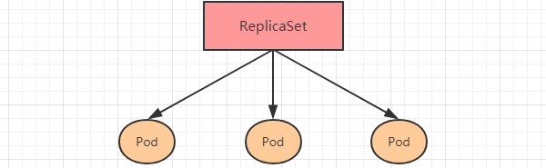

# pod控制器

## Pod控制器介绍

Pod是kubernetes的最小管理单元，在kubernetes中，按照pod的创建方式可以将其分为两类：

- 自主式pod：kubernetes直接创建出来的Pod，这种pod删除后就没有了，也不会重建
- 控制器创建的pod：kubernetes通过控制器创建的pod，这种pod删除了之后还会自动重建

`什么是Pod控制器`** 

Pod控制器是管理pod的中间层，使用Pod控制器之后，只需要告诉Pod控制器，想要多少个什么样的Pod就可以了，它会创建出满足条件的Pod并确保每一个Pod资源处于用户期望的目标状态。如果Pod资源在运行中出现故障，它会基于指定策略重新编排Pod。

在kubernetes中，有很多类型的pod控制器，每种都有自己的适合的场景，常见的有下面这些：

- ReplicationController：比较原始的pod控制器，已经被废弃，由ReplicaSet替代
- ReplicaSet：保证副本数量一直维持在期望值，并支持pod数量扩缩容，镜像版本升级
- Deployment：通过控制ReplicaSet来控制Pod，并支持滚动升级、回退版本
- Horizontal Pod Autoscaler：可以根据集群负载自动水平调整Pod的数量，实现削峰填谷
- DaemonSet：在集群中的指定Node上运行且仅运行一个副本，一般用于守护进程类的任务
- Job：它创建出来的pod只要完成任务就立即退出，不需要重启或重建，用于执行一次性任务
- Cronjob：它创建的Pod负责周期性任务控制，不需要持续后台运行
- StatefulSet：管理有状态应用

## ReplicaSet(RS)

ReplicaSet的主要作用是**保证一定数量的pod正常运行**，它会持续监听这些Pod的运行状态，一旦Pod发生故障，就会重启或重建。同时它还支持对pod数量的扩缩容和镜像版本的升降级。

## Deployment(Deploy)

​为了更好的解决服务编排的问题，kubernetes在V1.2版本开始，引入了Deployment控制器。值得一提的是，这种控制器并不直接管理pod，而是通过管理ReplicaSet来简介管理Pod，即：Deployment管理ReplicaSet，ReplicaSet管理Pod。所以Deployment比ReplicaSet功能更加强大。

Deployment主要功能有下面几个：

- 支持ReplicaSet的所有功能
- 支持发布的停止、继续
- 支持滚动升级和回滚版本

**镜像更新**

deployment支持两种更新策略:`重建更新`和`滚动更新`,可以通过`strategy`指定策略类型,支持两个属性:

~~~markdown
strategy：指定新的Pod替换旧的Pod的策略， 支持两个属性：
  type：指定策略类型，支持两种策略
    Recreate：在创建出新的Pod之前会先杀掉所有已存在的Pod
    RollingUpdate：滚动更新，就是杀死一部分，就启动一部分，在更新过程中，存在两个版本Pod
  rollingUpdate：当type为RollingUpdate时生效，用于为RollingUpdate设置参数，支持两个属性：
    maxUnavailable：用来指定在升级过程中不可用Pod的最大数量，默认为25%。
    maxSurge： 用来指定在升级过程中可以超过期望的Pod的最大数量，默认为25%。
~~~

**金丝雀发布**

​Deployment控制器支持控制更新过程中的控制，如“暂停(pause)”或“继续(resume)”更新操作。

​比如有一批新的Pod资源创建完成后立即暂停更新过程，此时，仅存在一部分新版本的应用，主体部分还是旧的版本。然后，再筛选一小部分的用户请求路由到新版本的Pod应用，继续观察能否稳定地按期望的方式运行。确定没问题之后再继续完成余下的Pod资源滚动更新，否则立即回滚更新操作。这就是所谓的金丝雀发布。

## Horizontal Pod Autoscaler(HPA)

​    在前面的课程中，我们已经可以实现通过手工执行`kubectl scale`命令实现Pod扩容或缩容，但是这显然不符合Kubernetes的定位目标--自动化、智能化。 Kubernetes期望可以实现通过监测Pod的使用情况，实现pod数量的自动调整，于是就产生了Horizontal Pod Autoscaler（HPA）这种控制器。

​    HPA可以获取每个Pod利用率，然后和HPA中定义的指标进行对比，同时计算出需要伸缩的具体值，最后实现Pod的数量的调整。其实HPA与之前的Deployment一样，也属于一种Kubernetes资源对象，它通过追踪分析RC控制的所有目标Pod的负载变化情况，来确定是否需要针对性地调整目标Pod的副本数，这是HPA的实现原理。

## DaemonSet(DS)

​    DaemonSet类型的控制器可以保证在集群中的每一台（或指定）节点上都运行一个副本。一般适用于日志收集、节点监控等场景。也就是说，如果一个Pod提供的功能是节点级别的（每个节点都需要且只需要一个），那么这类Pod就适合使用DaemonSet类型的控制器创建。

DaemonSet控制器的特点：

- 每当向集群中添加一个节点时，指定的 Pod 副本也将添加到该节点上
- 当节点从集群中移除时，Pod 也就被垃圾回收了

