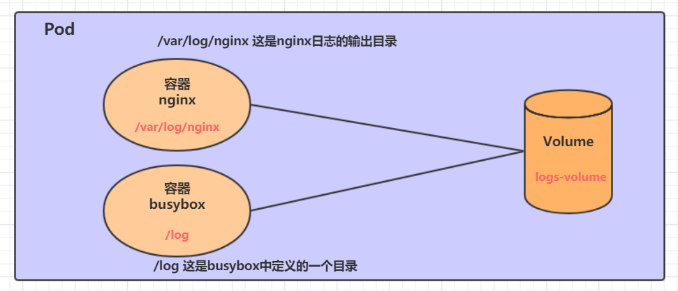

# 数据存储

​    在前面已经提到，容器的生命周期可能很短，会被频繁地创建和销毁。那么容器在销毁时，保存在容器中的数据也会被清除。这种结果对用户来说，在某些情况下是不乐意看到的。为了持久化保存容器的数据，kubernetes引入了Volume的概念。

​    Volume是Pod中能够被多个容器访问的共享目录，它被定义在Pod上，然后被一个Pod里的多个容器挂载到具体的文件目录下，kubernetes通过Volume实现同一个Pod中不同容器之间的数据共享以及数据的持久化存储。Volume的生命容器不与Pod中单个容器的生命周期相关，当容器终止或者重启时，Volume中的数据也不会丢失。

kubernetes的Volume支持多种类型，比较常见的有下面几个：

- 简单存储：EmptyDir、HostPath、NFS
- 高级存储：PV、PVC
- 配置存储：ConfigMap、Secret

## 基本存储

### EmptyDir

​    EmptyDir是最基础的Volume类型，一个EmptyDir就是Host上的一个空目录。

​    EmptyDir是在Pod被分配到Node时创建的，它的初始内容为空，并且无须指定宿主机上对应的目录文件，因为kubernetes会自动分配一个目录，当Pod销毁时， EmptyDir中的数据也会被永久删除。 EmptyDir用途如下：

- 临时空间，例如用于某些应用程序运行时所需的临时目录，且无须永久保留

- 一个容器需要从另一个容器中获取数据的目录（多容器共享目录）

接下来，通过一个容器之间文件共享的案例来使用一下EmptyDir。

​    在一个Pod中准备两个容器nginx和busybox，然后声明一个Volume分别挂在到两个容器的目录中，然后nginx容器负责向Volume中写日志，busybox中通过命令将日志内容读到控制台。

### HostPath

​    上节课提到，EmptyDir中数据不会被持久化，它会随着Pod的结束而销毁，如果想简单的将数据持久化到主机中，可以选择HostPath。

​    HostPath就是将Node主机中一个实际目录挂在到Pod中，以供容器使用，这样的设计就可以保证Pod销毁了，但是数据依据可以存在于Node主机上。

### NFS

​    HostPath可以解决数据持久化的问题，但是一旦Node节点故障了，Pod如果转移到了别的节点，又会出现问题了，此时需要准备单独的网络存储系统，比较常用的用NFS、CIFS。

​    NFS是一个网络文件存储系统，可以搭建一台NFS服务器，然后将Pod中的存储直接连接到NFS系统上，这样的话，无论Pod在节点上怎么转移，只要Node跟NFS的对接没问题，数据就可以成功访问。

### PV和PVC

​    前面已经学习了使用NFS提供存储，此时就要求用户会搭建NFS系统，并且会在yaml配置nfs。由于kubernetes支持的存储系统有很多，要求客户全都掌握，显然不现实。为了能够屏蔽底层存储实现的细节，方便用户使用， kubernetes引入PV和PVC两种资源对象。

​    PV（Persistent Volume）是持久化卷的意思，是对底层的共享存储的一种抽象。一般情况下PV由kubernetes管理员进行创建和配置，它与底层具体的共享存储技术有关，并通过插件完成与共享存储的对接。

​    PVC（Persistent Volume Claim）是持久卷声明的意思，是用户对于存储需求的一种声明。换句话说，PVC其实就是用户向kubernetes系统发出的一种资源需求申请。

使用了PV和PVC之后，工作可以得到进一步的细分：

- 存储：存储工程师维护
- PV：  kubernetes管理员维护
- PVC：kubernetes用户维护

## 配置存储

### ConfigMap

ConfigMap是一种比较特殊的存储卷，它的主要作用是用来存储配置信息的。

### Secret

​    在kubernetes中，还存在一种和ConfigMap非常类似的对象，称为Secret对象。它主要用于存储敏感信息，例如密码、秘钥、证书等等。

