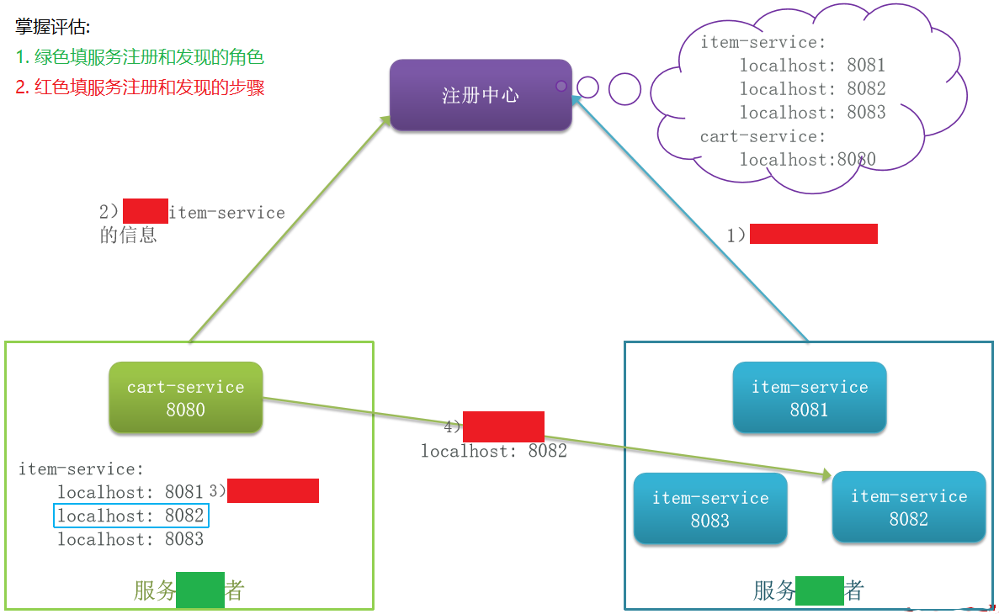

# 服务注册和发现

## 最佳实践


### 掌握评估

- 服务注册和发现的流程

    

    服务提供者通过`()`机制向注册中心报告自己的`()`，当心跳异常时注册中心会将异常服务`()`，并`()`订阅了该服务的消费者

### 题目总结


1. 服务提供者会在启动时`注册自己`到`注册中心`
2. 服务消费者可以从`注册中心`中`订阅`服务信息
3. `负载均衡`，挑选一个实例
4. `远程调用`

✨服务提供者通过`心跳`机制向注册中心报告自己的`健康状态`，当心跳异常时注册中心会将异常服务剔除，并`通知`订阅了该服务的消费者


## 服务注册和发现(又称服务治理)中的三个角色

- 服务提供者：暴露服务接口，供其它服务调用
- 服务消费者：调用其它服务提供的接口
- 注册中心：记录并监控微服务各实例状态，推送服务变更信息


## 服务注册和发现的流程


1. 服务提供者会在启动时`注册自己`到`注册中心`
2. 服务消费者可以从`注册中心`中`订阅`服务信息
3. `负载均衡`，挑选一个实例
4. `远程调用`


✨服务提供者通过`心跳`机制向注册中心报告自己的`健康状态`，当心跳异常时注册中心会将异常服务剔除，并`通知`订阅了该服务的消费者


Nacos是目前国内企业中占比最多的注册中心组件。它是阿里巴巴的产品，目前已经加入SpringCloudAlibaba中。

```java
// 1.根据服务名称拉取服务的实例列表
List<ServiceInstance> instances = discoveryClient.getInstances("item-service");
// 2.负载均衡，挑选一个实例
ServiceInstance instance = instances.get(RandomUtil.randomInt(instances.size()));
// 3.发送请求，查询商品
ResponseEntity<List<ItemDTO>> response = restTemplate.exchange(
        instance.getUri() + "/items?ids={ids}", // 请求路径
        HttpMethod.GET, // 请求方式
        null, // 请求实体
        new ParameterizedTypeReference<List<ItemDTO>>() {}, // 返回值类型
        Map.of("ids", CollUtil.join(itemIds, ",") // 请求参数
);
```