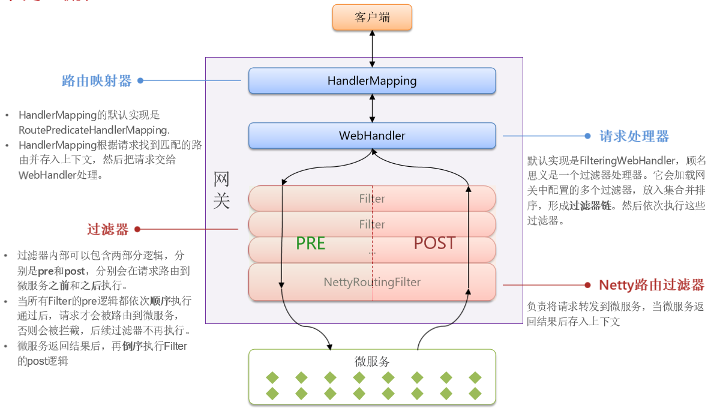
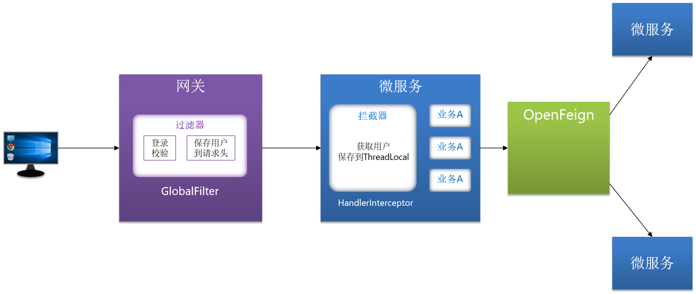
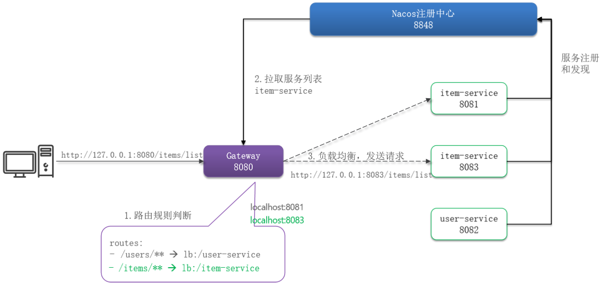

# 网关

## 最佳实践

### 掌握评估

- 网关的作用
    - `()`
    - `()`

### 问题总结

- 网关的作用
    - `路由, 转发, 负载均衡`
    - `身份校验`

## 网关

网关：就是网络的关口，负责请求的路由、转发、身份校验。使用的是SpringCloudGateWay

网关路由对应的Java类型是RouteDefinition，其中常见的属性有：

- id：路由唯一标示
- uri：路由目标地址
- predicates：路由断言，判断请求是否符合当前路由。
- filters：路由过滤器，对请求或响应做特殊处理。

✨predicates: Spring提供了12种基本的RoutePredicateFactory实现

| 名称                 | 说明                               | 示例                                                         |
| -------------------- | ---------------------------------- | ------------------------------------------------------------ |
| After                | 是某个时间点后的请求               | - `After=2037-01-20T17:42:47.789-07:00[America/Denver]`        |
| Before               | 是某个时间点之前的请求             | - `Before=2031-04-13T15:14:47.433+08:00[Asia/Shanghai]`        |
| Between              | 是某两个时间点之间的请求           | - `Between=2037-01-20T17:42:47.789-07:00[America/Denver],2037-01-21T17:42:47.789-07:00[America/Denver]` |
| Cookie               | 请求必须包含某些cookie             | - `Cookie=chocolate,ch.p`                                     |
| Header               | 请求必须包含某些header             | - `Header=X-Request-Id,\d+`                                   |
| Host                 | 请求必须是访问某个host（域名）     | - `Host=**.somehost.org,**.anotherhost.org`                    |
| Method               | 请求方式必须是指定方式             | - `Method=GET,POST`                                            |
| Path                 | 请求路径必须符合指定规则           | - `Path=/red/{segment},/blue/**`                               |
| Query                | 请求参数必须包含指定参数           | - `Query=name,Jack` 或者 - `Query=name`                         |
| RemoteAddr           | 请求者的ip必须是指定范围           | - `RemoteAddr=192.168.1.1/24`                                  |
| Weight               | 权重处理                           | - `Weight=group1,2`                                           |
| XForwardedRemoteAddr | 基于请求的来源IP做判断             | - `XForwardedRemoteAddr=192.168.1.1/24`                        |

✨filters: 网关中提供了33种路由过滤器，每种过滤器都有独特的作用。

| 名称                | 说明                               | 示例                                      |
| ------------------- | ---------------------------------- | ----------------------------------------- |
| AddRequestHeader    | 给当前请求添加一个请求头           | `AddrequestHeader=headerName,headerValue`   |
| RemoveRequestHeader | 移除请求中的一个请求头             | `RemoveRequestHeader=headerName`            |
| AddResponseHeader   | 给响应结果中添加一个响应头         | `AddResponseHeader=headerName,headerValue`  |
| RemoveResponseHeader| 从响应结果中移除一个响应头         | `RemoveResponseHeader=headerName`           |
| RewritePath         | 请求路径重写                       | `RewritePath=/red/?(?<segment>.*), /$\{segment}` |
| StripPrefix         | 去除请求路径中的N段前缀            | `StripPrefix=1，则路径/a/b转发时只保留/b`   |

## 网关登录校验

需求：在网关中基于过滤器实现登录校验功能

- 如何在网关转发之前做登录校验？
- 网关如何将用户信息传递给微服务？
- 如何在微服务之间传递用户信息

提示：黑马商城是基于JWT实现的登录校验。

## 网关负载均衡

