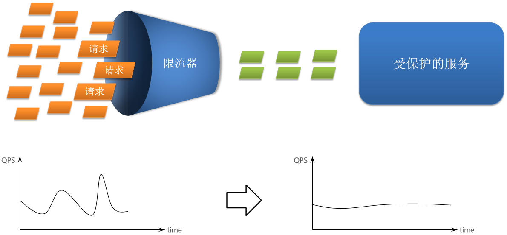
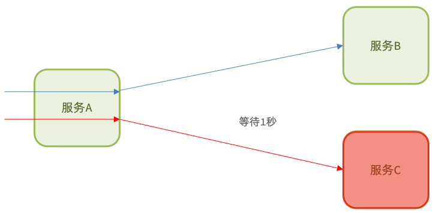
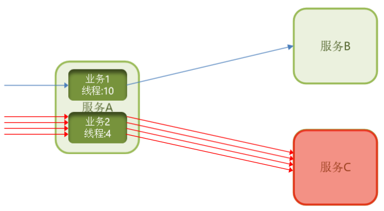
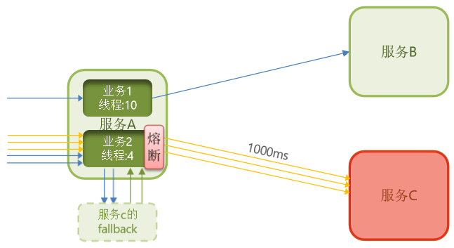
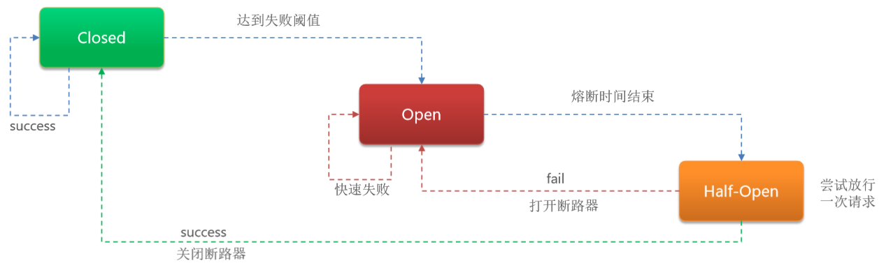

# 服务保护

## 最佳实践

### 掌握评估

1. 微服务雪崩
    - 服务故障 -> `()`
    - 服务故障 -> `()` -> `()` -> `()`

2. 解决方案
    - `()`: 避免因瞬间高并发流量而导致服务故障
    - `()`：设定超时时间，请求超过一定时间没有响应就返回错误信息，不会无休止等待
    - `()`：限定每个业务能使用的线程数，避免耗尽整个tomcat的资源，避免故障扩散。
    - `()`：由断路器统计请求的异常比例或慢调用比例，如果超出阈值则会熔断该业务，则拦截该接口的请求。熔断期间，所有请求快速失败，全都走fallback逻辑。而当服务恢复时，断路器会放行访问该服务的请求。

        状态机包括三个状态：

        - `()`，断路器放行所有请求，并开始统计异常比例、慢请求比例。超过阈值则切换到open状态
        - `()`，服务调用被熔断，访问被熔断服务的请求会被拒绝，快速失败，直接走降级逻辑。Open状态5秒后会进入half-open状态
        - `()`，放行`()`次请求，根据执行结果来判断接下来的操作。
            - 请求成功：则切换到`()`状态
            - 请求失败：则切换到`()`状态

### 问题总结

1. 微服务雪崩
    - 服务故障 -> `依赖该服务的服务阻塞`
    - 服务故障 -> `大量请求阻塞` -> `服务器资源耗尽` -> `该服务器的其他服务变得不可用`

2. 解决方案
    - `请求限流`: 避免因瞬间高并发流量而导致服务故障
    - `超时处理`：设定超时时间，请求超过一定时间没有响应就返回错误信息，不会无休止等待
    - `线程隔离`：限定每个业务能使用的线程数，避免耗尽整个tomcat的资源，避免故障扩散。
    - `熔断降级`：由断路器统计请求的异常比例或慢调用比例，如果超出阈值则会熔断该业务，则拦截该接口的请求。熔断期间，所有请求快速失败，全都走fallback逻辑。而当服务恢复时，断路器会放行访问该服务的请求。

        状态机包括三个状态：

        - `closed：关闭状态`，断路器放行所有请求，并开始统计异常比例、慢请求比例。超过阈值则切换到open状态
        - `open：打开状态`，服务调用被熔断，访问被熔断服务的请求会被拒绝，快速失败，直接走降级逻辑。Open状态5秒后会进入half-open状态
        - `half-open：半开状态`，放行一次请求，根据执行结果来判断接下来的操作。
            - 请求成功：则切换到closed状态
            - 请求失败：则切换到open状态

## 雪崩问题

雪崩问题是微服务之间相互调用，因为调用链中的一个服务故障，引起整个链路都无法访问的情况。

服务A和其他服务需要服务D响应，但此时服务D故障了，服务A无法接收到结果。由于服务器支持的线程和并发数有限，请求一致阻塞会导致服务器资源耗尽，从而导致依赖于当前服务的其它服务随着时间的推移，最终也都会变的不可用，形成级联失败，雪崩就发生了

- 与服务D线程有关的服务雪崩：服务D故障——> 服务A等有关服务阻塞
- 与服务D线程无关服务雪崩：服务D故障——> 大量请求阻塞 ——> 服务器资源耗尽 ——>其他服务变得不可用 ——> 级联失败（雪崩）

## 解决方案

- 限流是对服务的保护，避免因瞬间高并发流量而导致服务故障，进而避免雪崩。是一种预防措施。

    - 请求限流：限制访问微服务的请求的并发量，避免服务因流量激增出现故障。

        

- 超时处理、线程隔离、降级熔断是在部分服务故障时，将故障控制在一定范围，避免雪崩。是一种补救措施。

    - 超时处理：设定超时时间，请求超过一定时间没有响应就返回错误信息，不会无休止等待

        

    - 线程隔离：限定每个业务能使用的线程数，避免耗尽整个tomcat的资源，避免故障扩散。如图服务C出现故障, 则将业务2的线程数从10调整为4, 避免故障扩散.

        

    - 熔断降级：由断路器统计请求的异常比例或慢调用比例，如果超出阈值则会熔断该业务，则拦截该接口的请求。熔断期间，所有请求快速失败，全都走fallback逻辑。而当服务恢复时，断路器会放行访问该服务的请求。

    
    

    状态机包括三个状态：

    - closed：关闭状态，断路器放行所有请求，并开始统计异常比例、慢请求比例。超过阈值则切换到open状态
    - open：打开状态，服务调用被熔断，访问被熔断服务的请求会被拒绝，快速失败，直接走降级逻辑。Open状态5秒后会进入half-open状态
    - half-open：半开状态，放行一次请求，根据执行结果来判断接下来的操作。
        - 请求成功：则切换到closed状态
        - 请求失败：则切换到open状态

## Sentinel

Sentinel是阿里巴巴开源的一款微服务流量控制组件。

## 参考

- https://www.cnblogs.com/sexintercourse/p/18646562