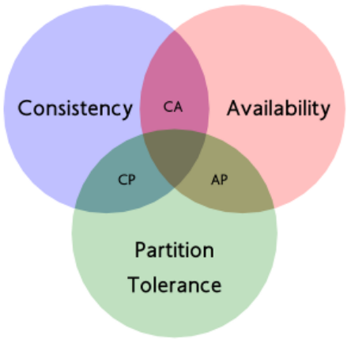

# 分布式事务

## 最佳实践

### 考察问

- 事务的特点: `()`, `()`, `()`, `()`
    - 原子性: 执行单元中的操作
        - 要么`()`执行成功，要么`()`失败。
        - 有一部分成功一部分失败那么成功的操作要全部`()`到执行前的状态。
    - 一致性: 执行一次事务会使用数据从一个正确的状态转换到另一个正确的状态, `()`是完整的。
    - 隔离性：在该事务执行的过程中，
        - 任何数据的改变只存在于`()`
        - 只有`()`其它事务才可以查询到最新的数据。
    - 持久性：事务完成后对数据的改变会永久性的`()`起来，即使发生断电宕机数据依然在。

- CAP理论
    - CAP包含三个部分: `()`, `()`, `()`
        - 一致性: 不能让请求者读到`()`的数据
        - 可用性: 请求在给定`()`内有`()`返回
        - 分区容忍性: 系统可以出现`()`

    - CAP两两组合:
        - CP：当一套系统在发生`()`后，客户端的任何请求都被`()`，但是，系统的每个节点总是会返回`()`的数据.
        - AP：当一套系统在发生`()`后，可以返回`()`数据, 放弃`()`一致性仅追求`()`一致性

### 考察点

- 事务的特点: `原子性`, `一致性`, `隔离性`, `持久性`
    - 原子性: 执行单元中的操作
        - 要么`全部`执行成功，要么`全部`失败。
        - 有一部分成功一部分失败那么成功的操作要全部`回滚`到执行前的状态。
    - 一致性: 执行一次事务会使用数据从一个正确的状态转换到另一个正确的状态, `执行过程`是完整的。
    - 隔离性：在该事务执行的过程中，
        - 任何数据的改变只存在于`该事务之中`
        - 只有`事务提交后`其它事务才可以查询到最新的数据。
    - 持久性：事务完成后对数据的改变会永久性的`存储`起来，即使发生断电宕机数据依然在。

- CAP理论
    - CAP包含三个部分: `一致性`, `可用性`, `分区容忍性`
        - 一致性: 不能让请求者读到`不一样`的数据
        - 可用性: 请求在给定`时间`内有`结果`返回
        - 分区容忍性: 系统可以出现`网络故障`

    - CAP两两组合:
        - CP：当一套系统在发生`分区故障`后，客户端的任何请求都被`卡死或者超时`，但是，系统的每个节点总是会返回`一致`的数据.
        - AP：当一套系统在发生`分区故障`后，可以返回`不一致`数据, 放弃`强`一致性仅追求`最终`一致性

## 事务

事务是指由一组操作组成的一个工作单元，这个工作单元具有原子性（atomicity）、一致性（consistency）、隔离性（isolation）和持久性（durability），这就是事务的ACID特性。

- 原子性：执行单元中的操作要么`全部`执行成功，要么`全部`失败。如果有一部分成功一部分失败那么成功的操作要全部`回滚`到执行前的状态。🌰一笔从银行的A账户转账到B账户的交易。它由两个操作组成，从A账户扣款然后保存到B账户，以原子事务执行这笔交易保证了数据库中数据一致的状态，也就是说，任何一个事务失败了，钱都不会减少或者增加。
- 一致性：执行一次事务会使用数据从一个正确的状态转换到另一个正确的状态, `执行过程`是完整的。如果不使用事务，那么在数据库执行多条语句的时候，有可能中间会出现问题而导致只执行了部分语句，因此，我们在这多条语句前面加上begintransaction，最后加上endtransaction，这就是很清楚的标明了，在这些语句执行前，系统是处于一致性状态的，而在这些语句执行后，系统也是处于一致性状态的
- 隔离性：在该事务执行的过程中，任何数据的改变只存在于`该事务之中`。只有`事务提交后`其它事务才可以查询到最新的数据。
- 持久性：事务完成后对数据的改变会永久性的`存储`起来，即使发生断电宕机数据依然在。

## 本地事务

本地事务就是用关系型数据库来控制事务，关系数据库通常都具有ACID特性。传统的单体应用通常会将数据全部存储在一个数据库中，会借助关系型数据库来完成事务控制。

## 分布式事务

涉及`多个`系统通过`网络`协同完成的事务称为分布式事务。例如电商项目中用户下单，此时就需要订单系统和库存系统协同来完成整个下单操作，即首先调用订单系统添加订单，然后调用库存系统扣减库存。

这里强调的是多个系统通过网络协同完成一个事务的过程，并不强调多个系统访问了不同的数据库，即使多个系统访问的是同一个数据库也是分布式事务。 如下图两种形式都属于分布式事务：

另外一种分布式事务的表现是，一个应用程序使用了多个数据源连接了不同的数据库，当一次事务需要操作多个数据源，此时也属于分布式事务，当系统作了数据库拆分后会出现此种情况。

## CAP理论

CAP理论是分布式事务处理的理论基础，其内容是：分布式系统在设计时只能在一致性(Consistency)、可用性(Availability)、分区容忍性(Partition Tolerance)中满足两种，无法兼顾三种。

✨由于CAP是学术理论，并不是工程理论，它会舍弃很多现实世界的问题。比如网络的时长，比如节点内部的处理速度不一致，比如节点间存储方式和速度的不一致。它说的一致性就是客户端是否能拿到最新数据，它说的可用性就是允许客户端拿不到最新数据。

### CAP包含三个部分

通过下图理解CAP理论：

- 一致性(Consistency)：服务A、B两个结点都存储了用户数据, 当一个A节点数据发生改变后, B节点也要发生一样的改变, 不能让请求者读到不一样的数据。这时AB改变数据就变成了一个事务, 在事务中, 请求无法返回数据.

- 可用性(Availability)：请求在给定`时间`内有`结果`返回。
    - 给定`时间`: 如果业务定的 100 毫秒，结果却在 1 秒才返回，那么这个系统就不满足可用性。
    - 有结果返回:
        - A节点`宕机`, B节点`正常返回`, 系统依然是可用的
        - A节点`最新`数据, B节点是`上一版本`的数据, 返回上一版本的数据, 系统仍然是可用的

- 分区容忍性(Partition Tolerance)：分布式系统是多个系统通过网络协同工作的，节点之间难免会出现网络中断、网延延迟等现象，这就是网络分区。既节点通信出现了问题，那么就出现了分区。分区容忍性是指如果出现了分区问题，我们的分布式存储系统还需要继续运行。

### CAP两两组合

同时满足“一致性”、“可用性”和“分区容忍性”三者是几乎不可能的。只能选择其中两个, 他们的组合方式为:

- CP：当一套系统在发生分区故障后，客户端的任何请求都被卡死或者超时，但是，系统的每个节点总是会返回一致的数据. 比如Zookeeper。比如跨行转账，一次转账请求要等待双方银行系统都完成整个事务才算完成。产生的问题: 由于网络问题的存在CP系统可能会出现待等待超时，如果没有处理超时问题则整理系统会出现阻塞。

- AP：当一套系统在发生分区故障后，可以返回不一致数据, 放弃强一致性仅追求最终一致性，很多NoSQL数据库按照AP进行设计。✨追求最终一致性是指允许暂时的数据不一致，只要最终在用户接受的时间内数据一致即可。

- CA：放弃分区容忍性，加强一致性和可用性，关系数据库按照CA进行设计。不要分区, 现实中不存在, 因为，在分布式系统内，P是必然的发生的，不选P，一旦发生分区错误，整个分布式系统就完全无法使用了，这是不符合实际需要的。所以，对于分布式系统，我们只能能考虑当发生分区错误时，如何选择一致性和可用性。

总结： 在分布式系统设计中AP的应用较多，即保证分区容忍性和可用性，牺牲数据的强一致性（写操作后立刻读取到最新数据），保证数据最终一致性。比如：订单退款，今日退款成功，明日账户到账，只要在预定的用户可以接受的时间内退款事务走完即可。

### 分布式组件与CAP理论

|应用名字|应用类型|CP/AP|分布式协议|描述|
|----|----|----|----|----|
|Nacos|注册中心|AP/CP|1.AP:distro（Nacos自定义的分布式一致性协议）2.CP:简化版raft|客户端在向Nacos进行注册时，可以通过ephemeral选择AP或CP模式|
|Eureka|注册中心|AP|对等复制（PeertoPeer）|
|Consul|注册中心|CP|raft|客户端在向Nacos进行注册时，通过ephemeral=false来选择CP模式|
|Zookeeper|分布式协调组件、注册中心|CP|ZAB||
|Redis|NoSql|AP|主从异步同步数据|写操作操作主节点，主节点将写操作异步同步到从节点|

## 参考

- <https://cloud.tencent.com/developer/article/1860632>
