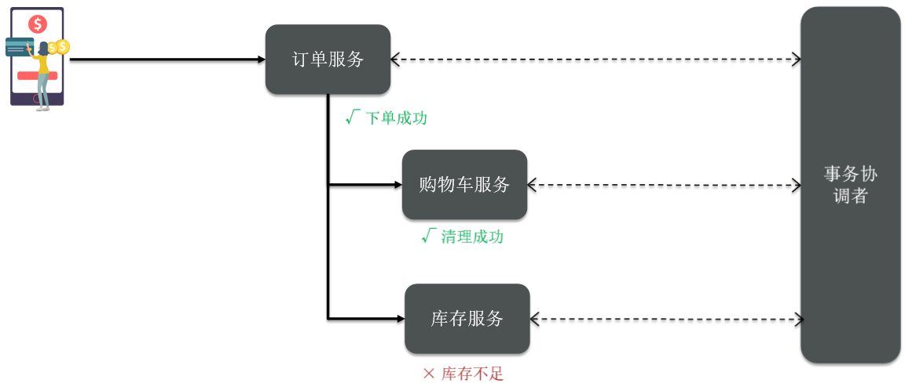
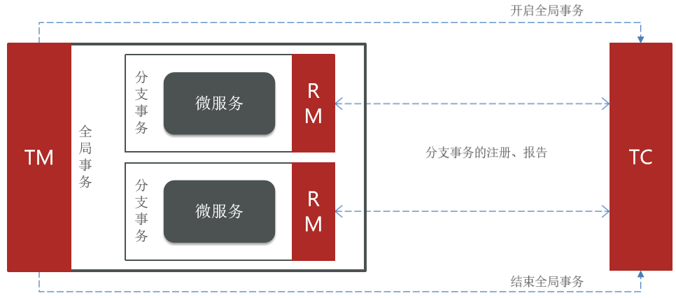
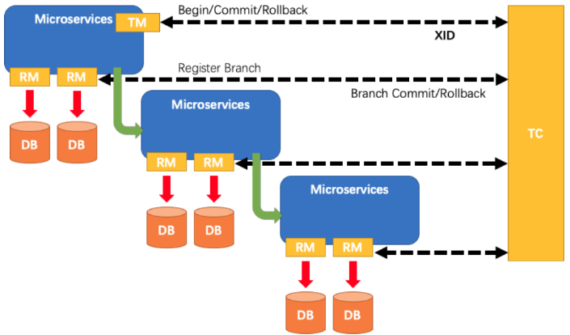
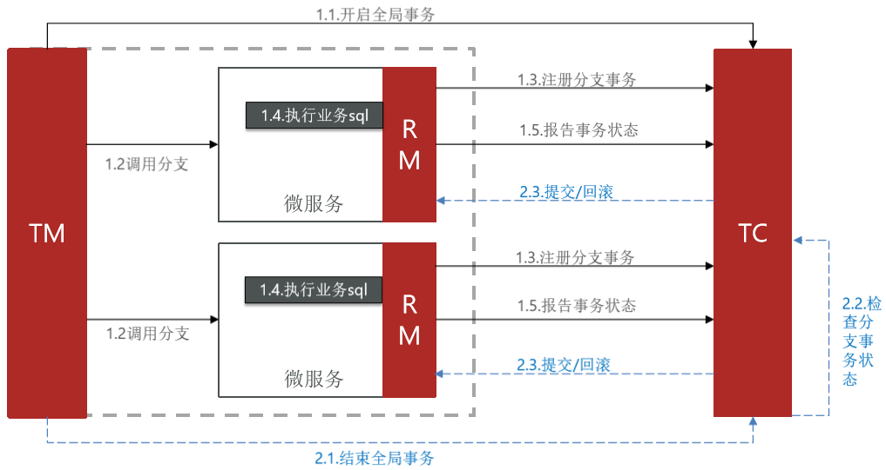
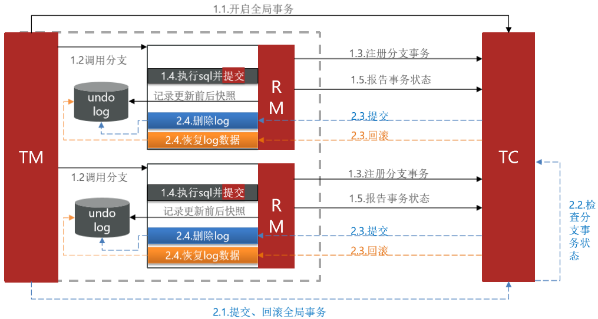

# Seata

## 考察问

- Seata有3个基本组成部分：
    - `()`：维护全局事务和分支事务的状态，驱动全局提交或回滚
    - `()`：定义全局事务的范围：开始全局事务，提交或回滚全局事务
    - `()`：管理正在处理的分支事务的资源，与TC对话以注册分支事务并报告分支事务的状态，并驱动分支事务的提交或回滚
- XA和AT模式的区别
    - XA模式一阶段`()`事务，`()`资源；AT模式一阶段`()`事务，`()`资源。✨执行SQL, 提交事务是两个概念
    - XA模式依赖`()`实现回滚；AT模式利用`()`实现数据回滚。
    - XA模式`()`；AT模式`()`

## 考察点

- Seata有3个基本组成部分：
    - `事务协调器（TC，Transaction Coordinator）`：维护全局事务和分支事务的状态，驱动全局提交或回滚
    - `事务管理器（TM，Transaction Manager）`：定义全局事务的范围：开始全局事务，提交或回滚全局事务
    - `资源管理器（RM，Resource Manager）`：管理正在处理的分支事务的资源，与TC对话以注册分支事务并报告分支事务的状态，并驱动分支事务的提交或回滚
- XA和AT模式的区别
    - XA模式一阶段`不提交`事务，`锁定`资源；AT模式一阶段`提交`事务，`不锁定`资源。✨执行SQL, 提交事务是两个概念
    - XA模式依赖`数据库机制`实现回滚；AT模式利用`数据快照`实现数据回滚。
    - XA模式`强一致`；AT模式`最终一致`

## Seata

解决分布式事务，各个子事务之间必须能感知到彼此的事务状态，才能保证状态一致。

[Seata](https://github.com/seata/seata)是阿里巴巴2019年开源的分布式事务解决方案，致力于在微服务架构下提供高性能和简单易用的分布式事务服务。

Seata有3个基本组成部分：

- 事务协调器（TC，Transaction Coordinator）：维护全局事务和分支事务的状态，驱动全局提交或回滚
- 事务管理器（TM，Transaction Manager）：定义全局事务的范围：开始全局事务，提交或回滚全局事务
- 资源管理器（RM，Resource Manager）：管理正在处理的分支事务的资源，与TC对话以注册分支事务并报告分支事务的状态，并驱动分支事务的提交或回滚

### 生命周期

Seata管理的分布式事务的典型生命周期：

- TM要求TC开始一项新的全局事务。TC生成代表全局事务的XID。
- XID通过微服务的调用链传播。
- RM将本地事务注册为XID到TC的相应全局事务的分支。
- TM要求TC提交或回退相应的XID全局事务。
- TC驱动XID的相应全局事务下的所有分支事务以完成分支提交或回滚。

### XA模式

XA规范是X/Open组织定义的分布式事务处理（DTP，Distributed Transaction Processing）标准，XA规范 描述了全局的TM与局部的RM之间的接口，几乎所有主流的关系型数据库都对XA规范提供了支持。Seata的XA模式如下：

1. 一阶段的工作：
    - RM注册分支事务到TC
    - RM执行分支业务sql但不提交
    - RM报告执行状态到TC
2. 二阶段的工作：
    - TC检测各分支事务执行状态
        - 如果都成功，通知所有RM提交事务
        - 如果有失败，通知所有RM回滚事务
    - RM接收TC指令，提交或回滚事务

XA模式的优缺点:

- 优点
    - 事务的强一致性，满足ACID原则
    - 常用数据库都支持，实现简单，并且没有代码侵入
- 缺点
    - 因为一阶段需要锁定数据库资源，等待二阶段结束才释放，性能较差
    - 依赖关系型数据库实现事务

### AT模式

Seata主推的是AT模式，AT模式同样是分阶段提交的事务模型，不过缺弥补了XA模型中资源锁定周期过长的缺陷。

1. 阶段一RM的工作：
    1. 注册分支事务
    2. 记录undo-log（数据快照）
    3. 执行业务sql并提交
    4. 报告事务状态
2. 阶段二
    - 提交时RM的工作：删除undo-log即可
    - 滚时RM的工作：根据undo-log恢复数据到更新前

### XT和AT的区别

- XA模式一阶段`不提交`事务，`锁定`资源；AT模式一阶段`提交`事务，`不锁定`资源。✨执行SQL, 提交事务是两个概念
- XA模式依赖`数据库机制`实现回滚；AT模式利用`数据快照`实现数据回滚。
- XA模式强一致；AT模式最终一致
