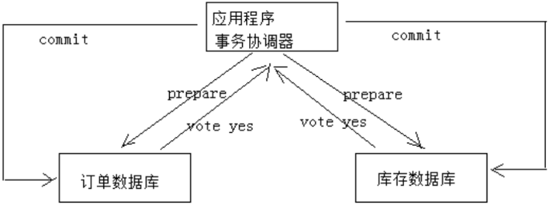
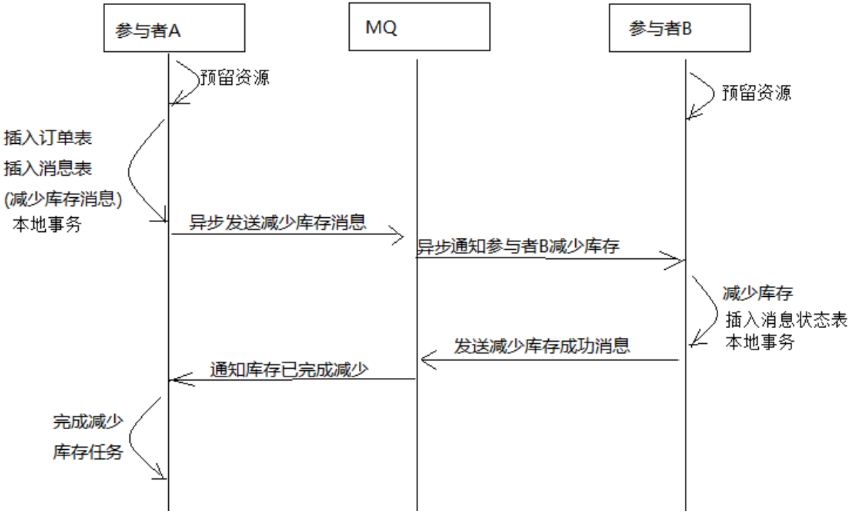
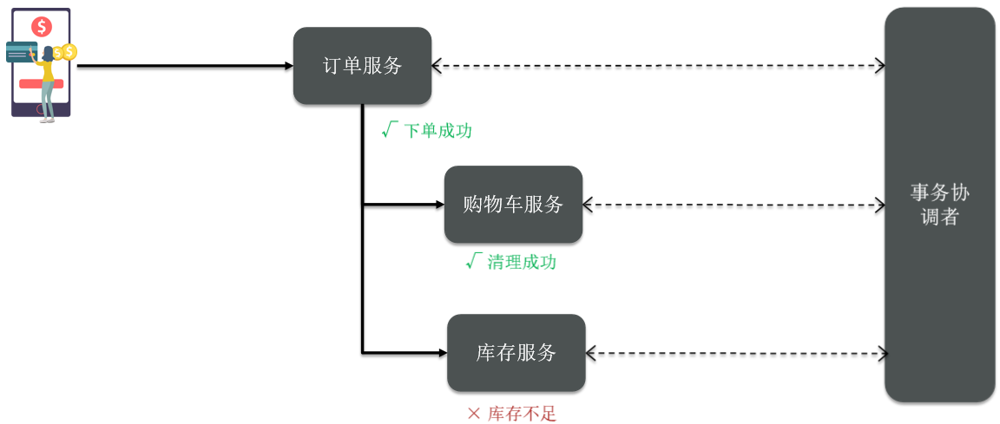
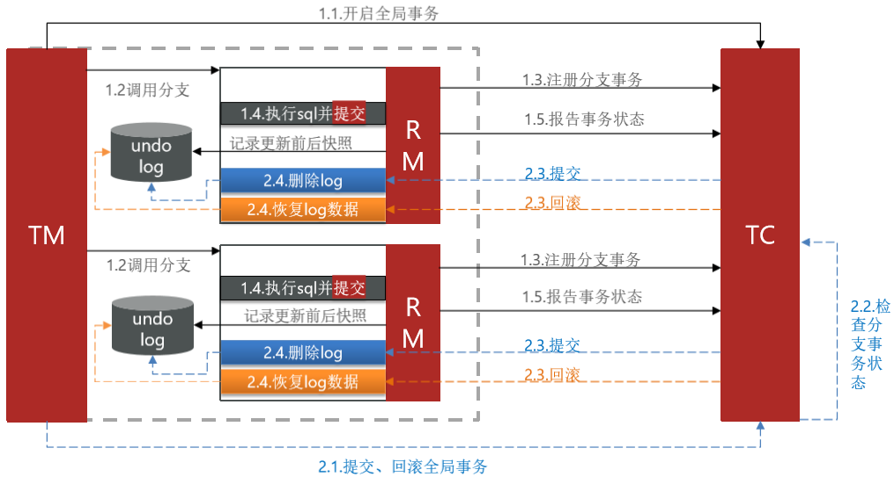

# 分布式事务

## 事务

事务是指由一组操作组成的一个工作单元，这个工作单元具有原子性（atomicity）、一致性（consistency）、隔离性（isolation）和持久性（durability），这就是事务的ACID特性。

- 原子性：执行单元中的操作要么全部执行成功，要么全部失败。如果有一部分成功一部分失败那么成功的操作要全部回滚到执行前的状态。
- 一致性：执行一次事务会使用数据从一个正确的状态转换到另一个正确的状态，执行前后数据都是完整的。
- 隔离性：在该事务执行的过程中，任何数据的改变只存在于该事务之中，对外界没有影响，事务与事务之间是完全隔离的。只有事务提交后其它事务才可以查询到最新的数据。
- 持久性：事务完成后对数据的改变会永久性的存储起来，即使发生断电宕机数据依然在。

## 本地事务

本地事务就是用关系型数据库来控制事务，关系数据库通常都具有ACID特性。传统的单体应用通常会将数据全部存储在一个数据库中，会借助关系型数据库来完成事务控制。

## 分布式事务

在分布式系统中一次操作由多个系统协同完成，这种一次事务操作涉及多个系统通过网络协同完成的过程称为分布 式事务。例如电商项目中用户下单，此时就需要订单系统和库存系统协同来完成整个下单操作，即首先调用订单系统添加订单，然后调用库存系统扣减库存。

这里强调的是多个系统通过网络协同完成一个事务的过程，并不强调多个系统访问了不同的数据库，即使多个系统访问的是同一个数据库也是分布式事务。 如下图两种形式都属于分布式事务：

## CAP理论

如何保证分布式事务？CAP理论是分布式事务处理的理论基础，了解了CAP理论有助于我们研究分布式事务的处理 方案。 CAP理论是：分布式系统在设计时只能在一致性(Consistency)、可用性(Availability)、分区容忍性(Partition Tolerance)中满足两种，无法兼顾三种。

通过下图理解CAP理论：

一致性(Consistency)：服务A、B、C三个结点都存储了用户数据， 三个结点的数据需要保持同一时刻数据一致 性。

可用性(Availability)：服务A、B、C三个结点，其中一个结点宕机不影响整个集群对外提供服务，如果只有服务A结 点，当服务A宕机整个系统将无法提供服务，增加服务B、C是为了保证系统的可用性。

分区容忍性(Partition Tolerance)：分布式系统不可避免的出现了多个系统通过网络协同工作的场景，节点之间难 免会出现网络中断、网延延迟等现象，这种现象一旦出现就导致数据被分散在不同的结点上，这就是网络分区。 当一个数据项只在一个节点中保存，那么分区出现后，和这个节点不连通的部分就访问不到这个数据了，这时分区就是无法容忍的。提高分区容忍性的办法就是一个数据项复制到多个节点上，那么出现分区之后，这一数据项就可能分布到各个区里，容忍性就提高了。总的来说就是，数据存在的节点越多，分区容忍性越高，但要复制更新的数据就越多，一致性就越难保证。为了保证一致性，更新所有节点数据所需要的时间就越长，可用性就会降低。

分布式系统能否兼顾C、A、P？ 在保证分区容忍性的前提下一致性和可用性无法兼顾，如果要提高系统的可用性就要增加多个结点，如果要保证数据的一致性就要实现每个结点的数据一致，节点越多可用性越好，但是数据一致性越差。 所以，在进行分布式系统设计时，同时满足“一致性”、“可用性”和“分区容忍性”三者是几乎不可能的。

CAP有哪些组合方式？

1、CA：放弃分区容忍性，加强一致性和可用性，关系数据库按照CA进行设计。

2、AP：放弃一致性，加强可用性和分区容忍性，追求最终一致性，很多NoSQL数据库按照AP进行设计。 说明：这里放弃一致性是指放弃强一致性，强一致性就是写入成功立刻要查询出最新数据。追求最终一致性是指允许暂时的数据不一致，只要最终在用户接受的时间内数据一致即可。

3、CP：放弃可用性，加强一致性和分区容忍性，一些强一致性要求的系统按CP进行设计，比如跨行转账，一次转 账请求要等待双方银行系统都完成整个事务才算完成。 说明：由于网络问题的存在CP系统可能会出现待等待超时，如果没有处理超时问题则整理系统会出现阻塞。

总结： 在分布式系统设计中AP的应用较多，即保证分区容忍性和可用性，牺牲数据的强一致性（写操作后立刻读取到最 新数据），保证数据最终一致性。比如：订单退款，今日退款成功，明日账户到账，只要在预定的用户可以接受的时间内退款事务走完即可。

## 解决方案

### 两阶段提交协议(2PC)

为解决分布式系统的数据一致性问题出现了两阶段提交协议（2 Phase Commitment Protocol），两阶段提交由 协调者和参与者组成，共经过两个阶段和三个操作，部分关系数据库如Oracle、MySQL支持两阶段提交协议，本节讲解关系数据库两阶段提交协议。

2PC协议流程图：

第一阶段：准备阶段(prepare) 协调者通知参与者准备提交订单，参与者开始投票。 参与者完成准备工作向协调者回应Yes。

第二阶段：提交(commit)/回滚(rollback)阶段 协调者根据参与者的投票结果发起最终的提交指令。 如果有参与者没有准备好则发起回滚指令。

下图是一个下单减库存的例子：

1、应用程序连接两个数据源。

2、应用程序通过事务协调器向两个库发起prepare，两个数据数据库收到消息分别执行本地事务（记录日志），但不提交，如果执行成功则回复yes，否则回复no。

3、事务协调器收到回复，只要有一方回复no则分别向参与者发起回滚事务，参与者开始回滚事务。

4、事务协调器收到回复，全部回复yes，此时向参与者发起提交事务。如果参与者有一方提交事务失败则由事务协调器发起回滚事务。

 

优点：实现强一致性，部分关系数据库支持（Oracle、MySQL等）。

缺点：整个事务的执行需要由协调者在多个节点之间去协调，增加了事务的执行时间，性能低下。

解决方案有：springboot+Atomikos or Bitronix

### 2.5.2 事务补偿(TCC)

TCC事务补偿是基于2PC实现的业务层事务控制方案，它是Try、Confirm和Cancel三个单词的首字母，含义如下：

1、Try 检查及预留业务资源，完成提交事务前的检查，并预留好资源。
2、Confirm 确定执行业务操作，对try阶段预留的资源正式执行。
3、Cancel 取消执行业务操作，对try阶段预留的资源释放。

下面用一个下单减库存的业务为例来说明：

1、Try 下单业务由订单服务和库存服务协同完成，在try阶段订单服务和库存服务完成检查和预留资源。 订单服务检查当前是否满足提交订单的条件（比如：当前存在未完成订单的不允许提交新订单）。 库存服务检查当前是否有充足的库存，并锁定资源。

2、Confirm 订单服务和库存服务成功完成Try后开始正式执行资源操作。 订单服务向订单写一条订单信息。 库存服务减去库存。

3、Cancel 如果订单服务和库存服务有一方出现失败则全部取消操作。 订单服务需要删除新增的订单信息。 库存服务将减去的库存再还原。

 

优点：最终保证数据的一致性，在业务层实现事务控制，灵活性好。

缺点：开发成本高，每个事务操作每个参与者都需要实现try/confirm/cancel三个接口。

 

注意：TCC的try/confirm/cancel接口都要实现幂等性，因为在try、confirm、cancel失败后要不断重试。

什么是幂等性？

幂等性是指同一个操作无论请求多少次，其结果都相同。

实现方式有：

1、操作之前在业务方法进行判断如果执行过了就不再执行。

2、缓存所有请求和处理的结果，已经处理的请求则直接返回结果。

3、在数据库表中加一个状态字段（未处理，已处理），数据操作时判断未处理时再处理。

## 消息队列实现最终一致性

本方案是将分布式事务拆分成多个本地事务来完成，并且由消息队列异步协调完成。 下边以下单减少库存为例来说明：

1、订单服务和库存服务完成检查和预留资源。

2、订单服务在本地事务中完成添加订单表记录和添加“减少库存任务消息”。

3、由定时任务根据消息表的记录发送给MQ通知库存服务执行减库存操作。

4、库存服务执行减少库存，并且记录执行消息状态（为避免重复执行消息，在执行减库存之前查询是否执行过此 消息）。

5、库存服务向MQ发送完成减少库存的消息。

6、订单服务接收到完成库存减少的消息后删除原来添加的“减少库存任务消息”。

实现最终事务一致性要求：预留资源成功理论上要求正式执行成功，如果执行失败会进行重试，要求业务执行方法实现幂等。

 

优点 ： 由MQ按异步的方式协调完成事务，性能较高。 不用实现try/confirm/cancel接口，开发成本比TCC低。

缺点： 此种方式基于关系数据库本地事务来实现，会出现频繁读写数据库记录，浪费数据库资源，另外对于高并发操作不是最佳方案。

## 分布式事务解决方案

解决分布式事务，各个子事务之间必须能感知到彼此的事务状态，才能保证状态一致。

[Seata](https://github.com/seata/seata)是阿里巴巴2019年开源的分布式事务解决方案，致力于在微服务架构下提供高性能和简单易用的分布式事务服务。在Seata开源之前，Seata对应的内部版本在阿里内部一直扮演着分布式一致性中间件的角色，帮助阿里度过历年的双11，对各业务进行了有力的支撑

Seata有3个基本组成部分：

- 事务协调器（TC，Transaction Coordinator）：维护全局事务和分支事务的状态，驱动全局提交或回滚
- 事务管理器（TM，Transaction Manager）：定义全局事务的范围：开始全局事务，提交或回滚全局事务
- 资源管理器（RM，Resource Manager）：管理正在处理的分支事务的资源，与TC对话以注册分支事务并报告分支事务的状态，并驱动分支事务的提交或回滚

 
## 生命周期

Seata管理的分布式事务的典型生命周期：

- TM要求TC开始一项新的全局事务。TC生成代表全局事务的XID。
- XID通过微服务的调用链传播。
- RM将本地事务注册为XID到TC的相应全局事务的分支。
- TM要求TC提交或回退相应的XID全局事务。
- TC驱动XID的相应全局事务下的所有分支事务以完成分支提交或回滚。

## XA模式

XA 规范 是 X/Open 组织定义的分布式事务处理（DTP，Distributed Transaction Processing）标准，XA 规范 描述了全局的TM与局部的RM之间的接口，几乎所有主流的关系型数据库都对 XA 规范 提供了支持。Seata的XA模式如下：

一阶段的工作：
1. RM注册分支事务到TC
2. RM执行分支业务sql但不提交
3. RM报告执行状态到TC
二阶段的工作：
1. TC检测各分支事务执行状态
    1. 如果都成功，通知所有RM提交事务
    2. 如果有失败，通知所有RM回滚事务
2. RM接收TC指令，提交或回滚事务

XA模式的优点是什么？
- 事务的强一致性，满足ACID原则。
- 常用数据库都支持，实现简单，并且没有代码侵入
XA模式的缺点是什么？
- 因为一阶段需要锁定数据库资源，等待二阶段结束才释放，性能较差
- 依赖关系型数据库实现事务

## AT模式

Seata主推的是AT模式，AT模式同样是分阶段提交的事务模型，不过缺弥补了XA模型中资源锁定周期过长的缺陷。

1. 阶段一RM的工作：
    1. 注册分支事务
    2. 记录undo-log（数据快照）
    3. 执行业务sql并提交
    4. 报告事务状态
2. 阶段二提交时RM的工作：
    - 删除undo-log即可
3. 阶段二回滚时RM的工作：
    - 根据undo-log恢复数据到更新前

## XT和AT的区别

简述AT模式与XA模式最大的区别是什么？
- XA模式一阶段不提交事务，锁定资源；AT模式一阶段直接提交，不锁定资源。
- XA模式依赖数据库机制实现回滚；AT模式利用数据快照实现数据回滚。
- XA模式强一致；AT模式最终一致

