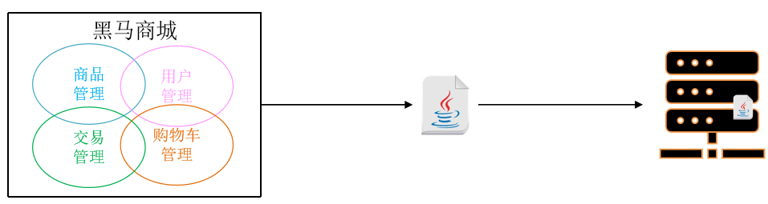
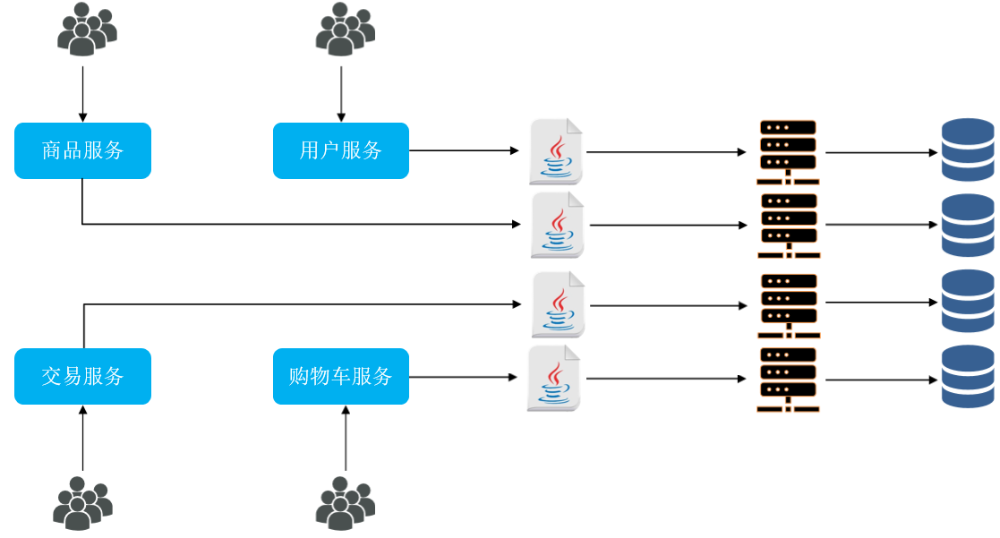

# 微服务基础

单体架构：将业务的所有功能集中在一个项目中开发，打成一个包部署。

- 优点：
    - 架构简单
    - 部署成本低

- 缺点：
    - 团队协作成本高
    - 系统发布效率低
    - 系统可用性差

总结：
单体架构适合开发功能相对简单，规模较小的项目。

微服务架构，是服务化思想指导下的一套最佳实践架构方案。服务化，就是把单体架构中的功能模块拆分为多个独立项目。

- 粒度小
- 团队自治
- 服务自治

SpringCloud集成了各种微服务功能组件，并基于SpringBoot实现了这些组件的自动装配，从而提供了良好的开箱即用体验：

- 服务注册发现：Eureka、Nacos、Consul
- 服务远程调用：OpenFeign、Dubbo
- 服务链路监控：Zipkin、Sleuth
- 统一配置管理：SpringCloudConfig、Nacos
- 统一网关路由：SpringCloudGateway、Zuul
- 流控、降级、保护：Hystrix、Sentinel

商城网站包含: 

- 用户模块
- 商品模块
- 购物车模块
- 订单模块
- 支付模块

什么时候拆分？

- 创业型项目：先采用单体架构，快速开发，快速试错。随着规模扩大，逐渐拆分。
- 确定的大型项目：资金充足，目标明确，可以直接选择微服务架构，避免后续拆分的麻烦。

从拆分目标来说，要做到：
- 高内聚：每个微服务的职责要尽量单一，包含的业务相互关联度高、完整度高。
- 低耦合：每个微服务的功能要相对独立，尽量减少对其它微服务的依赖。

从拆分方式来说，一般包含两种方式：
- 纵向拆分：按照业务模块来拆分
- 横向拆分：抽取公共服务，提高复用性

