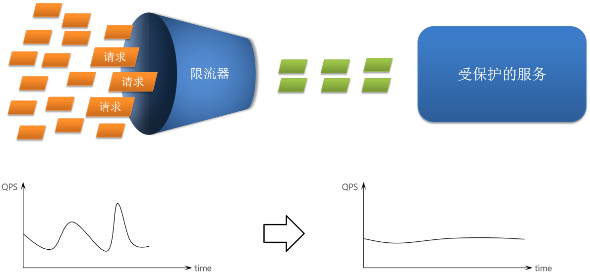
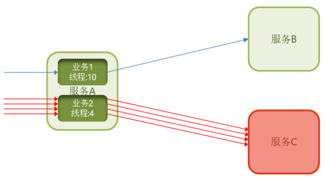

# 服务保护

雪崩问题产生的原因是什么？

- 微服务相互调用，服务提供者出现故障或阻塞。
- 服务调用者没有做好异常处理，导致自身故障。
- 调用链中的所有服务级联失败，导致整个集群故障

解决问题的思路有哪些？
- 尽量避免服务出现故障或阻塞。
- 保证代码的健壮性；
- 保证网络畅通；
- 能应对较高的并发请求；
- 服务调用者做好远程调用异常的后备方案，避免故障扩散

Sentinel是阿里巴巴开源的一款微服务流量控制组件。

服务保护方案:

1. 请求限流：限制访问微服务的请求的并发量，避免服务因流量激增出现故障。

    

2. 线程隔离：也叫做舱壁模式，模拟船舱隔板的防水原理。通过限定每个业务能使用的线程数量而将故障业务隔离，避免故障扩散。

    

3. 失败处理：给业务编写一个调用失败时的处理的逻辑，称为fallback。当调用出现故障（比如无线程可用）时，按照失败处理逻辑执行业务并返回，而不是直接抛出异常。

    

4. 服务熔断：由断路器统计请求的异常比例或慢调用比例，如果超出阈值则会熔断该业务，则拦截该接口的请求。熔断期间，所有请求快速失败，全都走fallback逻辑。而当服务恢复时，断路器会放行访问该服务的请求。

    
    

