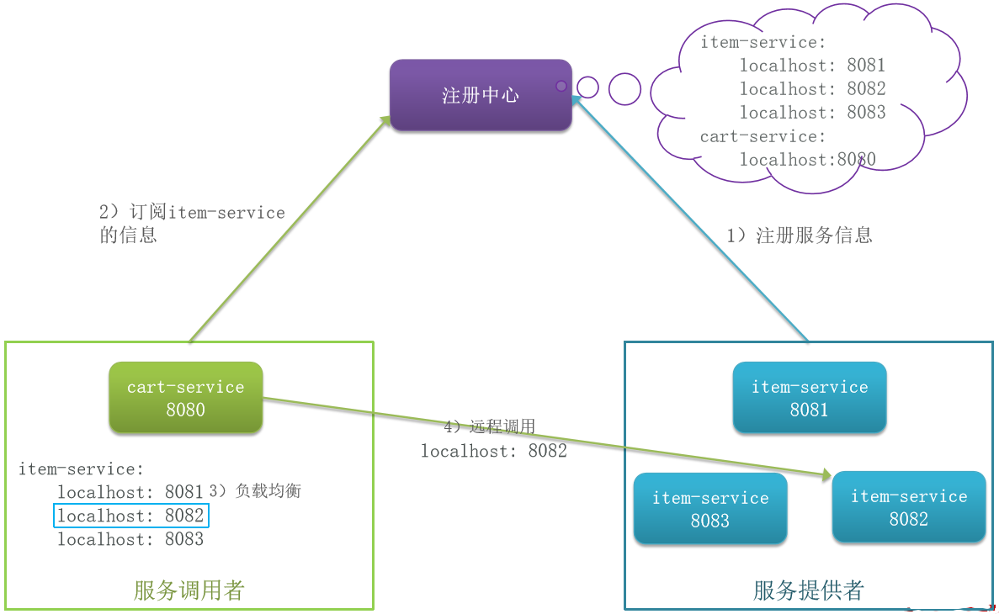
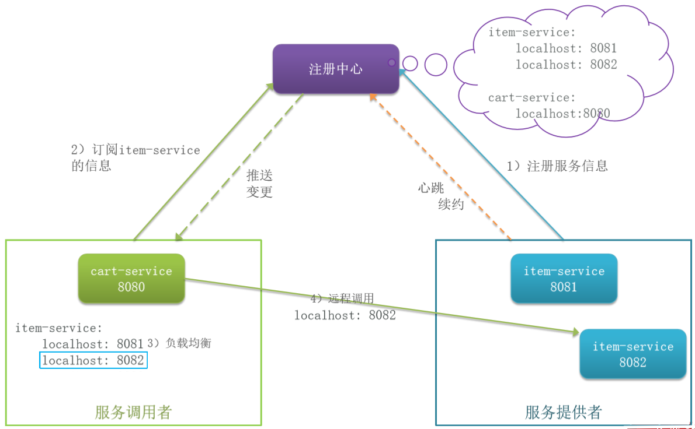

# 服务治理

服务治理中的三个角色分别是什么？

- 服务提供者：暴露服务接口，供其它服务调用
- 服务消费者：调用其它服务提供的接口
- 注册中心：记录并监控微服务各实例状态，推送服务变更信息

消费者如何知道提供者的地址？

服务提供者会在启动时注册自己信息到注册中心，消费者可以从注册中心订阅和拉取服务信息

消费者如何得知服务状态变更？
服务提供者通过心跳机制向注册中心报告自己的健康状态，当心跳异常时注册中心会将异常服务剔除，并通知订阅了该服务的消费者

当提供者有多个实例时，消费者该选择哪一个？
消费者可以通过负载均衡算法，从多个实例中选择一个





Nacos是目前国内企业中占比最多的注册中心组件。它是阿里巴巴的产品，目前已经加入SpringCloudAlibaba中。
```java
// 2.1.根据服务名称拉取服务的实例列表
List<ServiceInstance> instances = discoveryClient.getInstances("item-service");
// 2.2.负载均衡，挑选一个实例
ServiceInstance instance = instances.get(RandomUtil.randomInt(instances.size()));
// 2.3.发送请求，查询商品
ResponseEntity<List<ItemDTO>> response = restTemplate.exchange(
        instance.getUri() + "/items?ids={ids}", // 请求路径
        HttpMethod.GET, // 请求方式
        null, // 请求实体
        new ParameterizedTypeReference<List<ItemDTO>>() {}, // 返回值类型
        Map.of("ids", CollUtil.join(itemIds, ",") // 请求参数
);
```





