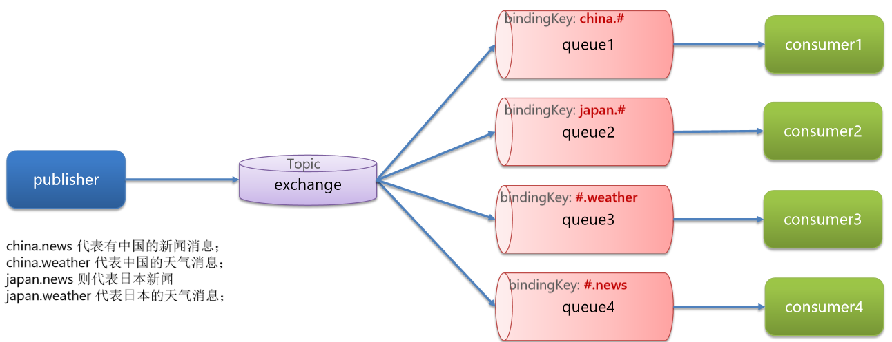

# 消息队列

## RabbitMQ的整体架构及核心概念

- virtual-host：虚拟主机，起到数据隔离的作用
- publisher：消息发送者
- consumer：消息的消费者
- queue：队列，存储消息
- exchange：交换机，负责路由消

✨交换机对应事项

- 交换机只能路由消息，无法存储消息
- 交换机只会路由消息给与其绑定的队列，因此队列必须与交换机绑定

## 案例

### 直接向queue发送消息

### Work Queues

让多个消费者绑定到一个队列，共同消费队列中的消息。

基本思路如下：

- 在RabbitMQ的控制台创建一个队列，名为work.queue
- 在publisher服务中定义测试方法，发送50条消息到work.queue
- 在consumer服务中定义两个消息监听者，都监听work.queue队列
- 消费者1每秒处理40条消息，消费者2每秒处理5条消息

默认情况下，RabbitMQ的会将消息依次轮询投递给绑定在队列上的每一个消费者。但这并没有考虑到消费者是否已经处理完消息，可能出现消息堆积。因此我们需要修改application.yml，设置preFetch值为1，确保同一时刻最多投递给消费者1条消息.

Work模型的使用：

- 多个消费者绑定到一个队列，可以加快消息处理速度
- 同一条消息只会被一个消费者处理
- 通过设置prefetch来控制消费者预取的消息数量，处理完一条再处理下一条，实现能者多劳

## 交换机

交换机的作用主要是接收发送者发送的消息，并将消息路由到与其绑定的队列。
常见交换机的类型有以下三种：

- Fanout：广播
- Direct：定向
- Topic：话题

### Fanout交换机

Fanout Exchange 会将接收到的消息路由到每一个跟其绑定的queue，所以也叫广播模式

### Direct交换机

Direct Exchange 会将接收到的消息根据规则路由到指定的Queue，因此称为定向路由。

- 每一个Queue都与Exchange设置一个BindingKey
- 发布者发送消息时，指定消息的RoutingKey
- Exchange将消息路由到BindingKey与消息RoutingKey一致的队列

如上图，

1. publisher如果发送key为blue的， 路由器只会转发给queue1， 因为其绑定了key：blue
2. publisher如果发送key为yellow的， 路由器只会转法给queue2， 因为其绑定了key：yellow
3. publisher如果发送key为red的, 路由器会分别转发给queue1和queue2, 因为他们俩都绑定了绑定了key: red

### topic exchange

TopicExchange与DirectExchange类似，区别在于routingKey可以是多个单词的列表，并且以 . 分割。
Queue与Exchange指定BindingKey时可以使用通配符：
# ：代指0个或多个单词
*：代指一个单词

## 发送者的可靠性

### 发送者重连

有的时候由于网络波动，可能会出现发送者连接MQ失败的情况。通过配置我们可以开启连接失败后的重连机制.

当网络不稳定的时候，利用重试机制可以有效提高消息发送的成功率。不过SpringAMQP提供的重试机制是阻塞式的重试，也就是说多次重试等待的过程中，当前线程是被阻塞的，会影响业务性能。

如果对于业务性能有要求，建议禁用重试机制。如果一定要使用，请合理配置等待时长和重试次数，当然也可以考虑使用异步线程来执行发送消息的代码。

### 发送者确认

SpringAMQP提供了Publisher Confirm和Publisher Return两种确认机制。开启确机制认后，当发送者发送消息给MQ后，MQ会返回确认结果给发送者。返回的结果有以下几种情况：

- 消息投递到了MQ，但是路由失败。此时会通过PublisherReturn返回路由异常原因，然后返回ACK，告知投递成功
- 临时消息投递到了MQ，并且入队成功，返回ACK，告知投递成功
- 持久消息投递到了MQ，并且入队完成持久化，返回ACK ，告知投递成功
- 其它情况都会返回NACK，告知投递失败

## MQ的可靠性

在默认情况下，RabbitMQ会将接收到的信息保存在内存中以降低消息收发的延迟。这样会导致两个问题：

- 一旦MQ宕机，内存中的消息会丢失
- 内存空间有限，当消费者故障或处理过慢时，会导致消息积压，引发MQ阻塞

RabbitMQ如何保证消息的可靠性

1. 首先通过配置可以让交换机、队列、以及发送的消息都持久化。这样队列中的消息会持久化到磁盘，MQ重启消息依然存在。
2. RabbitMQ在3.6版本引入了LazyQueue，并且在3.12版本后会称为队列的默认模式。LazyQueue会将所有消息都持久化。
    1. 接收到消息后直接存入磁盘，不再存储到内存
    2. 消费者要消费消息时才会从磁盘中读取并加载到内存（可以提前缓存部分消息到内存，最多2048条）

    在3.12版本后，所有队列都是Lazy Queue模式，无法更改。

## 消费者的可靠性

### 消费者确认机制

消费者确认机制（Consumer Acknowledgement）是为了确认消费者是否成功处理消息。当消费者处理消息结束后，应该向RabbitMQ发送一个回执，告知RabbitMQ自己消息处理状态：

1. ack：成功处理消息，RabbitMQ从队列中删除该消息
2. nack：消息处理失败，RabbitMQ需要再次投递消息
3. reject：消息处理失败并拒绝该消息，RabbitMQ从队列中删除该消息

### 失败重试机制

在开启重试模式后，重试次数耗尽，如果消息依然失败，则需要有MessageRecoverer接口来处理，它包含三种不同的实现：
- RejectAndDontRequeueRecoverer：重试耗尽后，直接reject，丢弃消息。默认就是这种方式
- ImmediateRequeueMessageRecoverer：重试耗尽后，返回nack，消息重新入队
- RepublishMessageRecoverer：重试耗尽后，将失败消息投递到指定的交换机

### 业务幂等性

幂等是一个数学概念，用函数表达式来描述是这样的：f(x) = f(f(x)) 。在程序开发中，则是指同一个业务，执行一次或多次对业务状态的影响是一致的。

幂等:
- 查询业务，例如根据id查询商品
- 删除业务，例如根据id删除商品

非幂等:
- 用户下单业务，需要扣减库存
- 用户退款业务，需要恢复余额

方案一，是给每个消息都设置一个唯一id，利用id区分是否是重复消息：
1. 每一条消息都生成一个唯一的id，与消息一起投递给消费者。
2. 消费者接收到消息后处理自己的业务，业务处理成功后将消息ID保存到数据库
3. 如果下次又收到相同消息，去数据库查询判断是否存在，存在则为重复消息放弃处理

方案二，是结合业务逻辑，基于业务本身做判断。以我们的余额支付业务为例

## 延迟消息

延迟消息：发送者发送消息时指定一个时间，消费者不会立刻收到消息，而是在指定时间之后才收到消息。

延迟任务：设置在一定时间之后才执行的任务

### 死信交换机

当一个队列中的消息满足下列情况之一时，就会成为死信（dead letter）：
- 消费者使用basic.reject或 basic.nack声明消费失败，并且消息的requeue参数设置为false
- 消息是一个过期消息（达到了队列或消息本身设置的过期时间），超时无人消费
- 要投递的队列消息堆积满了，最早的消息可能成为死信
如果队列通过dead-letter-exchange属性指定了一个交换机，那么该队列中的死信就会投递到这个交换机中。这个交换机称为死信交换机（Dead Letter Exchange，简称DLX）。

### 取消超时订单

设置30分钟后检测订单支付状态实现起来非常简单，但是存在两个问题：
- 如果并发较高，30分钟可能堆积消息过多，对MQ压力很大
- 大多数订单在下单后1分钟内就会支付，但是却需要在MQ内等待30分钟，浪费资源

