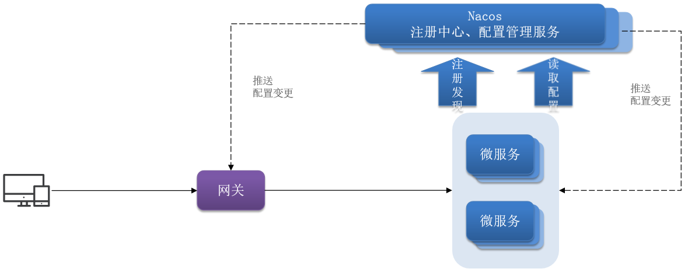
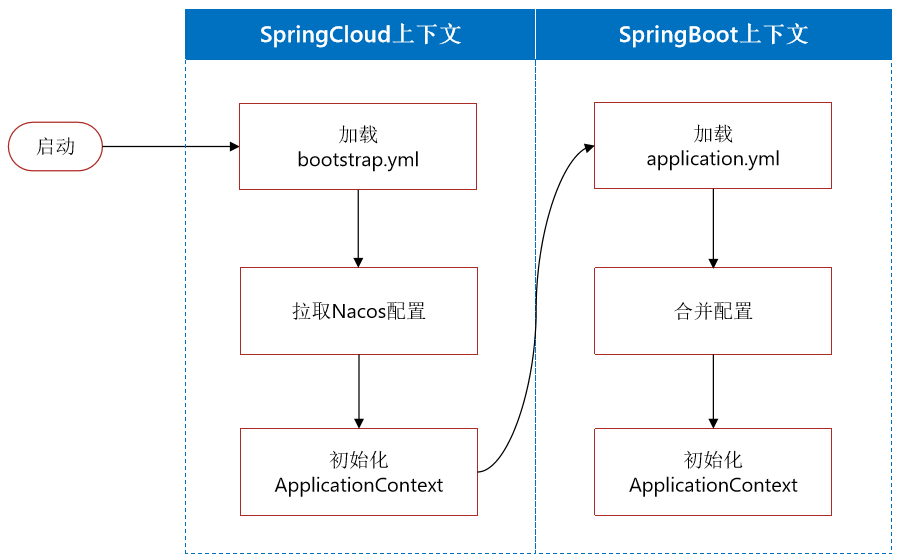

# 配置管理

- 微服务重复配置过多，维护成本高
- 业务配置经常变动，每次修改都要重启服务
- 网关路由配置写死，如果变更要重启网关

## 配置整合

添加一些共享配置到Nacos中，包括：Jdbc、MybatisPlus、日志、Swagger、OpenFeign等配置
基于NacosConfig拉取共享配置代替微服务的本地配置。

## 配置热更新

配置热更新：当修改配置文件中的配置时，微服务无需重启即可使配置生效。

需求：购物车的限定数量目前是写死在业务中的，将其改为读取配置文件属性，并将配置交给Nacos管理，实现热更新。

## 实现动态路由

要实现动态路由首先要将路由配置保存到Nacos，当Nacos中的路由配置变更时，推送最新配置到网关，实时更新网关中的路由信息。

我们需要完成两件事情：
- 监听Nacos配置变更的消息
- 当配置变更时，将最新的路由信息更新到网关路由表

