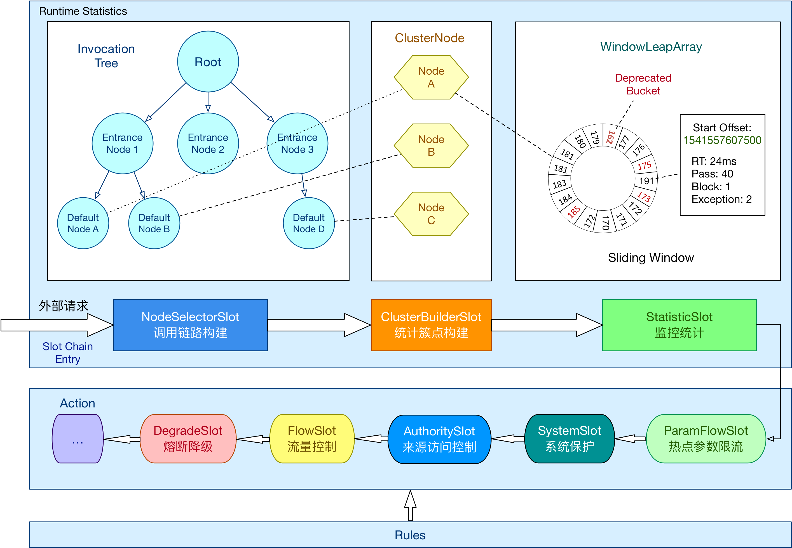

# 服务保护

## 最佳实践

### 考察问

- 雪崩问题是微服务之间相互调用，因为调用链中的`()`服务故障，引起`()`链路都无法访问的情况。
    - 服务A故障->`()`游服务B等有关服务阻塞
    - 服务A故障->大量请求阻塞->线程并发数`()`, 服务器资源`()`->其他服务变得`()`

### 考察点

- 雪崩问题是微服务之间相互调用，因为调用链中的`一`个服务故障，引起`整`个链路都无法访问的情况。
    - 服务A故障->`下`游服务B等有关服务阻塞
    - 服务A故障->大量请求阻塞->线程并发数`有限`, 服务器资源`耗尽`->其他服务变得`不可用`

## 微服务雪崩

雪崩问题是微服务之间相互调用，因为调用`链`中的一个服务故障，引起`整`个链路都无法访问的情况。

服务B和其他服务需要服务A响应，但此时服务A故障了，服务B无法接收到结果。由于服务器支持的线程和并发数有限，请求一致阻塞会导致服务器资源耗尽，从而导致依赖于当前服务的其它服务随着时间的推移，最终也都会变的不可用，形成级联失败，雪崩就发生了

- 与服务A线程有关的服务雪崩：服务A故障 -> 服务B等有关服务阻塞
- 与服务A线程无关服务雪崩：服务A故障 -> 大量请求阻塞 -> 线程并发数`有限`, 服务器资源耗尽 -> 其他服务变得不可用 -> 级联失败（雪崩）

## sentinel

Sentinel 是面向分布式、多语言异构化服务架构的流量治理组件，主要以流量为切入点，从流量路由、流量控制、流量整形、熔断降级、系统自适应过载保护、热点流量防护等多个维度来帮助开发者保障微服务的稳定性。

Sentinel 基本概念

- 资源

    资源是 Sentinel 的关键概念。它可以是 Java 应用程序中的任何内容，例如，由应用程序提供的服务，或由应用程序调用的其它应用提供的服务，甚至可以是一段代码。大部分情况下，可以使用方法签名，URL，甚至服务名称作为资源名来标示资源。

- 规则

    围绕资源的实时状态设定的规则，可以包括流量控制规则、熔断降级规则以及系统保护规则。所有规则可以动态实时调整。

## 基本原理

在 Sentinel 里面，所有的资源都对应一个资源名称以及一个 Entry。Entry 可以通过对主流框架的适配自动创建，也可以通过注解的方式或调用 API 显式创建；每一个 Entry 创建的时候，同时也会创建一系列功能插槽（slot chain）。这些插槽有不同的职责，例如:

- NodeSelectorSlot 负责收集资源的路径，并将这些资源的调用路径，以树状结构存储起来，用于根据调用路径来限流降级；
- ClusterBuilderSlot 则用于存储资源的统计信息以及调用者信息，例如该资源的 RT, QPS, thread count 等等，这些信息将用作为多维度限流，降级的依据；
- StatisticSlot 则用于记录、统计不同纬度的 runtime 指标监控信息；
- FlowSlot 则用于根据预设的限流规则以及前面 slot 统计的状态，来进行流量控制；
- AuthoritySlot 则根据配置的黑白名单和调用来源信息，来做黑白名单控制；
- DegradeSlot 则通过统计信息以及预设的规则，来做熔断降级；
- SystemSlot 则通过系统的状态，例如 load1 等，来控制总的入口流量；

