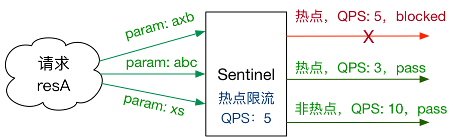

# 流量控制

## 最佳实践

### 考察问

- 基于`()`的流量控制

    - 并发数控制, 两种方案`()`隔离和`()`隔离

        - 线程池隔离(Hystrix): 不同的业务创建不同的线程池。优点: 隔离控制更`()`(但没必要), 缺点: 开销`()`, 虽然能够控制线程数量，但无法控制`()`时间。
        - 信号量隔离(Hystrix, Sentinel): 使用信号量来控制同时请求的个数。优点: 开销`()`, 缺点: 隔离控制更弱(但没必要)

            ✨如果组件具备了超时熔断和流量控制的能力，线程池隔离就显得没有那么必要了。

    - QPS流量控制: 当QPS超过某个阈值的时候，则采取措施进行流量控制。控制方法包括三种:
        - `()`方式。当QPS超过任意规则的阈值后，新的请求就会被立即拒绝. 适用于通过压测确定了系统的准确水位时。
        - `()`方式。让通过的流量缓慢增加，在一定时间内逐渐增加到阈值上限. 用于系统长期处于低水位的情况下，当流量突然增加时，直接把系统拉升到高水位可能瞬间把系统压垮。
        - `()`方式。让请求以均匀的速度通过，对应的是漏桶算法。

- 基于`()`的流量控制

    - `()`限流, 只针对调用方
    - `()`限流, 针对的是一条链路
    - `()`流量限流: read_db 和 write_db 这两个资源分别代表数据库读写，我们可以给 read_db 设置限流规则来达到写优先的目的

- 其他
    - `()`流量控制: 实际情况下流量到每台机器可能会不均匀，会导致总量没有到的情况下某些机器就开始限流。因此仅靠单机维度去限制的话会无法精确地限制总体流量。
    - `()`流量控制: Spring Cloud Gateway、Zuul等主流的API Gateway进行限流。
    - `()`限流:
        - 商品ID为参数，统计一段时间内最常购买的商品ID并进行限制
        - 用户ID为参数，针对一段时间内频繁访问的用户ID进行限制
    - `()`控制(黑白名单)

### 考察点

- 基于`并发数/QPS`的流量控制

    - 并发数控制, 两种方案`线程池`隔离和`信号量`隔离

        - 线程池隔离(Hystrix): 不同的业务创建不同的线程池。优点: 隔离控制更`强`(但没必要), 缺点: 开销`大`, 虽然能够控制线程数量，但无法控制`请求排队`时间。
        - 信号量隔离(Hystrix, Sentinel): 使用信号量来控制同时请求的个数。优点: 开销`小`, 缺点: 隔离控制更弱(但没必要)

            ✨如果组件具备了超时熔断和流量控制的能力，线程池隔离就显得没有那么必要了。

    - QPS流量控制: 当QPS超过某个阈值的时候，则采取措施进行流量控制。控制方法包括三种:
        - `直接拒绝`方式。当QPS超过任意规则的阈值后，新的请求就会被立即拒绝. 适用于通过压测确定了系统的准确水位时。
        - `冷启动`方式。让通过的流量缓慢增加，在一定时间内逐渐增加到阈值上限. 用于系统长期处于低水位的情况下，当流量突然增加时，直接把系统拉升到高水位可能瞬间把系统压垮。
        - `匀速器`方式。让请求以均匀的速度通过，对应的是漏桶算法。

- 基于`调用关系`的流量控制

    - `调用方`限流, 只针对调用方
    - `链路`限流, 针对的是一条链路
    - `关联`流量限流: read_db 和 write_db 这两个资源分别代表数据库读写，我们可以给 read_db 设置限流规则来达到写优先的目的

- 其他
    - `集群`流量控制: 实际情况下流量到每台机器可能会不均匀，会导致总量没有到的情况下某些机器就开始限流。因此仅靠单机维度去限制的话会无法精确地限制总体流量。
    - `网关`流量控制: Spring Cloud Gateway、Zuul等主流的API Gateway进行限流。
    - `热点参数`限流:
        - 商品ID为参数，统计一段时间内最常购买的商品ID并进行限制
        - 用户ID为参数，针对一段时间内频繁访问的用户ID进行限制
    - `来源访问`控制(黑白名单)

## 流量控制

FlowSlot会根据预设的规则，结合前面NodeSelectorSlot、ClusterNodeBuilderSlot、StatistcSlot统计出来的实时信息进行流量控制。


同一个资源可以对应多条限流规则。FlowSlot会对该资源的所有限流规则依次遍历，直到有规则触发限流或者所有规则遍历完毕。

一条限流规则主要由下面几个因素组成，我们可以组合这些元素来实现不同的限流效果：

- resource：限流规则的`作用对象`
- count: 限流`阈值`
- grade: `QPS`或`线程数`
- strategy: 根据调用关系选择策略

## 基于QPS/并发数的流量控制

流量控制主要有两种统计类型，一种是统计线程数，另外一种则是统计QPS。类型由FlowRule.grade字段来定义。其中，0代表根据并发数量来限流，1代表根据QPS来进行流量控制。其中线程数、QPS值，都是由StatisticSlot实时统计获取的。

- 1 并发线程数流量控制

    线程数限流用于保护业务线程数不被耗尽。为应对高线程占用的情况，业内有使用隔离的方案，比如通过不同业务逻辑使用不同线程池来隔离业务自身之间的资源争抢（线程池隔离），或者使用信号量来控制同时请求的个数（信号量隔离）。这种隔离方案虽然能够控制线程数量，但无法控制请求排队时间。当请求过多时排队也是无益的，直接拒绝能够迅速降低系统压力。Sentinel线程数限流不负责创建和管理线程池，而是简单统计当前请求上下文的线程个数，如果超出阈值，新的请求会被立即拒绝。

    隔离是 Hystrix 的核心功能之一。Hystrix 提供两种隔离策略：线程池隔离（Bulkhead Pattern）和信号量隔离，其中最推荐也是最常用的是线程池隔离。Hystrix 的线程池隔离针对不同的资源分别创建不同的线程池，不同服务调用都发生在不同的线程池中，在线程池排队、超时等阻塞情况时可以快速失败，并可以提供 fallback 机制。线程池隔离的好处是隔离度比较高，可以针对某个资源的线程池去进行处理而不影响其它资源，但是代价就是线程上下文切换的 overhead 比较大，特别是对低延时的调用有比较大的影响。

    但是，实际情况下，线程池隔离并没有带来非常多的好处。首先就是过多的线程池会非常影响性能。考虑这样一个场景，在 Tomcat 之类的 Servlet 容器使用 Hystrix，本身 Tomcat 自身的线程数目就非常多了（可能到几十或一百多），如果加上 Hystrix 为各个资源创建的线程池，总共线程数目会非常多（几百个线程），这样上下文切换会有非常大的损耗。另外，线程池模式比较彻底的隔离性使得 Hystrix 可以针对不同资源线程池的排队、超时情况分别进行处理，但这其实是超时熔断和流量控制要解决的问题，如果组件具备了超时熔断和流量控制的能力，线程池隔离就显得没有那么必要了。

    Hystrix 的信号量隔离限制对某个资源调用的并发数。这样的隔离非常轻量级，仅限制对某个资源调用的并发数，而不是显式地去创建线程池，所以 overhead 比较小，但是效果不错，也支持超时失败。Sentinel 可以通过并发线程数模式的流量控制来提供信号量隔离的功能。并且结合基于响应时间的熔断降级模式，可以在不稳定资源的平均响应时间比较高的时候自动降级，防止过多的慢调用占满并发数，影响整个系统。

- 2 QPS流量控制

    当QPS超过某个阈值的时候，则采取措施进行流量控制。流量控制的手段包括下面3种，对应 FlowRule中的controlBehavior字段：

    - 直接拒绝方式。该方式是默认的流量控制方式，当QPS超过任意规则的阈值后，新的请求就会被立即拒绝，拒绝方式为抛出FlowException。这种方式适用于对系统处理能力确切已知的情况下，比如通过压测确定了系统的准确水位时。

    - 冷启动方式。该方式主要用于系统长期处于低水位的情况下，当流量突然增加时，直接把系统拉升到高水位可能瞬间把系统压垮。通过"冷启动"，让通过的流量缓慢增加，在一定时间内逐渐增加到阈值上限，给冷系统一个预热的时间，避免冷系统被压垮的情况。

    - 匀速器（RuleConstant.CONTROL_BEHAVIOR_RATE_LIMITER）方式。这种方式严格控制了请求通过的间隔时间，也即是让请求以均匀的速度通过，对应的是`漏桶`算法。具体的例子参见 PaceFlowDemo。

## 基于调用关系的流量控制

调用关系包括调用方、被调用方；方法又可能会调用其它方法，形成一个调用链路的层次关系。Sentinel 通过 NodeSelectorSlot 建立不同资源间的调用的关系，并且通过 ClusterNodeBuilderSlot 记录每个资源的实时统计信息。

- 1 根据调用方限流

    限流规则中的limitApp字段用于根据调用方进行流量控制。该字段的值有以下三种选项，分别对应不同的场景：

    - default：表示不区分调用者，来自任何调用者的请求都将进行限流统计。如果这个资源名的调用总和超过了这条规则定义的阈值，则触发限流。
    - {some_origin_name}：表示针对特定的调用者，只有来自这个调用者的请求才会进行流量控制。例如 NodeA 配置了一条针对调用者caller1的规则，那么当且仅当来自 caller1 对 NodeA 的请求才会触发流量控制。
    - other：表示针对除 {some_origin_name} 以外的其余调用方的流量进行流量控制。例如，资源NodeA配置了一条针对调用者caller1的限流规则，同时又配置了一条调用者为 other 的规则，那么任意来自非 caller1 对 NodeA 的调用，都不能超过 other 这条规则定义的阈值。

    同一个资源名可以配置多条规则，规则的生效顺序为：{some_origin_name} > other > default

- 2 根据调用链路入口限流：链路限流

    NodeSelectorSlot 中记录了资源之间的调用链路，这些资源通过调用关系，相互之间构成一棵调用树。这棵树的根节点是一个名字为 machine-root 的虚拟节点，调用链的入口都是这个虚节点的子节点。

    一棵典型的调用树如下图所示：

    ```md
                machine-root
                /       \
                /         \
            Entrance1     Entrance2
            /             \
            /               \
    DefaultNode(nodeA)   DefaultNode(nodeA)
    ```

    上图中来自入口 Entrance1 和 Entrance2 的请求都调用到了资源 NodeA，Sentinel 允许只根据某个入口的统计信息对资源限流。比如我们可以设置 FlowRule.strategy 为 RuleConstant.CHAIN，同时设置 FlowRule.ref_identity 为 Entrance1 来表示只有从入口 Entrance1 的调用才会记录到 NodeA 的限流统计当中，而对来自 Entrance2 的调用漠不关心。

- 3 具有关系的资源流量控制：关联流量控制

    当两个资源之间具有资源争抢或者依赖关系的时候，这两个资源便具有了关联。比如对数据库同一个字段的读操作和写操作存在争抢，读的速度过高会影响写得速度，写的速度过高会影响读的速度。如果放任读写操作争抢资源，则争抢本身带来的开销会降低整体的吞吐量。可使用关联限流来避免具有关联关系的资源之间过度的争抢，举例来说，read_db 和 write_db 这两个资源分别代表数据库读写，我们可以给 read_db 设置限流规则来达到写优先的目的：设置 FlowRule.strategy 为 RuleConstant.RELATE 同时设置 FlowRule.ref_identity 为 write_db。这样当写库操作过于频繁时，读数据的请求会被限流。

## 集群流量控制

为什么要使用集群流控呢？假设我们希望给某个用户限制调用某个API的总QPS为50，但机器数可能很多（比如有100 台）。这时候我们很自然地就想到，找一个server来专门来统计总的调用量，其它的实例都与这台server通信来判断是否可以调用。这就是最基础的集群流控的方式。

另外集群流控还可以解决流量不均匀导致总体限流效果不佳的问题。假设集群中有10台机器，我们给每台机器设置单机限流阈值为10QPS，理想情况下整个集群的限流阈值就为100QPS。不过实际情况下流量到每台机器可能会不均匀，会导致总量没有到的情况下某些机器就开始限流。因此仅靠单机维度去限制的话会无法精确地限制总体流量。而集群流控可以精确地控制整个集群的调用总量，结合单机限流兜底，可以更好地发挥流量控制的效果。

集群流控中共有两种身份：

- Token Client：集群流控客户端，用于向所属Token Server通信请求 token。集群限流服务端会返回给客户端结果，决定是否限流。
- Token Server：即集群流控服务端，处理来自Token Client的请求，根据配置的集群规则判断是否应该发放token（是否允许通过）。

## 网关流量控制

Sentinel 支持对 Spring Cloud Gateway、Zuul 等主流的 API Gateway 进行限流。

Sentinel 1.6.0 引入了 Sentinel API Gateway Adapter Common 模块，此模块中包含网关限流的规则和自定义 API 的实体和管理逻辑：

- GatewayFlowRule：网关限流规则，针对 API Gateway 的场景定制的限流规则，可以针对不同 route 或自定义的 API 分组进行限流，支持针对请求中的参数、Header、来源 IP 等进行定制化的限流。
- ApiDefinition：用户自定义的 API 定义分组，可以看做是一些 URL 匹配的组合。比如我们可以定义一个 API 叫 my_api，请求 path 模式为 /foo/**和 /baz/** 的都归到 my_api 这个 API 分组下面。限流的时候可以针对这个自定义的 API 分组维度进行限流。

## 热点参数限流

何为热点？热点即经常访问的数据。很多时候我们希望统计某个热点数据中访问频次最高的Top K数据，并对其访问进行限制。比如：

- 商品ID为参数，统计一段时间内最常购买的商品ID并进行限制
- 用户ID为参数，针对一段时间内频繁访问的用户ID进行限制

热点参数限流会统计传入参数中的热点参数，并根据配置的限流阈值与模式，对包含热点参数的资源调用进行限流。热点参数限流可以看做是一种特殊的流量控制，仅对包含热点参数的资源调用生效。



Sentinel 利用LRU策略统计最近最常访问的热点参数，结合令牌桶算法来进行参数级别的流控。

## 来源访问控制

很多时候，我们需要根据调用方来限制资源是否通过，这时候可以使用 Sentinel 的黑白名单控制的功能。黑白名单根据资源的请求来源（origin）限制资源是否通过，若配置白名单则只有请求来源位于白名单内时才可通过；若配置黑名单则请求来源位于黑名单时不通过，其余的请求通过。

黑白名单规则（AuthorityRule）非常简单，主要有以下配置项：

- resource：资源名，即限流规则的作用对象
- limitApp：对应的黑名单/白名单，不同 origin 用 , 分隔，如 appA,appB
- strategy：限制模式，AUTHORITY_WHITE 为白名单模式，AUTHORITY_BLACK 为黑名单模式，默认为白名单模式

## 参考

- <https://www.cnblogs.com/sexintercourse/p/18646562>
- <https://sentinelguard.io/zh-cn/blog/sentinel-vs-hystrix.html>
