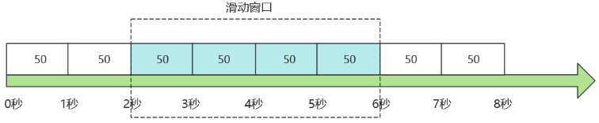

# 限流算法

## 最佳实践

### 考察问

|特性维度|滑动窗口|漏桶|令牌桶|
|--|--|--|--|
|突发处理|`()`（依赖窗口精度和实现），边界可能存在突刺（简单固定窗口）|`()`突发，而是将其平滑掉|`()`突发|
|流量整形能力|`()`（主要控制数量）|`()`（强制匀速输出）|`()`（控制平均速率，允许一定形态的突发）|
|是否引入特征延迟|`()`（通过/拒绝）|`()`（请求需排队等待匀速处理）|`()`（有令牌则通过；若无令牌选择等待则引入延迟）|
|关键参数|时间`()`大小、`()`|`()`容量、`()`速率|`()`容量、`()`速率|

### 考察点

|特性维度|滑动窗口|漏桶|令牌桶|
|--|--|--|--|
|突发处理|`一般`（依赖窗口精度和实现），边界可能存在突刺（简单固定窗口）|`不处理`突发，而是将其平滑掉|`桶容量内处理`突发|
|流量整形能力|`弱`（主要控制数量）|`强`（强制匀速输出）|`中`（控制平均速率，允许一定形态的突发）|
|是否引入特征延迟|`低`（通过/拒绝）|`高`（请求需排队等待匀速处理）|`中`（有令牌则通过；若无令牌选择等待则引入延迟）|
|关键参数|时间`窗口`大小、`阈值`|`桶`容量、`流出`速率|`令牌桶`容量、`令牌生成`速率|

## 限流算法

限流是对某一时间窗口内的请求数进行限制，保持系统的可用性和稳定性，防止因流量激增而导致的系统运行缓慢或宕机。

常见有4种限流算法，分别是：固定窗口、滑动窗口、漏桶算法以及令牌桶算法。

## 固定窗口

在固定时间窗口内累计访问次数，当访问次数达到设定的时间窗口阈值时，触发限流策略，当进入下一个时间窗口时进行访问次数的清零。如图所示。

- 优点：实现简单；
- 缺点：存在边界问题。例如时间窗口为5秒，限流200个请求，考虑前四秒没有请求，在第四秒到第六秒之间来了400个请求，由于第五秒会重置permits，所以导致400个请求都能通过，突破了我们的5秒内只允许200个请求的限制。

## 滑动窗口

基于固定窗口，滑动窗口的起止时间是动态的，窗口的大小固定. 在固定窗口的基础上，将设置的窗口大小等份分割为若干子窗口，每次只滑动一个子窗口，同时每个子窗口单独计数，但是所有子窗口的计数求和不应大于整体窗口的阈值。如图所示，假设设置4秒内允许通过200请求，分块后变为每秒50请求，总体4秒200请求。

- 优点：解决了固定窗口算法的窗口边界问题。
- 缺点：还是存在限流不够平滑的问题。

对于 Sentinel 来说其实窗口分为秒和分钟两个级别。秒级的话窗口数量是 2，分钟级则是 60 个窗口。每个窗口的时间长度是 1 秒，总的时间周期就是 60 秒，分成 60 个窗口，这里我们就以分钟级别的统计来说。滑动窗口的实现主要可以看 LeapArray 的代码，默认的话定义了时间窗口的相关参数。

## 漏桶算法(Leaky bucket)

漏桶算法可以有效地控制数据的传输速率以及防止网络拥塞。顾名思义，如果将外部请求比作注入漏桶的水，漏桶会存储一定水量并以固定速率出水，即匀速通过请求，如果请求量超过漏桶容量则会被丢弃，这个和 MQ 削峰填谷的思想比较类似。流量流入的速度是不定的，但是流出的速度是恒定的。

- 优点： 通过固定速率处理请求，可以有效的避免流量突发情况，具有很好的削峰填谷的作用，同时面对大量请求时，直接丢弃超过桶容量的请求，实现保护下游服务的目的。
- 缺点：
    - 虽然可以用漏桶出口的固定速率平滑突增流量，但也正是由于固定速率，使得在流量较小的时候也无法更快的处理请求；
    - 丢失请求，在超过桶容量的流量请求时，会丢弃掉超过的部分；

✨在我们的应用中，漏桶算法强制限定流量速率后，多出的（溢出的）流量可以被利用起来，并非完全丢弃，我们可以把它收集到一个队列里面，做流量队列，尽量做到合理利用所有资源。

Sentinel 主要根据 FlowSlot 中的流控进行流量控制，其中 RateLimiterController 就是漏桶算法的实现。

## 令牌桶算法(Token bucket)

令牌桶算法可以总结为：以固定速率生成令牌放入桶中，令牌数不会超过桶容量，当有请求到来时，会尝试申请一块令牌，如果没有令牌则会拒绝请求，有足够的令牌则会处理请求，并且减少桶内令牌数.
像 Guava 和 Sentinel 的实现都有冷启动 / 预热的方式。令牌桶算法会在最开始一段时间内冷启动，随着流量的增加，系统会根据流量大小动态地调整生成令牌的速度，直到最终请求达到系统阈值。

- 优点：

    - 1.可以处理突发流量：令牌桶算法可以处理突发流量。当桶满时，能够以最大速度处理请求。
    - 2.限制平均处理速率：在长期运行中，数据的传输率会被限制在预定义的平均速率（即生成令牌的速率）。
    - 3.灵活性：与漏桶算法相比，令牌桶算法提供了更大的灵活性。例如，可以动态地调整生成令牌的速率。

- 缺点：

    - 1.可能导致过载：如果令牌产生的速度过快，可能会导致大量的突发流量，这可能会使网络或服务过载。
    - 2.需要存储空间：令牌桶需要一定的存储空间来保存令牌，可能会导致内存资源的浪费。
    - 3.实现稍复杂：相比于计数器算法，令牌桶算法的实现稍微复杂一些。

Sentinel 的令牌桶实现基于 Guava，代码在 WarmUpController 中。

## 对比

|特性维度|滑动窗口|漏桶|令牌桶|
|--|--|--|--|
|主要目标|精确控制单位时间请求总数|平滑输出速率，保护后端|允许突发，控制平均速率|
|突发处理|一般（依赖窗口精度和实现），边界可能存在突刺（简单固定窗口）|削峰，缓冲或拒绝超出部分，不处理突发，而是将其平滑掉|良好（桶容量内突发）|
|流量整形能力|弱（主要控制数量）|强（强制匀速输出）|中（控制平均速率，允许一定形态的突发）|
|是否引入特征延迟|低（通过/拒绝）|是（请求需排队等待匀速处理）|低（有令牌则通过；若无令牌选择等待则引入延迟）|
|关键参数|时间窗口大小、阈值|桶容量、流出速率|令牌桶容量、令牌生成速率|
|资源利用率(系统空闲时)|相对较高|可能较低（因固定速率输出，无法利用瞬时空闲）|较高（有令牌即可快速响应）|
|实现复杂度(单机)|中等(简单实现)到复杂(精密实现)|简单(计数器版)到中等(队列版)|中等|

## 参考

- <https://www.cnblogs.com/zhaobo1997/p/17961258>
- <https://www.cnblogs.com/shoshana-kong/p/14759604.html>
- <https://zhuanlan.zhihu.com/p/1909556451510290032>
- <https://blog.csdn.net/GBS20200720/article/details/124467146>
