# sentinel实战

## 最佳实践

### 考察问

- 流控

    - 流控规则
        - `()`：限流规则的作用对象, 默认请求路径
        - `()`：Sentinel可以针对调用者进行限流，填写微服务名
        - 阈值类型/单机阈值(grade/count)：
            - `()`：当调用该api的QPS达到阈值的时候，进行限流
            - `()`：并发值，进行限流
    - 流控策略(strategy)：
        - `()`：api达到限流条件时，直接限流
        - `()`：当关联的资源达到阈值时，就限流自己

            🌰下单与支付案例: `()`

        - `()`：只记录指定链路上的流量（指定资源从入口资源进来的流量，如果达到阈值，就进行限流）

            🌰查询与支付案例: `()`

    - 流控效果(controlBehavior)：
        - `()`：直接失败，抛异常. 基于`()`.
        - `()`：根据codeFactor（冷加载因子，默认3）的值，从阈值/codeFactor，经过预热时长，才达到设置的QPS阈值. 基于`()`

            解释下图的参数的含义:

            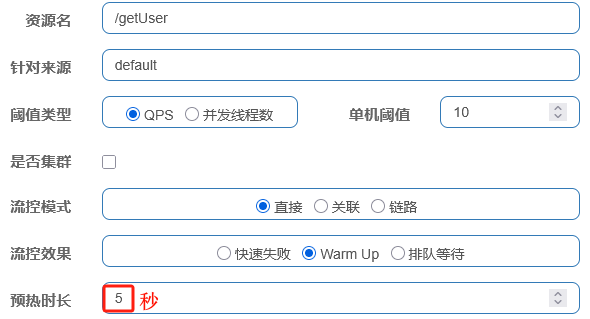

            - 请求阈值初始值是 `()`。
            - 在`()`内，逐渐提高到`()`值。

            🌰秒杀场景案例: `()`

        - `()`：匀速排队，让请求以匀速的速度通过，阈值类型必须设置为QPS，否则无效. 基于`()`

            - 如果请求处理估算的阈值小于timeout, 则`()`
            - 如果请求处理估算的阈值大于timeout, 则`()`

- 熔断降级三个策略: `()`, `()`, `()`

    - 慢调用比例: 在每1秒的`()`内，如果`()`超过200毫秒的请求`()`达到50%且`()`不少于5个，则触发熔断，`()`为10秒。

    - 异常比例: 在每1秒的`()`内，`()`大于5且异常`()`超过50%，则触发熔断，该资源在`()`的10秒内不再接受请求。

    - 异常数: 在每1秒的`()`内，`()`大于10且`()`超过3个 ，则触发熔断，该资源在`()`的10秒内不再接受请求。

- 热key限流

    🌰热点商品案例: `()`

- 集群流控
    - 为什么需要集群限流？
        - 防止因`()`不均导致的某些节点过载
        - 不同单机`()`不同, 负载也不同, 一个一个配置过于麻烦

    - 🌰不同配置案例

        `()`

### 考察点

- 流控

    - 流控规则
        - `资源名(resource)`：限流规则的作用对象, 默认请求路径
        - `针对来源(limitApp)`：Sentinel可以针对调用者进行限流，填写微服务名
        - 阈值类型/单机阈值(grade/count)：
            - `QPS（每秒钟的查询数量）`：当调用该api的QPS达到阈值的时候，进行限流
            - `线程数`：并发值，进行限流
    - 流控策略(strategy)：
        - `直接`：api达到限流条件时，直接限流
        - `关联`：当关联的资源达到阈值时，就限流自己

            🌰下单与支付案例: `一个是下单接口A，一个是支付接口B，此时一旦支付接口达到了阈值，那么订单接口就应该被限流，不然这边还在下单，消费者等待或者直接被拒绝支付将会极大的影响用户体验。`

        - `链路`：只记录指定链路上的流量（指定资源从入口资源进来的流量，如果达到阈值，就进行限流）

            🌰查询与支付案例: `比如某个微服务中/getUser接口，会被支付接口/pay接口调用。在另一个业务，/getUser接口也会被用户信息/userDetail接口调用。将入口资源设为/userDetail，则只会针对/userDetail接口的调用链路生效。当访问/userDetail接口的QPS超过10时，/getUser接口就会被限流。而另一条链路从/pay接口到getUser接口的链路则不会受到任何影响。这样就把机器资源让渡给了支付服务.`

    - 流控效果(controlBehavior)：
        - `快速失败`：直接失败，抛异常. 基于`滑动窗口算法`.
        - `WarmUp`：根据codeFactor（冷加载因子，默认3）的值，从阈值/codeFactor，经过预热时长，才达到设置的QPS阈值. 基于`令牌桶`

            解释下图的参数的含义:

            

            - 请求阈值初始值是 `maxThreshold / coldFactor`。
            - 在`指定时长`内，逐渐提高到`maxThreshold`值。

            🌰秒杀场景案例: `一开抢，可能会系统崩溃，先预热。`

        - `排队等待`：匀速排队，让请求以匀速的速度通过，阈值类型必须设置为QPS，否则无效. 基于`漏桶算法`

            - 如果请求处理估算的阈值小于timeout, 则`放入队列里排队，挨个通过`
            - 如果请求处理估算的阈值大于timeout, 则`返回错误`

- 熔断降级三个策略: `慢调用比例`, `异常比例`, `异常数`

    - 慢调用比例: 在每1秒的`统计时长`内，如果`最大RT(响应时长)`超过200毫秒的请求`比例阈值`达到50%且`最小请求数`不少于5个，则触发熔断，`熔断时长`为10秒。

    - 异常比例: 在每1秒的`统计时长`内，`最小请求数`大于5且异常`比例阈值`超过50%，则触发熔断，该资源在`熔断时长`的10秒内不再接受请求。

    - 异常数: 在每1秒的`统计时长`内，`最小请求数`大于10且`异常数`超过3个 ，则触发熔断，该资源在`熔断时长`的10秒内不再接受请求。

- 热key限流

    🌰热点商品案例: `访问/goods/{id}的请求中，id参数值会有变化，热点参数限流会根据参数值分别统计QPS, 当id=1的请求触发阈值被限流时，id值不为1的请求不受影响。在实际开发中，可能部分商品是热点商品，例如秒杀商品，我们希望这部分商品的QPS限制与其它商品不一样，高一些。`

- 集群流控
    - 为什么需要集群限流？
        - 防止因`负载均衡`不均导致的某些节点过载
        - 不同单机`硬件资源`不同, 负载也不同, 一个一个配置过于麻烦

    - 🌰不同配置案例

        `假设经过压测，机器配置为C48G最高能承受的TPS为 1500，而机器配置为8C16G能承受的TPS为2800，那如果采取单机限流，其阔值只能设置为1500，因为如果超过1500，会将4C8G的机器压垮。解决这种办法的方式就是针对整个集群进行限流，即为整个集群设置一个阔值，例如设置限流TPS为6000。集群与单机限流的最主要区别在与许可的生成，单机模式的许可直接在本地生成，但集群限流必须有一个统一的 Token 发放机制，以此来协调当前集群内多机调用，从而基于当前“调用总数”进行限流。`

### 考察点

- 流控

    - 流控规则
        - `资源名(resource)`：限流规则的作用对象, 默认请求路径
        - `针对来源(limitApp)`：Sentinel可以针对调用者进行限流，填写微服务名
        - 阈值类型/单机阈值(grade/count)：
            - `QPS（每秒钟的查询数量）`：当调用该api的QPS达到阈值的时候，进行限流
            - `线程数`：并发值，进行限流
    - 流控策略(strategy)：
        - `直接`：api达到限流条件时，直接限流
        - `关联`：当关联的资源达到阈值时，就限流自己

            🌰下单与支付案例: `一个是下单接口A，一个是支付接口B，此时一旦支付接口达到了阈值，那么订单接口就应该被限流，不然这边还在下单，消费者等待或者直接被拒绝支付将会极大的影响用户体验。`

        - `链路`：只记录指定链路上的流量（指定资源从入口资源进来的流量，如果达到阈值，就进行限流）

            🌰查询与支付案例: `比如某个微服务中/getUser接口，会被支付接口/pay接口调用。在另一个业务，/getUser接口也会被用户信息/userDetail接口调用。将入口资源设为/userDetail，则只会针对/userDetail接口的调用链路生效。当访问/userDetail接口的QPS超过10时，/getUser接口就会被限流。而另一条链路从/pay接口到getUser接口的链路则不会受到任何影响。这样就把机器资源让渡给了支付服务.`

    - 流控效果(controlBehavior)：
        - `快速失败`：直接失败，抛异常. 基于`滑动窗口算法`.
        - `WarmUp`：根据codeFactor（冷加载因子，默认3）的值，从阈值/codeFactor，经过预热时长，才达到设置的QPS阈值. 基于`令牌桶`

            解释下图的参数的含义:

            

            - 请求阈值初始值是 `maxThreshold / coldFactor`。
            - 在`指定时长`内，逐渐提高到`maxThreshold`值。

            🌰`秒杀场景案例`: 一开抢，可能会系统崩溃，先预热。

        - `排队等待`：匀速排队，让请求以匀速的速度通过，阈值类型必须设置为QPS，否则无效. 基于`漏桶算法`

            - 如果请求处理估算的阈值小于timeout, 则`放入队列里排队，挨个通过`
            - 如果请求处理估算的阈值大于timeout, 则`返回错误`

- 熔断降级三个策略: `慢调用比例`, `异常比例`, `异常数`

    - 慢调用比例: 在每1秒的`统计时长`内，如果`最大RT(响应时长)`超过200毫秒的请求`比例阈值`达到50%且`最小请求数`不少于5个，则触发熔断，`熔断时长`为10秒。

    - 异常比例: 在每1秒的`统计时长`内，`最小请求数`大于5且异常`比例阈值`超过50%，则触发熔断，该资源在`熔断时长`的10秒内不再接受请求。

    - 异常数: 在每1秒的`统计时长`内，`最小请求数`大于10且`异常数`超过3个 ，则触发熔断，该资源在`熔断时长`的10秒内不再接受请求。

- 热key限流

    🌰`热点商品案例`: 访问/goods/{id}的请求中，id参数值会有变化，热点参数限流会根据参数值分别统计QPS, 当id=1的请求触发阈值被限流时，id值不为1的请求不受影响。在实际开发中，可能部分商品是热点商品，例如秒杀商品，我们希望这部分商品的QPS限制与其它商品不一样，高一些。

- 集群流控
    - 为什么需要集群限流？
        - 防止因`负载均衡`不均导致的某些节点过载
        - 不同单机`硬件资源`不同, 负载也不同, 一个一个配置过于麻烦

    - 🌰`不同配置案例`

        假设经过压测，机器配置为C48G最高能承受的TPS为 1500，而机器配置为8C16G能承受的TPS为2800，那如果采取单机限流，其阔值只能设置为1500，因为如果超过1500，会将4C8G的机器压垮。

        解决这种办法的方式就是针对整个集群进行限流，即为整个集群设置一个阔值，例如设置限流TPS为6000。

        集群与单机限流的最主要区别在与许可的生成，单机模式的许可直接在本地生成，但集群限流必须有一个统一的 Token 发放机制，以此来协调当前集群内多机调用，从而基于当前“调用总数”进行限流。

## 流控规则

- 资源名(resource)：限流规则的作用对象, 默认`请求路径`
- 针对来源(limitApp)：Sentinel可以针对调用者进行限流，填写`微服务名`，默认default（不区分来源）
- 阈值类型/单机阈值(grade/count)：
    - QPS（每秒钟的请求数量）：当调用该api的QPS达到阈值的时候，进行限流
    - 线程数：当调用该api的线程数达到阈值的时候，进行限流
- 是否集群：不需要集群
- 流控策略(strategy)：
    - 直接：api达到限流条件时，直接限流
    - 关联：当关联的资源达到阈值时，就限流自己
    - 链路：只记录指定链路上的流量（指定资源从入口资源进来的流量，如果达到阈值，就进行限流）
- 流控效果(controlBehavior)：
    - 快速失败：直接失败，抛异常
    - Warm Up：根据codeFactor（冷加载因子，默认3）的值，从阈值/codeFactor，经过预热时长，才达到设置的QPS阈值
    - 排队等待：匀速排队，让请求以匀速的速度通过，阈值类型必须设置为QPS，否则无效

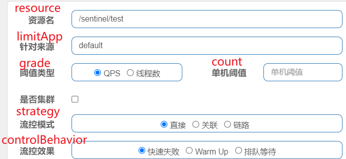

### 流控模式

设置统计的条件

- `直接`: 直接统计资源

    当指定的接口达到限流条件时开启限流。

    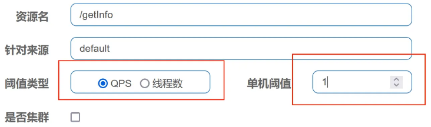

    限制/getInfo这个资源的单机QPS为1，即每秒只允许1次请求，超出的请求会被拦截并报错。

- `关联`: 相互关联的两个资源

    🌰一个是下单接口A，一个是支付接口B，此时一旦支付接口达到了阈值，那么订单接口就应该被限流，不然这边还在下单，消费者等待或者直接被拒绝支付将会极大的影响用户体验。

    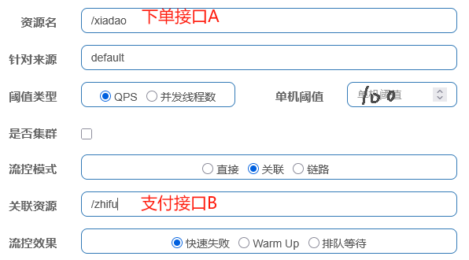

- `链路`: 只统计某个链路

    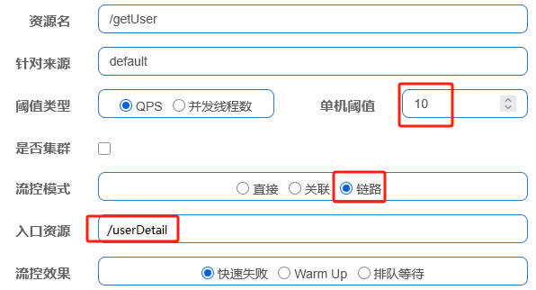

    假设现在某公司开发了一个单机的电商系统，为了满足完成“下订单”的业务，程序代码会依次执行订单创建方法->减少库存方法->微信支付方法->短信发送方法。方法像链条一样从前向后依次执行，这种执行的链条被称为调用链路在。

    🌰比如某个微服务中/getUser接口，会被支付接口/pay接口调用。在另一个业务，/getUser接口也会被用户信息/userDetail接口调用。将入口资源设为/userDetail，则只会针对/userDetail接口的调用链路生效。当访问/userDetail接口的QPS超过10时，/getUser接口就会被限流。而另一条链路从/pay接口到getUser接口的链路则不会受到任何影响。这样就把机器资源让渡给了支付服务.

### 流控效果

- `快速失败`

    直接失败，抛出异常Blocked by Sentinel (flow limiting)

- `Warmup预热`

    一个服务刚刚启动时，一切资源尚未初始化（冷启动），如果直接将QPS跑到最大值，可能导致服务瞬间宕机。因此先设置一个初始值, 然后再逐步提升到最大值

    - 请求阈值初始值是 maxThreshold / coldFactor, coldFactor的默认值是3。
    - 在指定时长内，逐渐提高到maxThreshold值。

    

    QPS的maxThreshold为10，预热时间为5秒，那么初始阈值就是10/3，也就是3.3，然后在5秒后逐渐增长到10.

    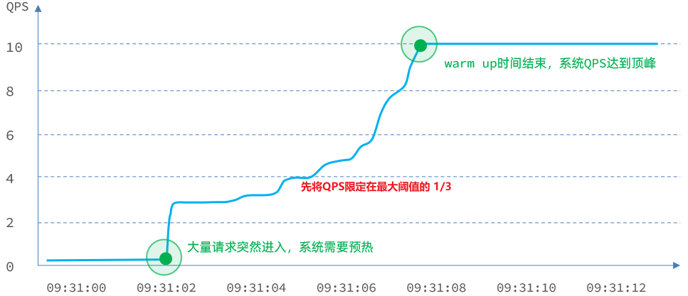

    预热底层是根据`令牌桶`算法实现的，源码对应得类在com.alibaba.csp.sentinel.slots.block.flow.controller.WarmUpController。

    🌰秒杀场景，一开抢，可能会系统崩溃，先预热。

- `排队等待`

    匀速排队，阈值必须设置为QPS，

    - 如果请求处理估算的阈值小于timeout, 则放入队列里排队，挨个通过
    - 如果请求处理估算的阈值大于timeout, 则返回错误

    例如：QPS=5，意味着每200ms处理一个队列中的请求；timeout = 2000，意味着预期等待时长超过2000ms的请求会被拒绝并抛出异常。那什么叫做预期等待时长呢？

    比如现在一下子来了12个请求，因为每200ms执行一个请求，那么：
    - 第6个请求的预期等待时长 = 200 * （6 - 1） = 1000ms, 通过
    - 第12个请求的预期等待时长 = 200 * （12-1） = 2200ms, 抛出异常

    匀速排队方式会严格控制请求通过的间隔时间，也即是让请求以均匀的速度通过，对应的是`漏桶`算法。源码对应得类：com.alibaba.csp.sentinel.slots.block.flow.controller.RateLimiterController

## 熔断降级规则

熔断是什么？

- 电压过高导致保险丝触发熔断保护
- 股票市场的熔断，当价格触发到了熔点之后，会暂停交易一段时间，或者交易可以继续进行，但是报价会限制在一定的范围。

- `慢调用比例`

    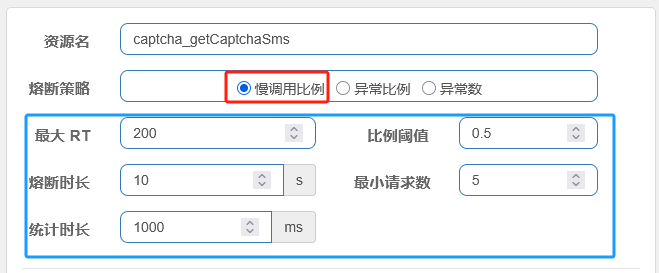

    以上配置的说明：

    在每1秒的`统计时长`内，如果`最大RT(响应时长)`超过200毫秒的请求`比例阈值`达到50%且`最小请求数`不少于5个，则触发熔断，`熔断时长`为10秒。

- `异常比例`

    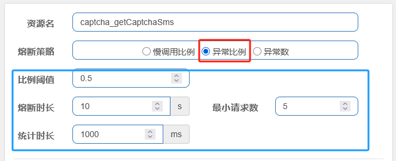

    在每1秒的`统计时长`内，`最小请求数`大于5且异常`比例阈值`超过50%，则触发熔断，该资源在`熔断时长`的10秒内不再接受请求。

- `异常数`

    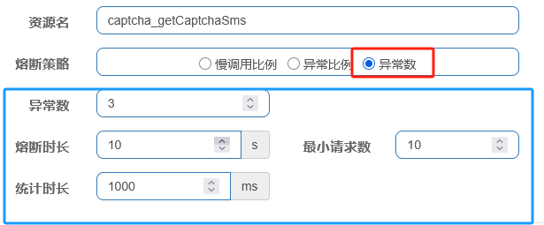

    在每1秒的`统计时长`内，`最小请求数`大于10且`异常数`超过3个 ，则触发熔断，该资源在`熔断时长`的10秒内不再接受请求。

## 热key限流

热点就是经常访问的数据，很多时候希望统计某个访问频次Top K数据并对其进行限流。比如秒杀系统中的商品ID，对于热点商品那一瞬间的并发量是非常可怕的，因此必须要对其进行限流。

Sentinel利用LRU策略统计最近最常访问的热点参数，结合令牌桶算法来进行参数级别的流控。

🌰访问/goods/{id}的请求中，id参数值会有变化，热点参数限流会根据参数值分别统计QPS，统计结果：

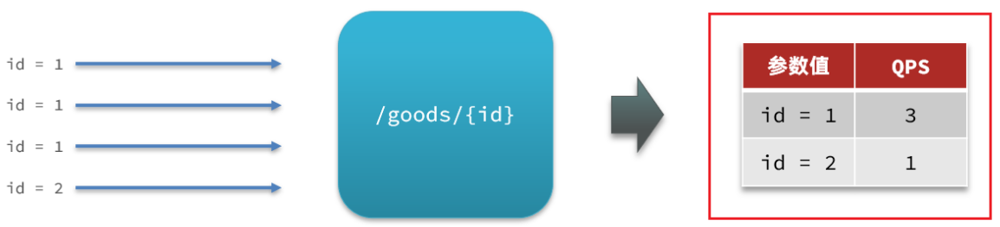

当id=1的请求触发阈值被限流时，id值不为1的请求不受影响。

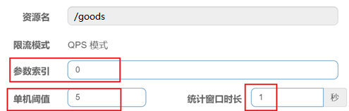

对/goods0号参数（第一个参数）做统计，每1秒相同参数值的请求数不能超过5

🌰刚才的配置中，对查询商品这个接口的所有商品一视同仁，QPS都限定为5.而在实际开发中，可能部分商品是热点商品，例如秒杀商品，我们希望这部分商品的QPS限制与其它商品不一样，高一些。那就需要配置热点参数限流的高级选项了：

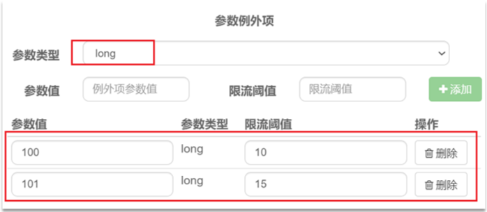

结合上一个配置，这里的含义是对0号的long类型参数限流，每1秒相同参数的QPS不能超过5，有两个例外：

- 如果参数值是100，则每1秒允许的QPS为10
- 如果参数值是101，则每1秒允许的QPS为15

## 系统规则

系统级别的，比如系统到达配置的qps 20万， 触发默认堵塞处理器

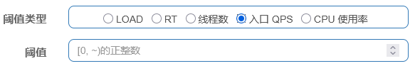

|选项名称|含义说明|单位|计算过程与值的含义|
|--|--|--|--|
|系统负载（load）|当系统负载超过设定阈值，且系统当前并发线程数超过系统容量时，触发保护机制|-|阈值通常设置为CPU核心数的1~3倍（如4核CPU可设为8），需结合系统实际负载能力调整|
|RT（响应时间）|当接口平均响应时间超过阈值，触发降级保护|毫秒|统计单位时间内接口的平均响应时间，超过阈值则触发规则（如设置100ms，即平均RT>100ms触发）|
|线程数|当接口并发线程数超过阈值，触发保护|个|统计接口当前正在处理的线程数量，超过设定值则限制新请求（如设置20，即并发线程>20时触发）|
|入口QPS|限制系统的总入口QPS，防止流量过大压垮系统|QPS|统计单位时间内进入系统的总请求数，超过设定值则限流（如设置1000，即每秒请求>1000时触发）|
|CPU使用率|当系统CPU使用率超过阈值，触发保护机制|%|基于操作系统的CPU使用率统计，超过设定百分比则触发（如设置80，即CPU使用率>80%时触发）|

## 集群流控

为什么需要集群限流？

- 全局流量控制：当服务部署在多个节点上时，单机限流无法准确控制整个集群的流量
- 避免单机不均：
    - 防止因负载均衡不均导致的某些节点过载
    - 不同单机硬件不同, 负载也不同, 一个一个配置过于麻烦

核心实现原理: 思想很简单就是提供一个专门的server来统计调用的总量，其他的实例都与server保持通信。集群流控可以精确地控制整个集群的调用总量，结合单机限流兜底，可以更好地发挥流量控制的效果。

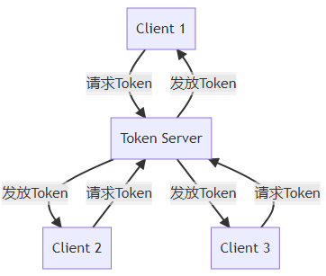

集群流控中共有两种身份：

- Token Client：集群流控客户端，用于向所属 Token Server 通信请求 token。集群限流服务端会返回给客户端结果，决定是否限流。

- Token Server：即集群流控服务端，处理来自 Token Client 的请求，根据配置的集群规则判断是否应该发放 token（是否允许通过）。

令牌请求流程:

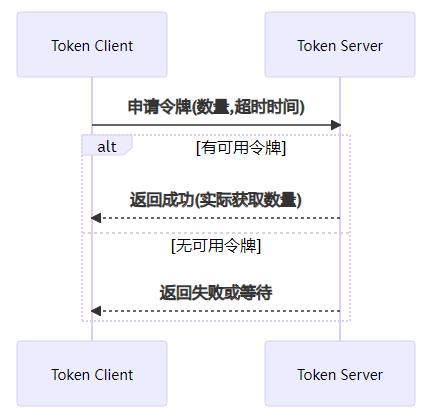

🌰首先一个服务有三个服务提供者，但这三台集群的硬件配置不一样，如图所示：

为了充分利用硬件的资源，诸如 Dubbo 都提供了基于权重的负载均衡机制，例如可以将8C16G的机器设置的权重是4C8G的两倍，这样充分利用硬件资源，假如现在需要引入 Sentinel 的限流机制，例如为一个 Dubbo 服务设置限流规则，这样由于三台集群分担的流量不均匀，会导致无法重复利用高配机器的资源。

假设经过压测，机器配置为C48G最高能承受的TPS为 1500，而机器配置为8C16G能承受的TPS为2800，那如果采取单机限流，其阔值只能设置为1500，因为如果超过1500，会将4C8G的机器压垮。

解决这种办法的方式就是针对整个集群进行限流，即为整个集群设置一个阔值，例如设置限流TPS为6000。

集群与单机限流的最主要区别在与许可的生成，单机模式的许可直接在本地生成，但集群限流必须有一个统一的 Token 发放机制，以此来协调当前集群内多机调用，从而基于当前“调用总数”进行限流。

集群模式使用注意，如果使用的是集群模式限流，则如下两个配置则失效：

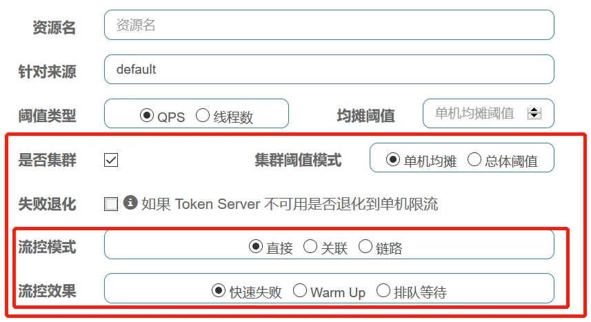

## 授权

授权规则可以对请求方来源做判断和控制。（通过判断请求方的请求头是否携带指定的参数来判断）

授权规则可以对调用方的来源做控制，有白名单和黑名单两种方式。

- 白名单：来源（origin）在白名单内的调用者允许访问
- 黑名单：来源（origin）在黑名单内的调用者不允许访问

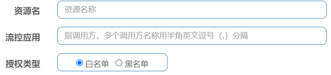

资源名：就是受保护的资源，例如/order/

流控应用：是来源者的名单，

- 如果是勾选白名单，则名单中的来源被许可访问。
- 如果是勾选黑名单，则名单中的来源被禁止访问。

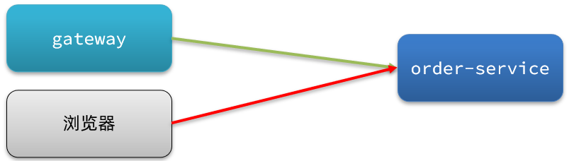

我们允许请求从gateway到order-service，不允许浏览器访问order-service，那么白名单中就要填写网关的来源名称（origin）。

## 持久化

一旦我们重启应用，Sentinel规则将消失，生产环境需要将配置规则进行持久化。规则是否能持久化，取决于规则管理模式，sentinel支持三种规则管理模式：

- `原始`模式：Sentinel的默认模式，将规则保存在内存，重启服务会丢失。
- `pull`模式：存储各服务器本地，一定时间内会轮询检查规则并更新
- `push`模式：存储在nacos注册中心

### pull模式

控制台将配置的规则推送到Sentinel客户端，而客户端会将配置规则保存在本地文件或数据库中。以后会定时去本地文件或数据库中查询，更新本地规则。

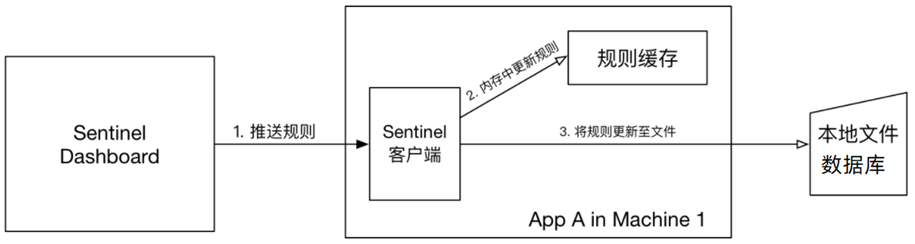

### push模式

push模式：控制台将配置规则推送到远程配置中心，例如Nacos。Sentinel客户端监听Nacos，获取配置变更的推送消息，完成本地配置更新。

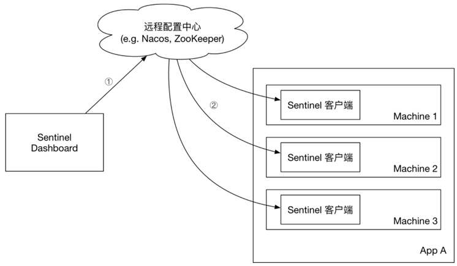

## 参考

- <https://www.cnblogs.com/sexintercourse/p/18646562>
- <https://www.cnblogs.com/Chary/p/18671073>
- <https://www.cnblogs.com/wzzkaifa/p/19067982>
- <https://developer.aliyun.com/article/1392703>
- [集群流控](https://developer.aliyun.com/article/939744)
<https://blog.csdn.net/qq_58299462/article/details/148840838>
<https://blog.csdn.net/weixin_43521001/article/details/149330661>
