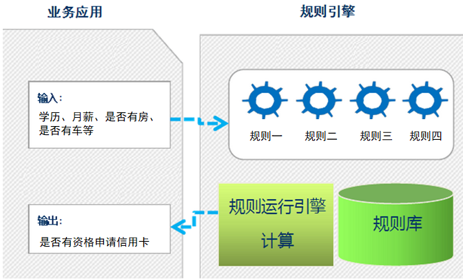

# 规则引擎

## 问题引出

现有一个在线申请信用卡的业务场景，用户需要录入个人信息，如下图所示：

通过上图可以看到，用户录入的个人信息包括姓名、性别、年龄、学历、电话、所在公司、职位、月收入、是否有房、是否有车、是否有信用卡等。录入完成后点击申请按钮提交即可。

1. 检查用户信息合法性的规则如下：

    |规则编号|名称|描述|
    |----------|--------------------|----------------------------------------------------------------------|
    |1|检查学历与薪水1|如果申请人既没房也没车，同时学历为大专以下，并且月薪少于5000，那么不通过|
    |2|检查学历与薪水2|如果申请人既没房也没车，同时学历为大专或本科，并且月薪少于3000，那么不通过|
    |3|检查学历与薪水3|如果申请人既没房也没车，同时学历为本科以上，并且月薪少于2000，同时之前没有信用卡的，那么不通过|
    |4|检查申请人已有的信用卡数量|如果申请人现有的信用卡数量大于10，那么不通过|

2. 信用卡发放规则

    用户信息合法性检查通过后，还需要根据如下信用卡发放规则确定用户所办信用卡的额度：

    |规则编号|名称|描述|
    |--------|----|----------------------------------------------------------------------|
    |1|规则1|如果申请人有房有车，或者月收入在20000以上，那么发放的信用卡额度为15000|
    |2|规则2|如果申请人没房没车，但月收入在10000~20000之间，那么发放的信用卡额度为6000|
    |3|规则3|如果申请人没房没车，月收入在10000以下，那么发放的信用卡额度为3000|
    |4|规则4|如果申请人有房没车或者没房但有车，月收入在10000以下，那么发放的信用卡额度为5000|
    |5|规则5|如果申请人有房没车或者是没房但有车，月收入在10000~20000之间，那么发放的信用卡额度为8000|

思考：如何实现上面的业务逻辑呢？
我们最容易想到的就是使用分支判断(if else)来实现

通过上面的伪代码我们可以看到，我们的业务规则是通过Java代码的方式实现的。这种实现方式存在如下问题：

1、硬编码实现业务规则难以维护
2、硬编码实现业务规则难以应对变化
3、业务规则发生变化需要修改代码，重启服务后才能生效

那么面对上面的业务场景，还有什么好的实现方式吗？

答案是规则引擎。

## 规则引擎概述

规则引擎，全称为业务规则管理系统，英文名为BRMS(即Business Rule Management System)。规则引擎的主要思想是将应用程序中的业务决策部分分离出来，并使用预定义的语义模块编写业务决策（业务规则），由用户或开发者在需要时进行配置、管理。

需要注意的是规则引擎并不是一个具体的技术框架，而是指的一类系统，即业务规则管理系统。目前市面上具体的规则引擎产品有：drools、VisualRules、iLog等。

规则引擎实现了将业务决策从应用程序代码中分离出来，接收数据输入，解释业务规则，并根据业务规则做出业务决策。规则引擎其实就是一个输入输出平台。

上面的申请信用卡业务场景使用规则引擎后效果如下：

系统中引入规则引擎后，业务规则不再以程序代码的形式驻留在系统中，取而代之的是处理规则的规则引擎，业务规则存储在规则库中，完全独立于程序。业务人员可以像管理数据一样对业务规则进行管理，比如查询、添加、更新、统计、提交业务规则等。业务规则被加载到规则引擎中供应用系统调用。

## 使用规则引擎的优势

1、业务规则与系统代码分离，实现业务规则的集中管理
2、在不重启服务的情况下可随时对业务规则进行扩展和维护
3、可以动态修改业务规则，从而快速响应需求变更
4、规则引擎是相对独立的，只关心业务规则，使得业务分析人员也可以参与编辑、维护系统的业务规则
5、减少了硬编码业务规则的成本和风险
6、使用规则引擎提供的规则编辑工具，使复杂的业务规则实现变得的简单

## 规则引擎应用场景

对于一些存在比较复杂的业务规则并且业务规则会频繁变动的系统比较适合使用规则引擎，如下：

1、风险控制系统----风险贷款、风险评估
2、反欺诈项目----银行贷款、征信验证
3、决策平台系统----财务计算
4、促销平台系统----满减、打折、加价购

## [Drools](https://drools.org/)介绍

drools是一款由JBoss组织提供的基于Java语言开发的开源规则引擎，可以将复杂且多变的业务规则从硬编码中解放出来，以规则脚本的形式存放在文件或特定的存储介质中(例如存放在数据库中)，使得业务规则的变更不需要修改项目代码、重启服务器就可以在线上环境立即生效。

### 规则引擎构成

- drools规则引擎由以下三部分构成：

    - Working Memory（工作内存）
    - Rule Base（规则库）
    - Inference Engine（推理引擎）

- 其中Inference Engine（推理引擎）又包括：

    - Pattern Matcher（匹配器）
    - Agenda(议程)
    - Execution Engine（执行引擎）

如下图所示：

3.3.2 相关概念说明

- Working Memory：工作内存，drools规则引擎会从Working Memory中获取数据并和规则文件中定义的规则进行模式匹配，所以我们开发的应用程序只需要将我们的数据插入到Working Memory中即可，例如本案例中我们调用kieSession.insert(order)就是将order对象插入到了工作内存中。
- Fact：事实，是指在drools 规则应用当中，将一个普通的JavaBean插入到Working Memory后的对象就是Fact对象，例如本案例中的Order对象就属于Fact对象。Fact对象是我们的应用和规则引擎进行数据交互的桥梁或通道。
- Rule Base：规则库，我们在规则文件中定义的规则都会被加载到规则库中。
- Pattern Matcher：匹配器，将Rule Base中的所有规则与Working Memory中的Fact对象进行模式匹配，匹配成功的规则将被激活并放入Agenda中。
- Agenda：议程，用于存放通过匹配器进行模式匹配后被激活的规则。
- Execution Engine：执行引擎，执行Agenda中被激活的规则。

## 规则引擎执行过程

- 将初始数据（fact）输入至工作内存（Working Memory）
- 使用Pattern Matcher将规则库中的规则（rule）和数据（fact）比较
- 如果执行规则存在冲突（conflict），即同时激活了多个规则，将冲突的规则放入冲突集合
- 解决冲突，将激活的规则按顺序放入Agenda
- 执行Agenda中的规则。重复步骤b至e，直到执行完毕Agenda中的所有规则

