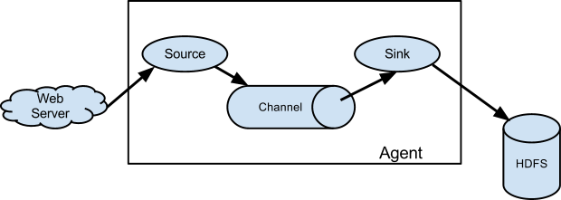
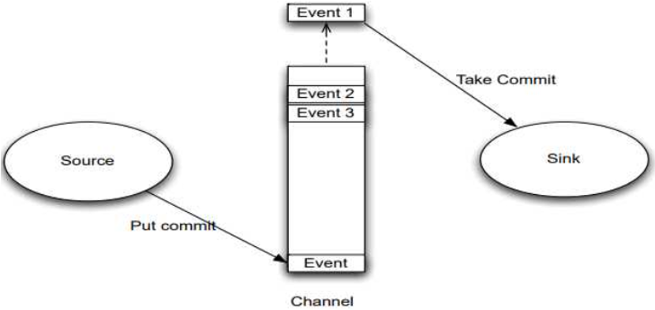
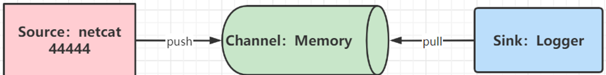

# flume基本概念

在企业中，Flume多用于日志采集

Flume的核心是把数据从数据源(source)收集过来，再将收集到的数据送到指定的目的地(sink)。
为了保证输送的过程一定成功，在送到目的地(sink)之前，会先缓存数据(channel),待数据真正到达目的地(sink)后，flume在删除自己缓存的数据。

Flume的基础架构有3部分

- Source，负责数据的读取
- Channel，负责数据在Flume内部暂存，它是一个消息队列（简易）
- Sink，负责将Flume的数据写出想去的地方

也可以这样认为：

- E：抽取（Flume Source）
- T：转换（Flume Channel）
- L：加载（Flume SInk）



对于我们使用者来说，我们可以自行选择3大组件：

- Source可以选择，比如从Kafka读取、从文件读取、从Socket读取、从TCP读取、从WEB API读取 等等、从CSV读取。。。
- Channel可以选择，比如：磁盘Channel，内存Channel。
- Sink可以选择，比如写出：Kafka、文件、HDFS、MySQL、Oracle等等。。。。。

## Apache Flume 运行机制

在整个数据的传输的过程中，流动的是event，它是Flume内部数据传输的最基本单元。



event将传输的数据进行封装，如果是文本文件，通常是一行记录，event也是事务的基本单位。
event从source，流向channel，再到sink，本身为一个字节数组，并可携带headers(头信息)信息。
event代表着一个数据的最小完整单元，从外部数据源来，向外部的目的地去。
一个完整的event包括：event headers、event body，其中event body是flume收集到的日记记录。

## flume使用



```sh
# 第一部分：定义这个agent中各组件的名字
a1.sources = r1
a1.sinks = k1
a1.channels = c1

# 第二部分：描述和配置source组件：r1
a1.sources.r1.type = netcat
a1.sources.r1.bind = node1.itcast.cn
a1.sources.r1.port = 44444

# 第三部分：描述和配置sink组件：k1
a1.sinks.k1.type = logger

# 第四部分：描述和配置channel组件，此处使用是内存缓存的方式
a1.channels.c1.type = memory
a1.channels.c1.capacity = 1000
a1.channels.c1.transactionCapacity = 100

# 第五部分：描述和配置source、channel、sink之间的连接关系
a1.sources.r1.channels = c1
a1.sinks.k1.channel = c1
```
