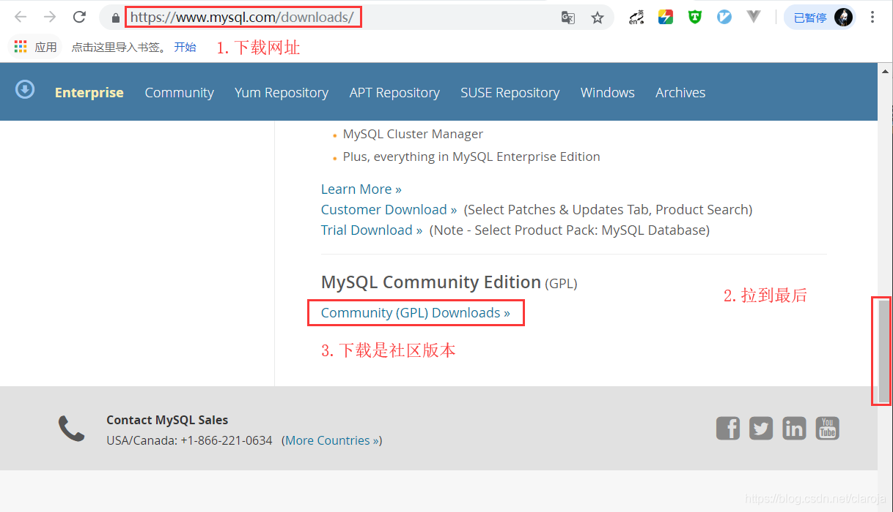
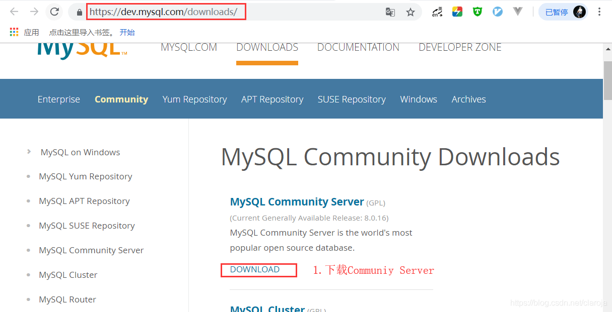
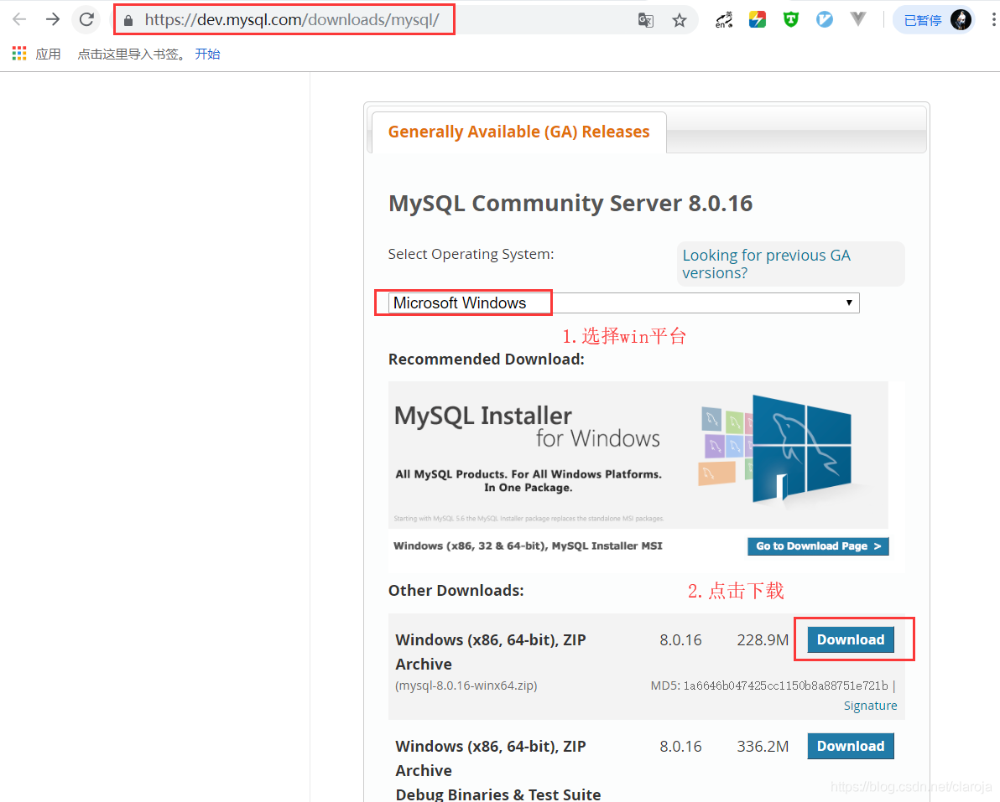
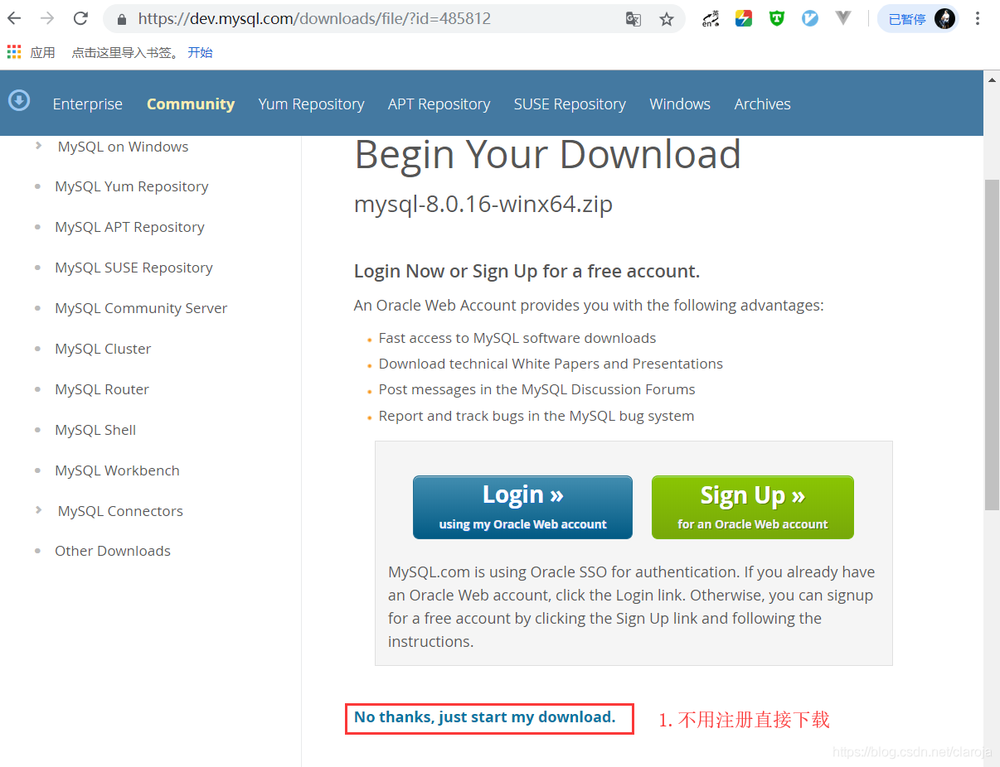
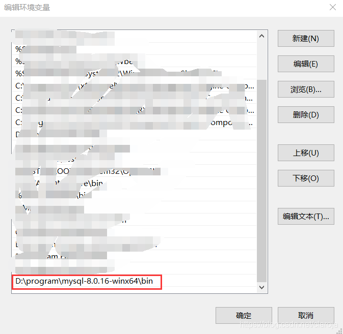
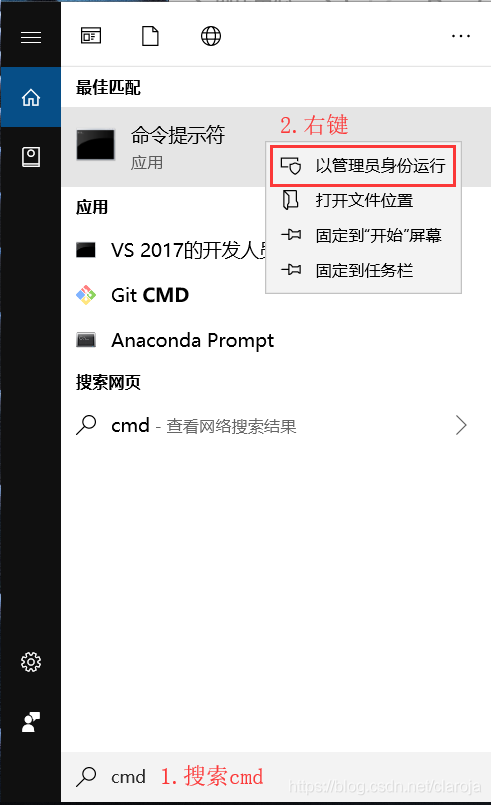

# win

## 1.下载MySQL8









## 2.配置环境变量
将压缩包解压，并配置环境变量



##  3.初始化
在MySQ文件夹根目录下创建my.ini文件,内容如下：
```ini
[mysqld]
## 设置3306端口
port=3306
## 设置mysql的安装目录
basedir=D:\program\mysql-8.0.16-winx64
## 设置mysql数据库的数据的存放目录,一般都设置在根目录下
datadir=D:\program\mysql-8.0.16-winx64\Data
## 允许最大连接数
max_connections=200
## 允许连接失败的次数。
max_connect_errors=10
## 服务端使用的字符集默认为utf8mb4
character-set-server=utf8mb4
## 创建新表时将使用的默认存储引擎
default-storage-engine=INNODB
## 默认使用“mysql_native_password”插件认证
#mysql_native_password
default_authentication_plugin=mysql_native_password
[mysql]
## 设置mysql客户端默认字符集
default-character-set=utf8mb4
[client]
## 设置mysql客户端连接服务端时默认使用的端口
port=3306
default-character-set=utf8mb4
```

## 4.注册服务
以管理员身份打开cmd,以win10为例

1. `mysqld --initialize --console` 初始化mysql,注意将密码记下
2. `mysqld --install` 注册mysql服务
3. `net start mysql`启动mysql服务


## 重置密码
`mysql -uroot -p --port=3306`
`ALTER USER 'root'@'localhost' IDENTIFIED WITH mysql_native_password BY 'newpassword';`

参考文献:
https://blog.csdn.net/qq_37350706/article/details/81707862
https://blog.csdn.net/lxlong89940101/article/details/80246675
https://www.baidu.com/s?wd=mysql+8+%E6%9B%B4%E6%94%B9%E5%AF%86%E7%A0%81&tn=98012088_5_dg&ch=11
