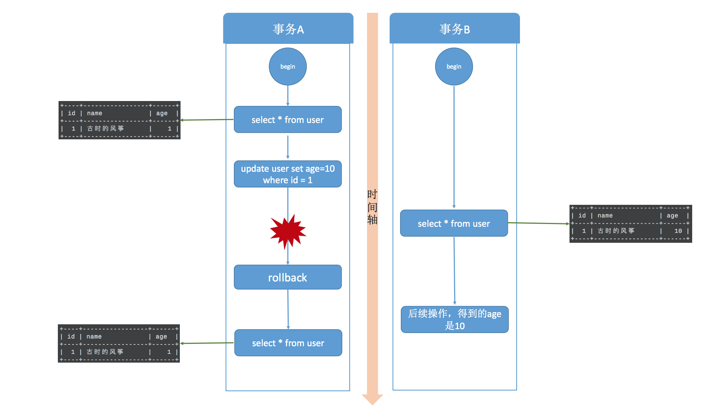
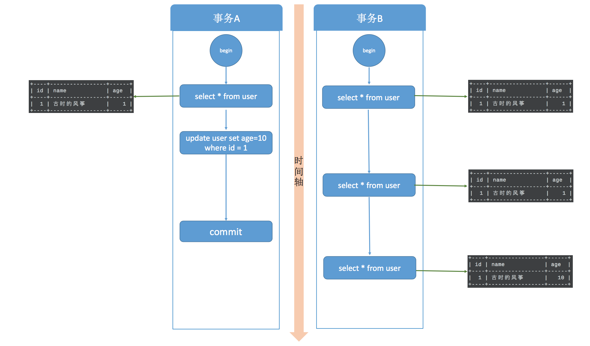
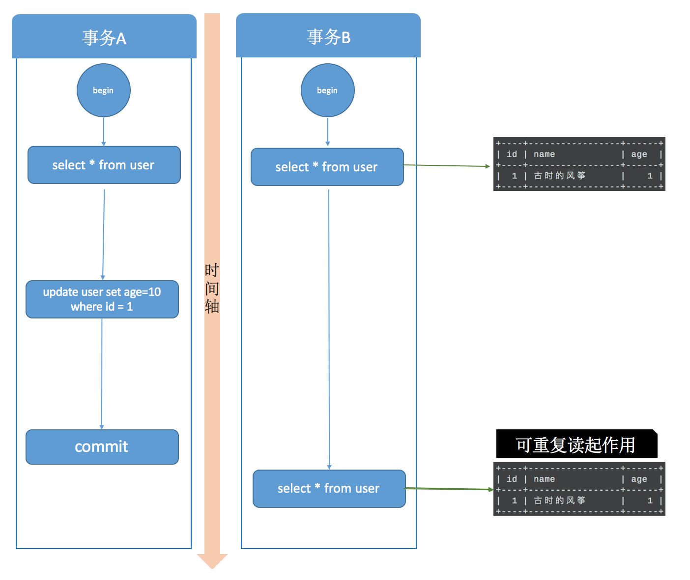
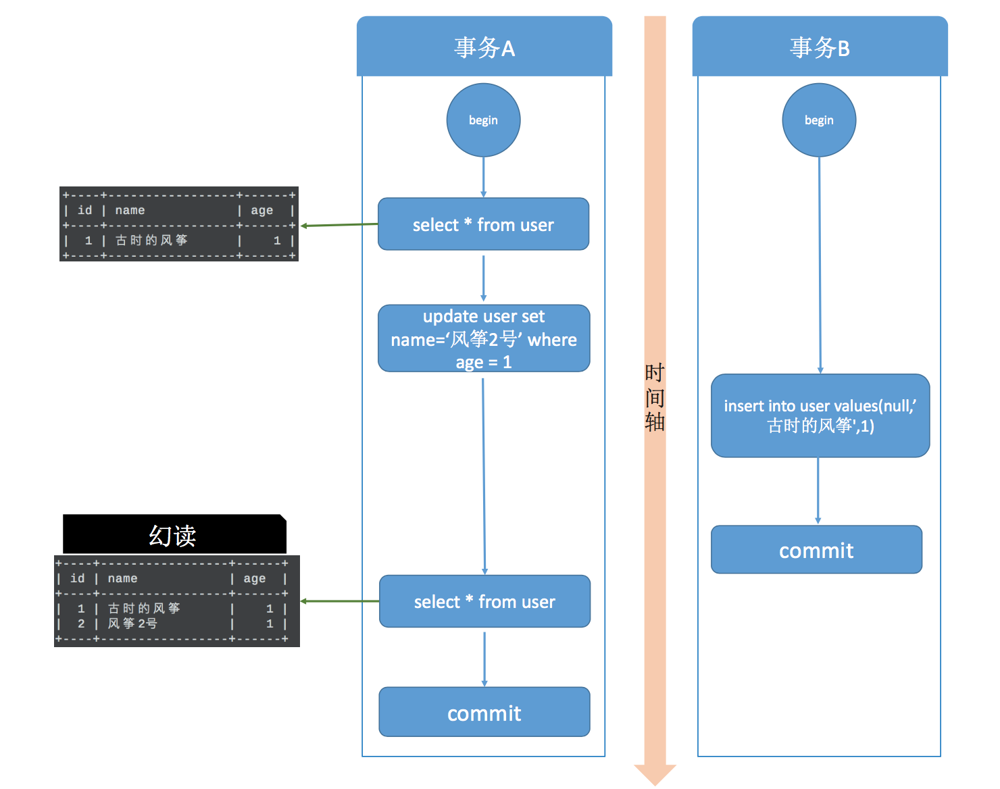

# 事务的隔离级别

## 事务

MySQL 事务都是指在 InnoDB 引擎下，MyISAM 引擎是不支持事务的。

数据库事务指的是一组数据操作，事务内的操作要么就是全部成功，要么就是全部失败，什么都不做，其实不是没做，是可能做了一部分但是只要有一步失败，就要回滚所有操作. 🌰一个网购付款的操作，用户付款后要涉及到订单状态更新、扣库存以及其他一系列动作，这就是一个事务，如果一切正常那就相安无事，一旦中间有某个环节异常，那整个事务就要回滚，总不能更新了订单状态但是不扣库存.

事务具有原子性（Atomicity）、一致性（Consistency）、隔离性（Isolation）、持久性（Durability）四个特性，简称 ACID，缺一不可。今天要说的就是隔离性。

## 概念说明

- 脏读: 针对数据`回滚(rollback)`操作。读到了其他事务未提交的数据. 未提交意味着这些数据可能会回滚，也就是可能最终不会存到数据库中。读到了并不一定最终存在的数据，这就是脏读。

- 不可重复读: 针对数据`更新（UPDATE）`操作。在同一事务内，不同的时刻读到的同一批数据可能是不一样的，可能会受到其他事务的影响，比如其他事务改了这批数据并提交了。

- 幻读: 针对数据`插入（INSERT）`操作来说的。假设事务A对某些行的内容作了更改，但是还未提交，此时事务B插入了与事务A更改前的记录相同的记录行，并且在事务A提交之前先提交了，而这时，在事务A中查询，会发现好像刚刚的更改对于某些数据未起作用，但其实是事务B刚插入进来的，让用户感觉很魔幻，感觉出现了幻觉，这就叫幻读。

## 事务隔离级别

SQL 标准定义了四种隔离级别，MySQL 全都支持。这四种隔离级别分别是：

1. 读未提交（READ UNCOMMITTED）
2. 读提交 （READ COMMITTED）
3. 可重复读 （REPEATABLE READ）
4. 串行化 （SERIALIZABLE）

从上往下，隔离强度逐渐增强，性能逐渐变差。采用哪种隔离级别要根据系统需求权衡决定，其中，可重复读是 MySQL 的默认级别。

事务隔离其实就是为了解决上面提到的脏读、不可重复读、幻读这几个问题，下面展示了 4 种隔离级别对这三个问题的解决程度。

事务隔离级别|脏读|不可重复读|幻读
--|--|--|--
读未提交（read-uncommitted）|是|是|是
不可重复读（read-committed）|否|是|是
可重复读（repeatable-read） |否|否|是
串行化（serializable）|否|否|否

## 读未提交(read-uncommitted)

MySQL 事务隔离其实是依靠锁来实现的，加锁自然会带来性能的损失。而读未提交隔离级别是不加锁的，所以它的性能是最好的，没有加锁、解锁带来的性能开销。但它也无法解决脏读的问题。

首先设置全局隔离级别为读未提交。`set global transaction isolation level read uncommitted;`

🌰启动两个事务，分别为事务A和事务B，在事务A中使用 update 语句，修改 age 的值为10，初始是1 ，在执行完 update 语句之后，在事务B中查询 user 表，会看到 age 的值已经是 10 了，这时候事务A还没有提交，而此时事务B有可能拿着已经修改过的 age=10 去进行其他操作了。在事务B进行操作的过程中，很有可能事务A由于某些原因，进行了事务回滚操作，那其实事务B得到的就是脏数据了，拿着脏数据去进行其他的计算，那结果肯定也是有问题的。

## 读提交(read-committed)

读提交就是一个事务只能读到其他事务已经提交过的数据，也就是其他事务调用 commit 命令之后的数据。那脏数据问题迎刃而解了。

首先把事务隔离级别改为读提交级别。`set global transaction isolation level read committed;`

🌰同样开启事务A和事务B两个事务，在事务A中使用 update 语句将 id=1 的记录行 age 字段改为 10。此时，在事务B中使用 select 语句进行查询，我们发现在事务A提交之前，事务B中查询到的记录 age 一直是1，直到事务A提交，此时在事务B中 select 查询，发现 age 的值已经是 10 了。

这就出现了一个问题，在同一事务中(本例中的事务B)，事务的不同时刻同样的查询条件，查询出来的记录内容是不一样的，事务A的提交影响了事务B的查询结果，这就是不可重复读，也就是读提交隔离级别。

## 可重复读(REPEATABLE READ)

上面说不可重复读是指同一事物不同时刻读到的数据值可能不一致。而可重复读是指，事务不会读到其他事务对已有数据的修改，及时其他事务已提交，也就是说，事务开始时读到的已有数据是什么，在事务提交前的任意时刻，这些数据的值都是一样的。

同样的，需改全局隔离级别为可重复读级别。`set global transaction isolation level repeatable read;`

在这个隔离级别下，启动两个事务，两个事务同时开启。首先看一下可重复读的效果，事务A启动后修改了数据，并且在事务B之前提交，事务B在事务开始和事务A提交之后两个时间节点都读取的数据相同，已经可以看出可重复读的效果。

可重复读做到了，这只是针对已有行的更改操作有效，但是对于新插入的行记录，就没这么幸运了，幻读就这么产生了。

✨要说明的是，当你在 MySQL 中测试幻读的时候，并不会出现上图的结果，幻读并没有发生，MySQL 的可重复读隔离级别其实解决了幻读问题，这会在后面的内容说明

## 串行化(serializable)

串行化是4种事务隔离级别中隔离效果最好的，解决了脏读、可重复读、幻读的问题，但是效果最差，它将事务的执行变为顺序执行，与其他三个隔离级别相比，它就相当于单线程，后一个事务的执行必须等待前一个事务结束。

事务A开始后，执行 update 操作，将 age = 1 的记录的 name 改为“风筝2号”；

事务B开始后，在事务执行完 update 后，执行 insert 操作，插入记录 age =1，name = 古时的风筝，这和事务A修改的那条记录值相同，然后提交。

事务B提交后，事务A中执行 select，查询 age=1 的数据，这时，会发现多了一行，并且发现还有一条 name = 古时的风筝，age = 1 的记录，这其实就是事务B刚刚插入的，这就是幻读。

## 参考

<https://www.cnblogs.com/fengzheng/p/12557762.html>
