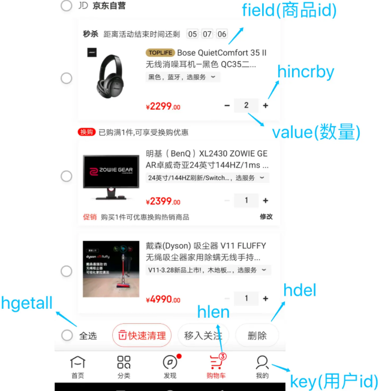

# Hash

## 最佳实践

### 考察问

- 购物车

    以用户id为key，商品id为field，商品数量为value，恰好构成了购物车的3个要素，如下图所示。

    

    涉及的命令如下：

    - 添加商品：`()`
    - 添加数量：`()`
    - 商品总数：`()`
    - 删除商品：`()`
    - 获取购物车所有商品：`()`

### 考察点

- 购物车

    以用户id为key，商品id为field，商品数量为value，恰好构成了购物车的3个要素，如下图所示。

    

    涉及的命令如下：

    - 添加商品：`HSET cart:{用户id} {商品id} 1`
    - 添加数量：`HINCRBY cart:{用户id} {商品id} 1`
    - 商品总数：`HLEN cart:{用户id}`
    - 删除商品：`HDEL cart:{用户id} {商品id}`
    - 获取购物车所有商品：`HGETALL cart:{用户id}`

## 概念
Hash类型，也叫散列，其value是一个无序字典

String结构是将对象序列化为JSON字符串后存储，当需要修改对象某个字段时很不方便：

| KEY           | VALUE                  |
|---------------|------------------------|
| heima:user:1  | {name:"Jack", age:21}  |
| heima:user:2  | {name:"Rose", age:18}  |

Hash结构可以将对象中的每个字段独立存储，可以针对单个字段做CRUD：

| KEY           | field | value |
|---------------|-------|-------|
| heima:user:1  | name  | Jack  |
| heima:user:1  | age   | 21    |
| heima:user:2  | name  | Rose  |
| heima:user:2  | age   | 18    |

## 原理

Hash 类型的底层数据结构是由压缩列表或哈希表实现的. 在最新 Redis 版本中，压缩列表数据结构已经废弃了，交由 listpack 数据结构来实现了。

## 常用命令

1. 创建哈希: `HSET key field value [field value ...]`
2. 获得哈希键的值: `HGET key field`
3. 删除哈希的键: `HDEL key field [field ...]`
4. 获得哈希的键的数量: `HLEN key`
5. 增加哈希键的值: `HINCRBY key field increment`
6. 判断哈希键存在: `HEXISTS key field`
7. 获得哈希所有键: `HKEYS key`
8. 获得哈希所有值: `HVALS key`
9. 获得哈希所有键值: `HGETALL key`

## 应用场景

### 缓存对象

在介绍 String 类型的应用场景时有所介绍，String + Json 也是存储对象的一种方式，那么存储对象时，到底用 String + json 还是用 Hash 呢？

一般对象用 String + Json 存储，对象中某些频繁变化的属性可以考虑抽出来用 Hash 类型存储。

参考[String](2_1String🔴🟨💛.md)

### 购物车

以用户 id 为 key，商品 id 为 field，商品数量为 value，恰好构成了购物车的3个要素，如下图所示。

涉及的命令如下：

- 添加商品：`HSET cart:{用户id} {商品id} 1`
- 添加数量：`HINCRBY cart:{用户id} {商品id} 1`
- 商品总数：`HLEN cart:{用户id}`
- 删除商品：`HDEL cart:{用户id} {商品id}`
- 获取购物车所有商品：`HGETALL cart:{用户id}`

## 参考

- https://cloud.tencent.com/developer/article/2320407

