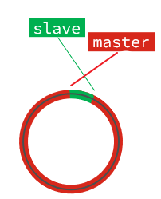
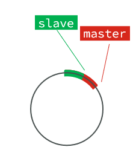

# Redis主从

## 最佳实践

### 考察问

- 💚全量同步

    - `()`，是数据集的标记，id一致则说明是同一数据集。每一个master都有`()`的replid，slave则会`()`master节点的replid

    - `()`：偏移量，随着记录在`()`文件中的数据增多而逐渐增大。slave完成同步时也会记录当前同步的offset。如果slave的offset`()`master的offset，说明slave数据落后于master，需要更新。

    

    ✨总结:
    - 一个文件: `()`
    - 两个关键数据: `()`和`()`
    - 三个阶段:
        1. 通过两个关键数据, 判断是`()`还是`()`
        2. 生成`()`以及记录此期间产生的`()`
        3. 发生`()`

- 💚增量同步

    - repl_baklog: 环形的数组, 会记录master`()`的offset和slave`()`的offset

    - 如果master的offset没有超过slave的offset, 则`()`拷贝

        

    - 如果master的offset超过并slave的offset, 则`()`拷贝(slave发现自己的offset不见了)

        

- 💛主从同步优化

    - 在master中配置repl-diskless-sync yes启用无磁盘复制，避免全量同步时的磁盘IO。
    - Redis单节点上的内存占用不要太`大`，减少RDB导致的过多磁盘IO
    - 适当提高repl_backlog的`大小`，发现slave宕机时尽快实现故障恢复，尽可能避免全量同步
    - 限制一个master上的slave节点数量，如果实在是太多slave，则可以采用`主-从-从`链式结构，减少master压力

    

### 考察点

- 全量同步

    - `Replication Id(replid)`，是数据集的标记，id一致则说明是同一数据集。每一个master都有`唯一`的replid，slave则会`继承`master节点的replid
    - `offset`：偏移量，随着记录在`repl_backlog`文件中的数据增多而逐渐增大。slave完成同步时也会记录当前同步的offset。如果slave的offset`小于`master的offset，说明slave数据落后于master，需要更新。

    

    ✨总结:
    - 一个文件: `repl_backlog`
    - 两个关键数据: `replid`和`offset`
    - 三个阶段:
        1. 通过两个关键数据, 判断是`全量`还是`增量`
        2. 生成`RDB`以及记录此期间产生的`新命令`
        3. 发生`新命令`

- 增量同步

    - repl_baklog: 环形的数组, 会记录master`当前`的offset和slave`已经拷贝到`的offset

    - 如果master的offset没有超过slave的offset, 则`增量`拷贝
        
    - 如果master的offset超过并slave的offset, 则`全量`拷贝(slave发现自己的offset不见了)
        

- 主从同步优化

    - 在master中配置repl-diskless-sync yes启用无磁盘复制，避免全量同步时的磁盘IO。
    - Redis单节点上的内存占用不要太`大`，减少RDB导致的过多磁盘IO
    - 适当提高repl_baklog的`大小`，发现slave宕机时尽快实现故障恢复，尽可能避免全量同步
    - 限制一个master上的slave节点数量，如果实在是太多slave，则可以采用`主-从-从`链式结构，减少master压力

    

## 主从架构

单节点Redis的并发能力是有上限的，要进一步提高Redis的并发能力，就需要搭建主从集群，实现读写分离。

## 主从数据同步原理

### 全量同步

主从第一次建立连接时，会执行`全量同步`，将master节点的所有数据都拷贝给slave节点，流程：

关键问题，master如何得知salve是第一次来连接呢？

有几个概念，可以作为判断依据：

- `Replication Id`：简称replid，是数据集的标记，id一致则说明是同一数据集。每一个master都有`唯一`的replid，slave则会`继承`master节点的replid
- `offset`：偏移量，随着记录在`repl_backlog`中的数据增多而逐渐增大。slave完成同步时也会记录当前同步的offset。如果slave的offset`小于`master的offset，说明slave数据落后于master，需要更新。

因此slave做数据同步，必须向master声明自己的replication id 和offset，master才可以判断到底需要同步哪些数据。

1. slave原本也是一个master，有自己的replid和offset，当第一次变成slave，与master建立连接时，发送的replid和offset是自己的replid和offset。

2. master判断发现slave发送来的replid与自己的不一致，说明这是一个全新的slave，就知道要做全量同步了。

3. master会将自己的replid和offset都发送给这个slave，slave保存这些信息。以后slave的replid就与master一致了。

因此，master判断一个节点是否是第一次同步的依据，就是看`replid`是否一致。如图：

完整流程描述：

1. slave节点请求增量同步
2. master节点判断replid，发现不一致，拒绝增量同步
3. master将完整内存数据生成RDB，发送RDB到slave
4. slave清空本地数据，加载master的RDB
5. master将RDB期间的命令记录在repl_baklog，并持续将log中的命令发送给slave
6. slave执行接收到的命令，保持与master之间的同步

### 增量同步

全量同步需要先做RDB，然后将RDB文件通过网络传输个slave，成本太高了。因此除了第一次做全量同步，其它大多数时候slave与master都是做`增量同步`。

什么是增量同步？就是只更新slave与master存在差异的部分数据。如图：

master怎么知道slave与自己的数据差异在哪里呢? 这就要说到全量同步时的repl_baklog文件了。

这个文件是一个固定大小的数组，只不过数组是`环形`，也就是说`角标到达数组末尾后，会再次从0开始读写`，这样数组头部的数据就会被覆盖。

repl_baklog中会记录Redis处理过的命令日志及offset，包括master当前的offset，和slave已经拷贝到的offset：

slave与master的offset之间的差异，就是salve需要增量拷贝的数据了。

随着不断有数据写入，master的offset逐渐变大，slave也不断的拷贝，追赶master的offset：

直到数组被填满：

此时，如果有新的数据写入，就会覆盖数组中的旧数据。不过，旧的数据只要是绿色的，说明是已经被同步到slave的数据，即便被覆盖了也没什么影响。因为未同步的仅仅是红色部分。

但是，如果slave出现网络阻塞，导致master的offset远远超过了slave的offset：

如果master继续写入新数据，其offset就会覆盖旧的数据，直到将slave现在的offset也覆盖：

棕色框中的红色部分，就是尚未同步，但是却已经被覆盖的数据。此时如果slave恢复，需要同步，却发现自己的offset都`没有了`，无法完成增量同步了。只能做`全量同步`。

## 主从同步优化

主从同步可以保证主从数据的一致性，非常重要。

可以从以下几个方面来优化Redis主从就集群：

- 在master中配置repl-diskless-sync yes启用无磁盘复制，避免全量同步时的磁盘IO。
- Redis单节点上的内存占用不要太大，减少`RDB`导致的过多磁盘IO
- 适当提高`repl_baklog`的大小，发现slave宕机时尽快实现故障恢复，尽可能避免全量同步
- 限制一个master上的slave节点数量，如果实在是太多slave，则可以采用`主-从-从`链式结构，减少master压力

主从从架构图：

