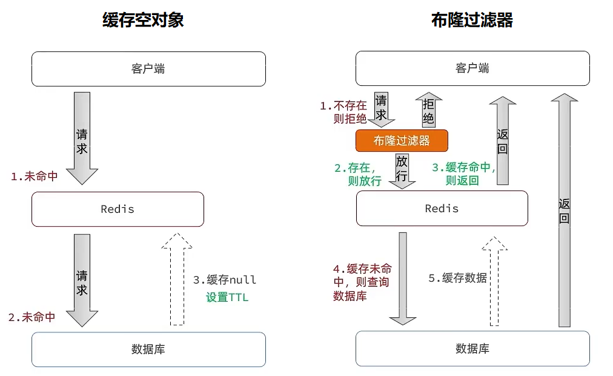

# redis缓存穿透雪崩击穿问题

## 最佳实践

### 考察问

- 💚缓存穿透: 查询key缓存和数据库`()`不存在, 解决方法
    - `()`
    - `()`

    

- 💚缓存雪崩: 大量key`()`失效, 解决方法

    - 给不同的Key的TTL添加`()`
    - 利用Redis`()`提高服务的可用性
    - 给业务添加`()`缓存
    - 给缓存业务添加`()`策略

- 💚缓存击穿: `()`key失效, 解决方法
    - `()`

        

    - `()`

        

### 考察点

- 缓存穿透: 查询key缓存和数据库`都`不存在, 解决方法
    - `缓存空对象`
    - `布隆过滤器`

    

- 缓存雪崩: 大量key`同时`失效, 解决方法

    - 给不同的Key的TTL添加`随机值`
    - 利用Redis`集群`提高服务的可用性
    - 给业务添加`多级`缓存
    - 给缓存业务添加`降级限流`策略

- 缓存击穿: `热点`key失效, 解决方法
    - `互斥锁`: ✨`一个线程修改数据(加锁), 其他线程等待`

        

    - `逻辑过期`✨`一个线程修改数据(加锁), 其他线程返回过期数据`

        

## 缓存穿透

缓存穿透是指客户端请求的数据在缓存中和数据库中`都`不存在，这样缓存永远不会生效，这些请求都会打到数据库。

常见的解决方案有两种：

- 缓存空对象
    - 优点：实现简单，维护方便
    - 缺点：
        - 额外的内存消耗
        - 可能造成短期的不一致
- 布隆过滤
    - 优点：内存占用较少，没有多余key
    - 缺点：
        - 实现复杂
        - 存在误判可能

## 缓存雪崩

缓存雪崩是指在同一时段大量的缓存key`同时`失效或者Redis服务宕机，导致大量请求到达数据库，带来巨大压力。

解决方案：

- 给不同的Key的TTL添加`随机值`
- 利用Redis`集群`提高服务的可用性
- 给业务添加`多级`缓存
- 给缓存业务添加`降级限流`策略

## 缓存击穿

缓存击穿问题也叫`热点Key`问题，就是一个被高并发访问并且缓存重建业务较复杂的key突然失效了，无数的请求访问会在瞬间给数据库带来巨大的冲击。

假设线程1在查询缓存之后，本来应该去查询数据库，然后把这个数据重新加载到缓存的，此时只要线程1走完这个逻辑，其他线程就都能从缓存中加载这些数据了，但是假设在线程1没有走完的时候，后续的线程2，线程3，线程4同时过来访问当前这个方法， 那么这些线程都不能从缓存中查询到数据，那么他们就会同一时刻来访问查询缓存，都没查到，接着同一时间去访问数据库，同时的去执行数据库代码，对数据库访问压力过大

常见的解决方案有两种：

- 互斥锁
- 逻辑过期

### 互斥锁

假设现在线程1过来访问，他查询缓存没有命中，但是此时他获得到了锁的资源，那么线程1就会一个人去执行逻辑，假设现在线程2过来，线程2在执行过程中，并没有获得到锁，那么线程2就可以进行到休眠，直到线程1把锁释放后，线程2获得到锁，然后再来执行逻辑，此时就能够从缓存中拿到数据了。

### 逻辑过期方案

缓存击穿问题，主要原因是在于对key设置了过期时间，假设不设置过期时间，其实就不会有缓存击穿的问题，但是不设置过期时间，这样数据不就一直占用我们内存了吗，我们可以采用逻辑过期方案。

我们把过期时间设置在redis的value中，注意：这个过期时间并不会直接作用于redis，而是我们后续通过逻辑去处理。假设线程1去查询缓存，然后从value中判断出来当前的数据已经过期了，此时线程1去获得互斥锁，那么其他线程会进行阻塞，获得了锁的线程他会开启一个 线程去进行 以前的重构数据的逻辑，直到新开的线程完成这个逻辑后，才释放锁， 而线程1直接进行返回，假设现在线程3过来访问，由于线程线程2持有着锁，所以线程3无法获得锁，线程3也直接返回数据，只有等到新开的线程2把重建数据构建完后，其他线程才能走返回正确的数据。

这种方案巧妙在于，异步的构建缓存，缺点在于在构建完缓存之前，返回的都是脏数据。

