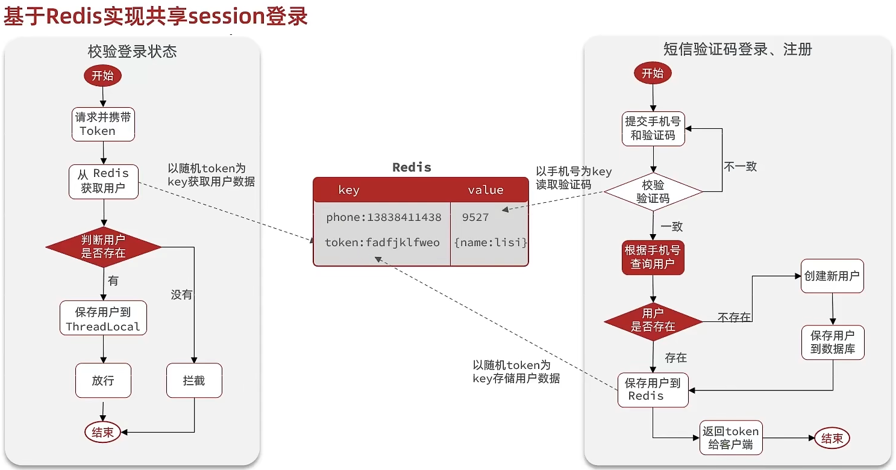

# Redis实战

1. 一台4核8G的tomcat, 1000左右的并发
2. 16或32 核心cpu，32 或64G内存，像企业级mysql加上固态硬盘能够支撑的并发，大概就是4000起~7000左右

## 基于Session实现登录流程

**发送验证码：**

用户在提交手机号后，会校验手机号是否合法，如果不合法，则要求用户重新输入手机号

如果手机号合法，后台此时生成对应的验证码，同时将验证码进行保存，然后再通过短信的方式将验证码发送给用户

**短信验证码登录、注册：**

用户将验证码和手机号进行输入，后台从session中拿到当前验证码，然后和用户输入的验证码进行校验，如果不一致，则无法通过校验，如果一致，则后台根据手机号查询用户，如果用户不存在，则为用户创建账号信息，保存到数据库，无论是否存在，都会将用户信息保存到session中，方便后续获得当前登录信息

**校验登录状态:**

用户在请求时候，会从cookie中携带者JsessionId到后台，后台通过JsessionId从session中拿到用户信息，如果没有session信息，则进行拦截，如果有session信息，则将用户信息保存到threadLocal中，并且放行

## session共享问题

每个tomcat中都有一份属于自己的session,假设用户第一次访问第一台tomcat，并且把自己的信息存放到第一台服务器的session中，但是第二次这个用户访问到了第二台tomcat，那么在第二台服务器上，肯定没有第一台服务器存放的session，所以此时 整个登录拦截功能就会出现问题. 

早期的方案是session拷贝，就是说虽然每个tomcat上都有不同的session，但是每当任意一台服务器的session修改时，都会同步给其他的Tomcat服务器的session，这样的话，就可以实现session的共享了. 但是这种方案具有两个大问题

1. 每台服务器中都有完整的一份session数据，服务器压力过大。
2. session拷贝数据时，可能会出现延迟

后来采用的方案都是基于redis来完成，我们把session换成redis，redis数据本身就是共享的，就可以避免session共享的问题了

## Redis代替session的业务流程

1. 如果使用String，同学们注意他的value，比较直观, 但会用多占用一点空间.
2. 如果使用哈希，可以将每个字段独立存储, 针对每个字段做CRUD, 并且内存占用少.

## 实现登录拦截功能

每个用户其实对应都是去找tomcat线程池中的一个线程来完成工作的， 使用完成后再进行回收，既然每个请求都是独立的，所以在每个用户去访问我们的工程时，我们可以使用threadlocal来做到线程隔离，每个线程操作自己的一份数据

这种方案可以使用对应路径的拦截，同时刷新登录token令牌的存活时间，但是现在这个拦截器他只是拦截需要被拦截的路径，假设当前用户访问了一些不需要拦截的路径，那么这个拦截器就不会生效，所以此时令牌刷新的动作实际上就不会执行，所以这个方案他是存在问题的

既然之前的拦截器无法对不需要拦截的路径生效，那么我们可以添加一个拦截器，在第一个拦截器中拦截所有的路径，把第二个拦截器做的事情放入到第一个拦截器中，同时刷新令牌，因为第一个拦截器有了threadLocal的数据，所以此时第二个拦截器只需要判断拦截器中的user对象是否存在即可，完成整体刷新功能。

