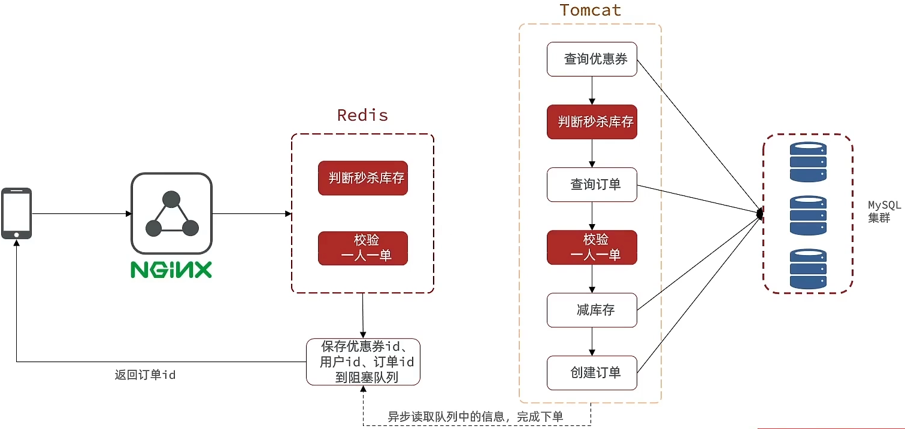
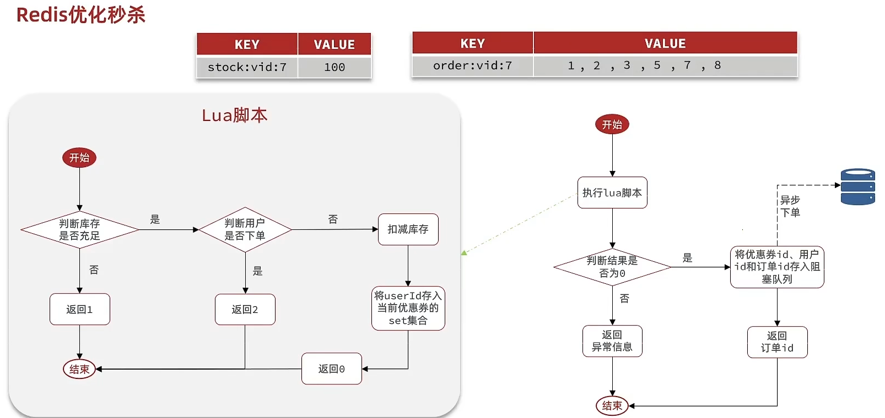

# redis消息队列

## 背景

我们来回顾一下下单流程

当用户发起请求，此时会请求nginx，nginx会访问到tomcat，而tomcat中的程序，会进行串行操作，分成如下几个步骤

1、查询优惠卷

2、判断秒杀库存是否足够

3、查询订单

4、校验是否是一人一单

5、扣减库存

6、创建订单

在这六步操作中，又有很多操作是要去操作数据库的，而且还是一个线程串行执行， 这样就会导致我们的程序执行的很慢，所以我们需要异步程序执行，那么如何加速呢？

优化方案：我们将耗时比较短的逻辑判断放入到redis中，比如是否库存足够，比如是否一人一单，这样的操作，只要这种逻辑可以完成，就意味着我们是一定可以下单完成的，我们只需要进行快速的逻辑判断，根本就不用等下单逻辑走完，我们直接给用户返回成功， 再在后台开一个线程，后台线程慢慢的去执行queue里边的消息，这样程序不就超级快了吗？而且也不用担心线程池消耗殆尽的问题，因为这里我们的程序中并没有手动使用任何线程池，当然这里边有两个难点

第一个难点是我们怎么在redis中去快速校验一人一单，还有库存判断

第二个难点是由于我们校验和tomct下单是两个线程，那么我们如何知道到底哪个单他最后是否成功，或者是下单完成，为了完成这件事我们在redis操作完之后，我们会将一些信息返回给前端，同时也会把这些信息丢到异步queue中去，后续操作中，可以通过这个id来查询我们tomcat中的下单逻辑是否完成了。

我们现在来看看整体思路：当用户下单之后，判断库存是否充足只需要导redis中去根据key找对应的value是否大于0即可，如果不充足，则直接结束，如果充足，继续在redis中判断用户是否可以下单，如果set集合中没有这条数据，说明他可以下单，如果set集合中没有这条记录，则将userId和优惠卷存入到redis中，并且返回0，整个过程需要保证是原子性的，我们可以使用lua来操作

当以上判断逻辑走完之后，我们可以判断当前redis中返回的结果是否是0 ，如果是0，则表示可以下单，则将之前说的信息存入到到queue中去，然后返回，然后再来个线程异步的下单，前端可以通过返回的订单id来判断是否下单成功。

最简单的消息队列模型包括3个角色：

- 消息队列：存储和管理消息，也被称为消息代理（Message Broker）
- 生产者：发送消息到消息队列
- 消费者：从消息队列获取消息并处理消息

使用队列的好处在于 **解耦：**所谓解耦，举一个生活中的例子就是：快递员(生产者)把快递放到快递柜里边(Message Queue)去，我们(消费者)从快递柜里边去拿东西，这就是一个异步，如果耦合，那么这个快递员相当于直接把快递交给你，这事固然好，但是万一你不在家，那么快递员就会一直等你，这就浪费了快递员的时间，所以这种思想在我们日常开发中，是非常有必要的。

这里我们可以使用一些现成的mq，比如kafka，rabbitmq等等，但是呢，如果没有安装mq，我们也可以直接使用redis提供的mq方案，降低我们的部署和学习成本。

## Redis消息队列-基于List实现消息队列

Redis的list数据结构是一个双向链表，很容易模拟出队列效果。

队列是入口和出口不在一边，因此我们可以利用：LPUSH 结合 RPOP、或者 RPUSH 结合 LPOP来实现。

不过要注意的是，当队列中没有消息时RPOP或LPOP操作会返回null，并不像JVM的阻塞队列那样会阻塞并等待消息。因此这里应该使用BRPOP或者BLPOP来实现阻塞效果。

## Redis消息队列-基于PubSub的消息队列

PubSub（发布订阅）是Redis2.0版本引入的消息传递模型。顾名思义，消费者可以订阅一个或多个channel，生产者向对应channel发送消息后，所有订阅者都能收到相关消息。

1. SUBSCRIBE channel [channel] ：订阅一个或多个频道
2. PUBLISH channel msg ：向一个频道发送消息
3. PSUBSCRIBE pattern[pattern] ：订阅与pattern格式匹配的所有频道

## Redis消息队列-基于Stream的消息队列

Stream 是 Redis 5.0 引入的一种新数据类型，可以实现一个功能非常完善的消息队列。

注意：当我们指定起始ID为$时，代表读取最新的消息，如果我们处理一条消息的过程中，又有超过1条以上的消息到达队列，则下次获取时也只能获取到最新的一条，会出现漏读消息的问题

STREAM类型消息队列的XREAD命令特点：

1. 消息可回溯
2. 一个消息可以被多个消费者读取
3. 可以阻塞读取
4. 有消息漏读的风险

## Redis消息队列-基于Stream的消息队列-消费者组

STREAM类型消息队列的XREADGROUP命令特点：

- 消息可回溯
- 可以多消费者争抢消息，加快消费速度
- 可以阻塞读取
- 没有消息漏读的风险
- 有消息确认机制，保证消息至少被消费一次

