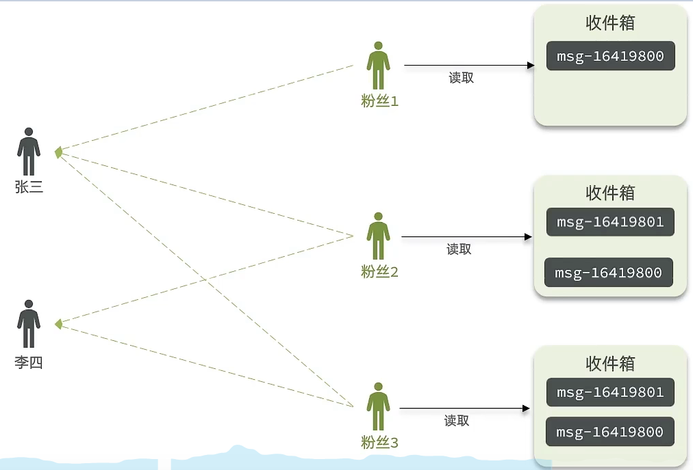

# redis用户点赞与关注

# redis点赞功能

- 需求：

    - 同一个用户只能点赞一次，再次点击则取消点赞
    - 如果当前用户已经点赞，则点赞按钮高亮显示（前端已实现，判断字段Blog类的isLike属性）

- 实现步骤：

    - 给Blog类中添加一个isLike字段，标示是否被当前用户点赞
    - 修改点赞功能，利用Redis的set集合判断是否点赞过，未点赞过则点赞数+1，已点赞过则点赞数-1
    - 修改根据id查询Blog的业务，判断当前登录用户是否点赞过，赋值给isLike字段
    - 修改分页查询Blog业务，判断当前登录用户是否点赞过，赋值给isLike字段

- 为什么采用set集合：

    因为我们的数据是不能重复的

# redis点赞排行榜

之前的点赞是放到set集合，但是set集合是不能排序的，所以这个时候，咱们可以采用一个可以排序的set集合，就是咱们的sortedSet

我们接下来来对比一下这些集合的区别是什么

所有点赞的人，需要是唯一的，所以我们应当使用set或者是sortedSet

其次我们需要排序，就可以直接锁定使用sortedSet啦

|          | List                      | Set             | SortedSet        |
| -------- | ------------------------- | --------------- | ---------------- |
| 排序方式 | 按添加顺序排序            | 无法排序        | 根据score值排序  |
| 唯一性   | 不唯一                    | 唯一            | 唯一             |
| 查找方式 | 按索引查找或首尾查找 | 根据元素查找    | 根据元素查找     |

## redis关注

需求：利用Redis中恰当的数据结构，实现共同关注功能。在博主个人页面展示出当前用户与博主的共同关注呢。

当然是使用我们之前学习过的set集合咯，在set集合中，有交集并集补集的api，我们可以把两人的关注的人分别放入到一个set集合中，然后再通过api去查看这两个set集合中的交集数据。

我们需要在用户关注了某位用户后，需要将数据放入到set集合中，方便后续进行共同关注，同时当取消关注时，也需要从set集合中进行删除

## Feed流实现方案

当我们关注了用户后，这个用户发了动态，那么我们应该把这些数据推送给用户，这个需求，其实我们又把他叫做Feed流，关注推送也叫做Feed流，直译为投喂。

1. 对于传统的模式的内容解锁：我们是需要用户去通过搜索引擎或者是其他的方式去解锁想要看的内容
2. 对于新型的Feed流的的效果：不需要我们用户再去推送信息，而是系统分析用户到底想要什么，然后直接把内容推送给用户，从而使用户能够更加的节约时间，不用主动去寻找。

Feed流产品有两种常见模式：
Timeline：不做内容筛选，简单的按照内容发布时间排序，常用于好友或关注。例如朋友圈

* 优点：信息全面，不会有缺失。并且实现也相对简单
* 缺点：信息噪音较多，用户不一定感兴趣，内容获取效率低

智能排序：利用智能算法屏蔽掉违规的、用户不感兴趣的内容。推送用户感兴趣信息来吸引用户

* 优点：投喂用户感兴趣信息，用户粘度很高，容易沉迷
* 缺点：如果算法不精准，可能起到反作用
  本例中的个人页面，是基于关注的好友来做Feed流，因此采用Timeline的模式。该模式的实现方案有三种：

我们本次针对好友的操作，采用的就是Timeline的方式，只需要拿到我们关注用户的信息，然后按照时间排序即可

，因此采用Timeline的模式。该模式的实现方案有三种：

* 拉模式
* 推模式
* 推拉结合

**拉模式**：也叫做读扩散

该模式的核心含义就是：当张三和李四和王五发了消息后，都会保存在自己的邮箱中，假设赵六要读取信息，那么他会从读取他自己的收件箱，此时系统会从他关注的人群中，把他关注人的信息全部都进行拉取，然后在进行排序

优点：比较节约空间，因为赵六在读信息时，并没有重复读取，而且读取完之后可以把他的收件箱进行清楚。

缺点：比较延迟，当用户读取数据时才去关注的人里边去读取数据，假设用户关注了大量的用户，那么此时就会拉取海量的内容，对服务器压力巨大。

**推模式**：也叫做写扩散。

推模式是没有写邮箱的，当张三写了一个内容，此时会主动的把张三写的内容发送到他的粉丝收件箱中去，假设此时李四再来读取，就不用再去临时拉取了

优点：时效快，不用临时拉取

缺点：内存压力大，假设一个大V写信息，很多人关注他， 就会写很多分数据到粉丝那边去

**推拉结合模式**：也叫做读写混合，兼具推和拉两种模式的优点。

推拉模式是一个折中的方案，站在发件人这一段，如果是个普通的人，那么我们采用写扩散的方式，直接把数据写入到他的粉丝中去，因为普通的人他的粉丝关注量比较小，所以这样做没有压力，如果是大V，那么他是直接将数据先写入到一份到发件箱里边去，然后再直接写一份到活跃粉丝收件箱里边去，现在站在收件人这端来看，如果是活跃粉丝，那么大V和普通的人发的都会直接写入到自己收件箱里边来，而如果是普通的粉丝，由于他们上线不是很频繁，所以等他们上线时，再从发件箱里边去拉信息。

传统了分页在feed流是不适用的，因为我们的数据会随时发生变化

假设在t1 时刻，我们去读取第一页，此时page = 1 ，size = 5 ，那么我们拿到的就是10~6 这几条记录，假设现在t2时候又发布了一条记录，此时t3 时刻，我们来读取第二页，读取第二页传入的参数是page=2 ，size=5 ，那么此时读取到的第二页实际上是从6 开始，然后是6~2 ，那么我们就读取到了重复的数据，所以feed流的分页，不能采用原始方案来做。

需求：在个人主页的“关注”卡片中，查询并展示推送的Blog信息：

具体操作如下：

1、每次查询完成后，我们要分析出查询出数据的最小时间戳，这个值会作为下一次查询的条件

2、我们需要找到与上一次查询相同的查询个数作为偏移量，下次查询时，跳过这些查询过的数据，拿到我们需要的数据

综上：我们的请求参数中就需要携带 lastId：上一次查询的最小时间戳 和偏移量这两个参数。

这两个参数第一次会由前端来指定，以后的查询就根据后台结果作为条件，再次传递到后台。

