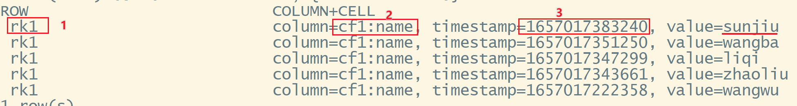
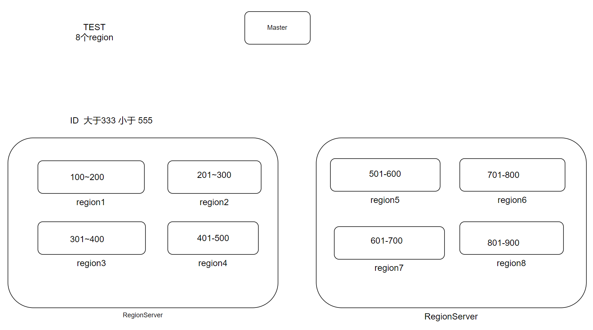

# hbase原理

## 多版本

在HBase中，一个二级列的具体数据，是可以有多个版本的。通过数据的`时间戳`确定版本的新和老. 如果是5个版本的话，当第6个版本写入的时候，最老的那一个将被删除. 

## KV型数据库-单元格

HBase是：`分布式的`、`列式存储的`、`KV型的`、NoSQL数据库

Python中的 字典，就是典型的KV型数据结构，通过一个Key来对应一个Value
HBase的Key是一个组合体：`Rowkey + 列族 + 二级列 + 时间戳` 4者组合

HBase的Value，就是二级列的具体值

如图，通过编号1（Rowky）和编号2（列族:二级列）和编号3（时间戳）的组合，才能对应一个具体的value值：sunjiu

✨注意：时间戳是很重要的，它是Key的组成的一部分。
如果列族没有多版本，只支持1个版本，时间戳有没有无影响
如果列族有多个版本，Key的组合体中没有时间戳的话，依旧无法做成1个key对应一个具体的value

HBase是用于KV型查询的。

给定Key（可以只是Rowkey），就能瞬间查到对应的value（包括列族、二级列时间戳一堆）

不适合用于复杂查询：

- 聚合（不合适）
- 分组（不合适）
- json（不合适）

HBase一般是假设它是大规模数据存储，HBase是用于

- 大规模数据存储的随机查询（查询是找到就ok）
- 不用于大规模的随机分析（即席查询），请用ClickHouse（用于大规模数据随机分析，进行数据统计计算）

## Region和Rowkey
在HBase中，一个表的数据，是分散在多个`region`中

每一个region都满足：

- 内部有序
- 有数据的起始和结束范围
- region之间的范围不会重叠

基于这种特性（有开始和结束范围，以及范围不会重叠），我们查询数据，就可以快速定位到一个具体的region，由同时因为region内部是有序的，在有序数据中查询出1条数据，是非常快的

所以综合起来，HBase在查询单条数据上是非常快

如果要查询：ID大于333，小于555的全部数据，那么：

基于Region有范围，可以锁定Region3、Region4、Region5

基于Region内部`有序`（不需要做判读，按顺序读即可）：

- Region3快速找到333，从333开始，读到Region结束
- Region4全部读出来
- Region5,从开头读到555

所以，范围查询对HBase来说，只要Rowkey设计合理，也是非常快的（只需要定义第一条，剩下的挨个取出）

==HBase有且仅有1个索引：Rowkey==

因为，在HBase中

- Region的范围是基于Rowkey的
- Region内部有序是基于Rowkey做排序的

