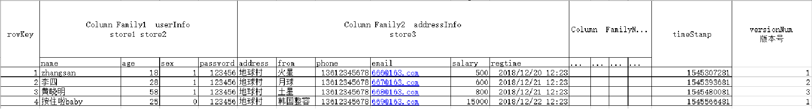

# hbase基础概念

最早的Hadoop的设计中：

- HDFS存储
- MapReduce计算
- HBase(Hadoop DataBase) 随机查询

之后的HBase从Hadoop中脱离出来，独立成为了一个顶级项目。

HBase作为Hadoop的模块之一，它的运行是基于HDFS的

# HBase的表数据模型

HBase：HBase是一款`分布式的`、`列式存储的`、`KV型的`NoSQL数据库

## 列式存储

列式存储：以列为单元，将数据存储在文件内。 也就是，一列数据是一个文件。可以有多个文件，每个文件表示1个列

行式存储：以行为单元，将数据存储在文件内。 也就是，一个文件内存储多行数据，只有1个文件，1个文件内存了全部行。

## 行存储 VS 列存储

### 列存储的优点

- 针对列的操作，效率极高
  - select 列,列...... FROM 表
  - 删除列
  - 增加列
- 可以针对列设置合适的压缩算法
- 可以针对列进行单独的索引

### 列存储的缺点

- 整行操作效率低下
  - SELECT * FROM 表
- 完成事务是很难的（不是不可以，这是成本较高）

### 行存储的优缺点

正好和列相反：

优点

- 整行操作效率高
- 完成事务更轻松

缺点：

- 单列操作性能低下
- 无法针对列设置压缩
- 无法针对列设置独立索引

## Hbase表结构设计

如图，HBase中表有如下内容：

- 列族：表示的是HBase中真正的一个列（会带有列存储的具体文件）
    - 列族userinfo，是一个独立的文件
- 二级列：表示是列族内的下级列（在列族文件内，以行存储存在）
    - 列族addressinfo，也是一个独立的文件
        - name、age、sex、password，都是userinfo这个列族（独立的文件）内部的行存储
        - address、from、phone、email、salary、regtime都是addressinfo这个列族内部的行存储

如果要将数据存储到HBase中。

- 列userinfo有自己的数据文件，在内部存储了 name\age\sex\passwd 4个二级列
- 列addressinfo有自己的数据文件，在内部存储了address\from\phone\email\salary\time 6个二级列

#### HBase的主键

在HBase中，一条数据的主键称之为Rowkey，Rowkey满足: 不可以重复

