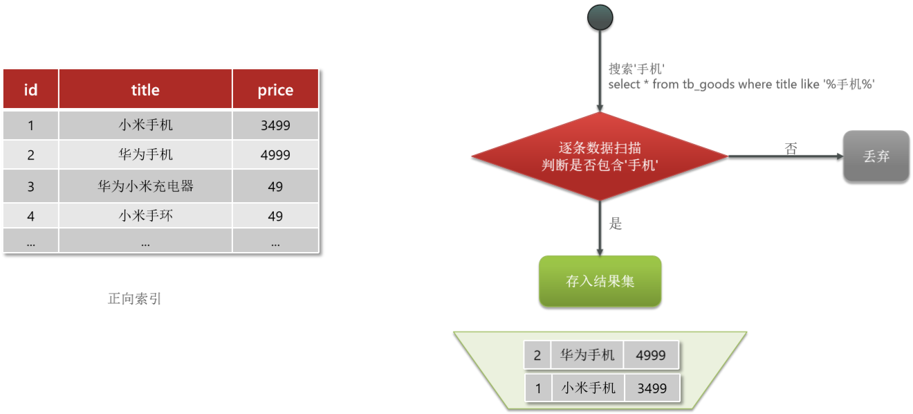
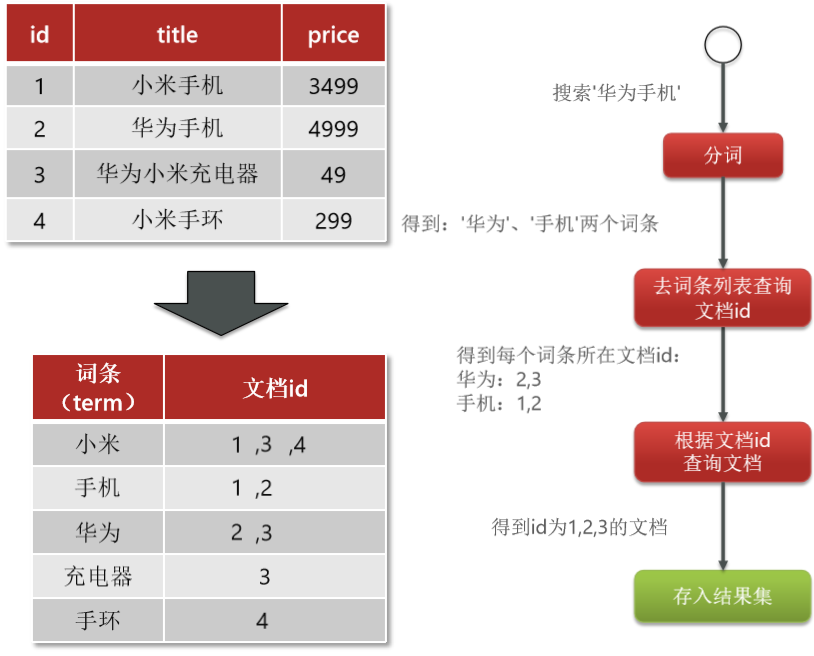
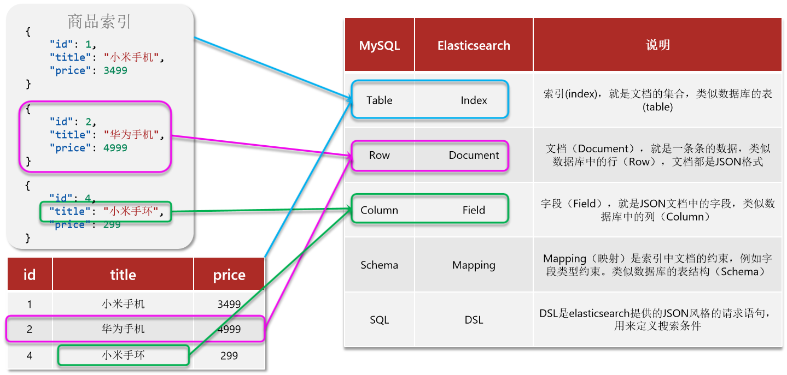
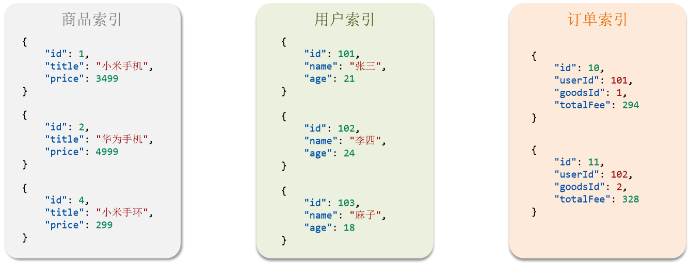

# elasticsearch

Elasticsearch：开源的分布式搜索引擎

elasticsearch具备下列优势：

- 支持分布式，可水平扩展
- 提供Restful接口，可被任何语言调用

elasticsearch结合kibana(数据可视化)、Logstash(存储, 计算, 搜索)、Beats和logstash(数据抓取)，是一整套技术栈，被叫做ELK。被广泛应用在日志数据分析、实时监控等领域。

## 倒排索引

传统数据库（如MySQL）采用正向索引，例如给下表（tb_goods）中的id创建索引：

elasticsearch采用倒排索引：

- 文档（document）：每条数据就是一个文档
- 词条（term）：文档按照语义分成的词语

## 总结

1. 什么是文档和词条？
    - 每一条数据就是一个文档
    - 对文档中的内容分词，得到的词语就是词条
2. 什么是正向索引？
    - 基于文档id创建索引。根据id查询快，但是查询词条时必须先找到文档，而后判断是否包含词条
3. 什么是倒排索引？
    - 对文档内容分词，对词条创建索引，并记录词条所在文档的id。查询时先根据词条查询到文档id，而后根据文档id查询文档

## 基础概念

索引（index）：相同类型的文档的集合

映射（mapping）：索引中文档的字段约束信息，类似表的结构约束

Elasticsearch提供的所有API都是Restful的接口

