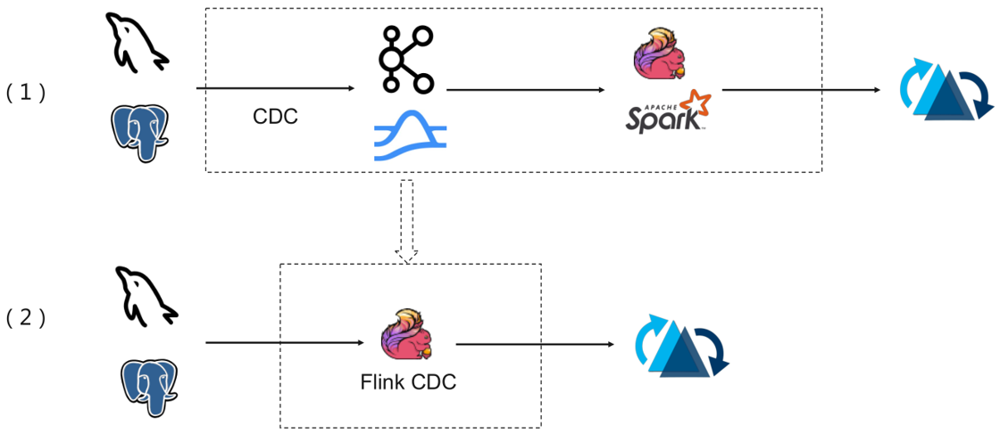

## hudi_spark

1. hive操作hudi数据: 在hive中创建表映射到hudi表中

## CDC

CDC 全称是Change data Capture，即变更数据捕获，主要面向数据库的变更

对于CDC，业界主要有两种类型：
- 一是基于查询的，客户端会通过SQL方式查询源库表变更数据，然后对外发送。
- 二是基于日志的，这也是业界广泛使用的一种方式，一般是通过binlog方式，变更的记录会写入binlog，解析binlog后会写入消息系统，或直接基于Flink CDC进行处理。

典型CDC入湖的链路：
（1）链路是大部分公司采取的链路，前面CDC的数据先通过CDC工具导入Kafka或者Pulsar，再通过Flink或者是Spark流式消费写到Hudi里。
（2）链路是通过Flink CDC直联到MySQL上游数据源，直接写到下游Hudi表。

