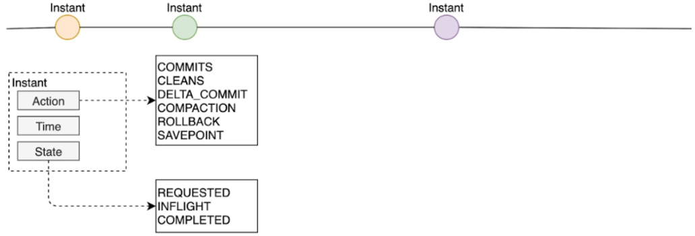
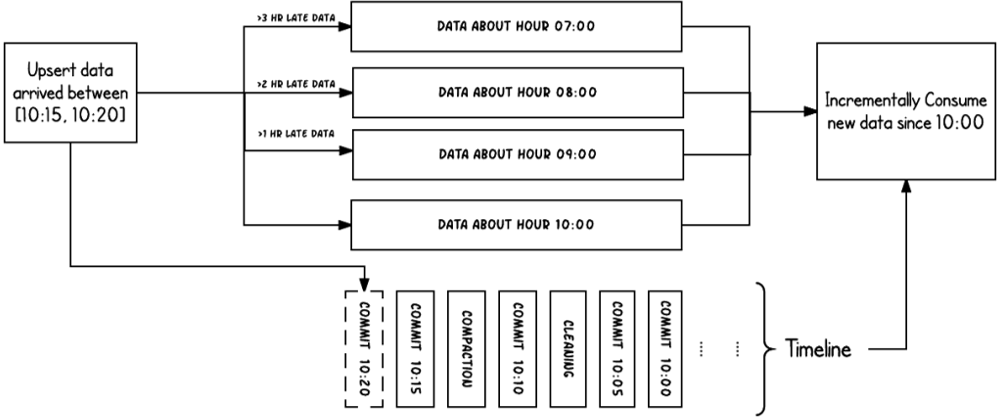
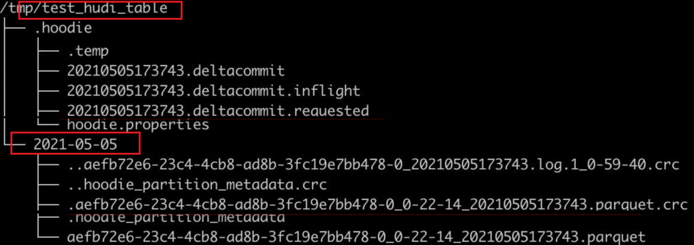
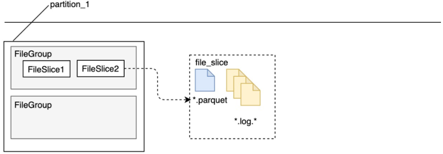
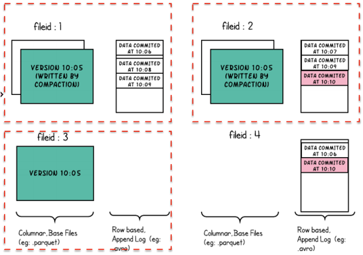
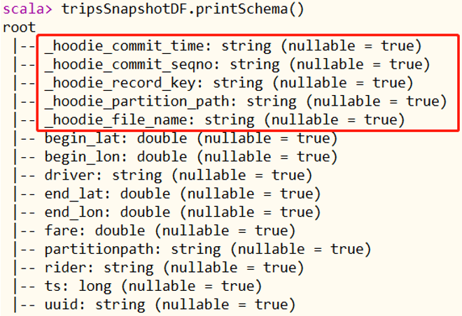

# hudi核心概念

Hudi 提供了Hudi 表的概念，这些表支持CRUD操作，可以利用现有的大数据集群比如HDFS做数据文件存储，然后使用SparkSQL或Hive等分析引擎进行数据分析查询。
Hudi表的三个主要组件：
- 有序的时间轴元数据，类似于数据库事务日志。
- 分层布局的数据文件：实际写入表中的数据；
- 索引（多种实现方式）：映射包含指定记录的数据集。

### 时间轴Timeline

Hudi 核心：在所有的表中维护了一个包含在不同的即时（Instant）时间对数据集操作（比如新增、修改或删除）的时间轴（Timeline）。

在每一次对Hudi表的数据集操作时都会在该表的Timeline上生成一个Instant，从而可以实现在仅查询某个时间点之后成功提交的数据，或是仅查询某个时间点之前的数据，有效避免了扫描更大时间范围的数据。

同时，可以高效地只查询更改前的文件（如在某个Instant提交了更改操作后，仅query某个时间点之前的数据，则仍可以query修改前的数据）。

Timeline 是 Hudi 用来管理提交（commit）的抽象，每个 commit 都绑定一个固定时间戳，分散到时间线上。

在 Timeline 上，每个 commit 被抽象为一个 HoodieInstant，一个 instant 记录了一次提交 (commit) 的行为、时间戳、和状态

上图中采用时间（小时）作为分区字段，从 10:00 开始陆续产生各种 commits，10:20 来了一条 9:00 的数据，该数据仍然可以落到 9:00 对应的分区，通过 timeline 直接消费 10:00 之后的增量更新（只消费有新 commits 的 group），那么这条延迟的数据仍然可以被消费到。

### 文件管理

1. Hudi将DFS上的数据集组织到基本路径（HoodieWriteConfig.BASEPATHPROP）下的目录结构中。
2. 数据集分为多个分区（DataSourceOptions.PARTITIONPATHFIELDOPT_KEY），这些分区与Hive表非常相似，是包含该分区的数据文件的文件夹。

在每个分区内，文件被组织为文件组，由文件id充当唯一标识。每个文件组包含多个文件切片，其中每个切片包含在某个即时时间的提交/压缩生成的基本列文件（.parquet）以及一组日志文件（.log），该文件包含自生成基本文件以来对基本文件的插入/更新。

Hudi 的 base file (parquet 文件) 在 footer 的 meta 去记录了 record key 组成的 BloomFilter，用于在 file based index 的实现中实现高效率的 key contains 检测。

Hudi 的 log （avro 文件）是自己编码的，通过积攒数据 buffer 以 LogBlock 为单位写出，每个 LogBlock 包含 magic number、size、content、footer 等信息，用于数据读、校验和过滤。

### 索引Index

Hudi通过索引机制提供高效的Upsert操作，该机制会将一个RecordKey+PartitionPath组合的方式作为唯一标识映射到一个文件ID，而且这个唯一标识和文件组/文件ID之间的映射自记录被写入文件组开始就不会再改变。
- 全局索引：在全表的所有分区范围下强制要求键保持唯一，即确保对给定的键有且只有一个对应的记录。
- 非全局索引：仅在表的某一个分区内强制要求键保持唯一，它依靠写入器为同一个记录的更删提供一致的分区路径。

