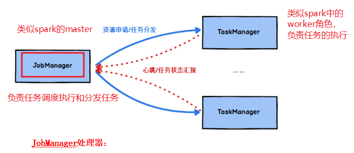
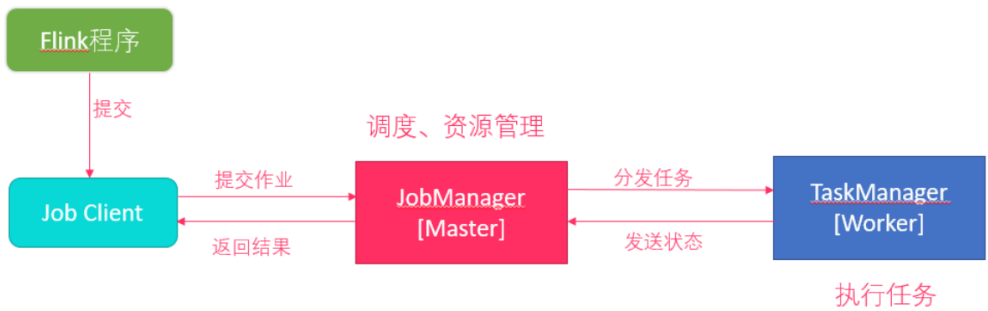
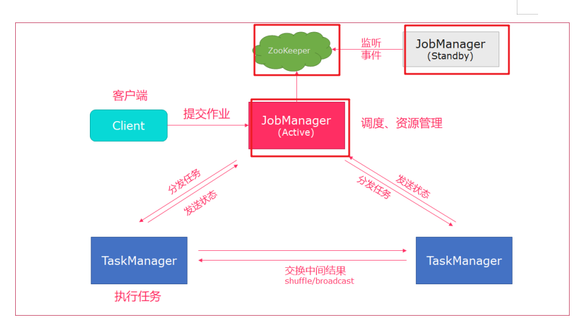
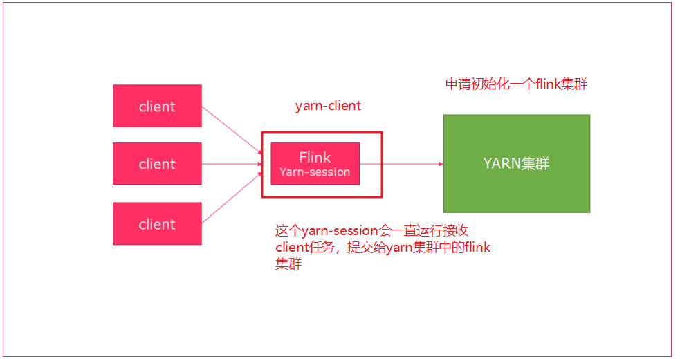
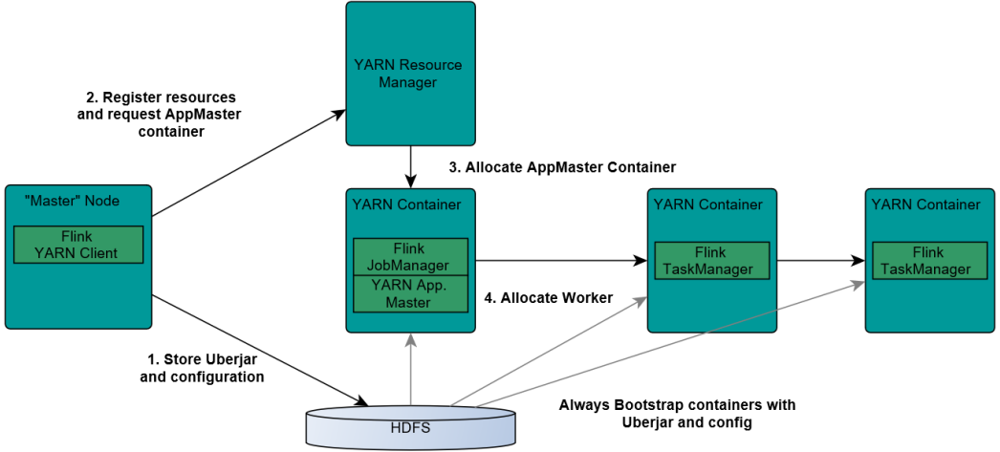
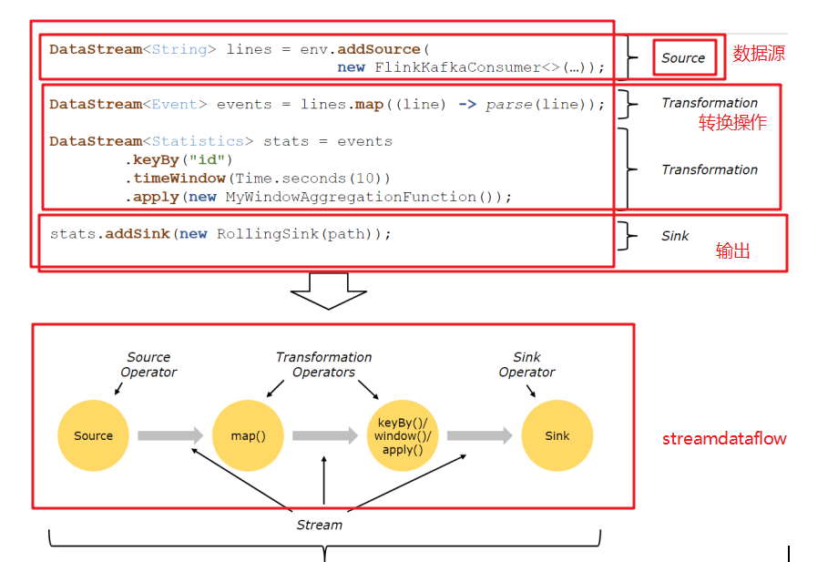
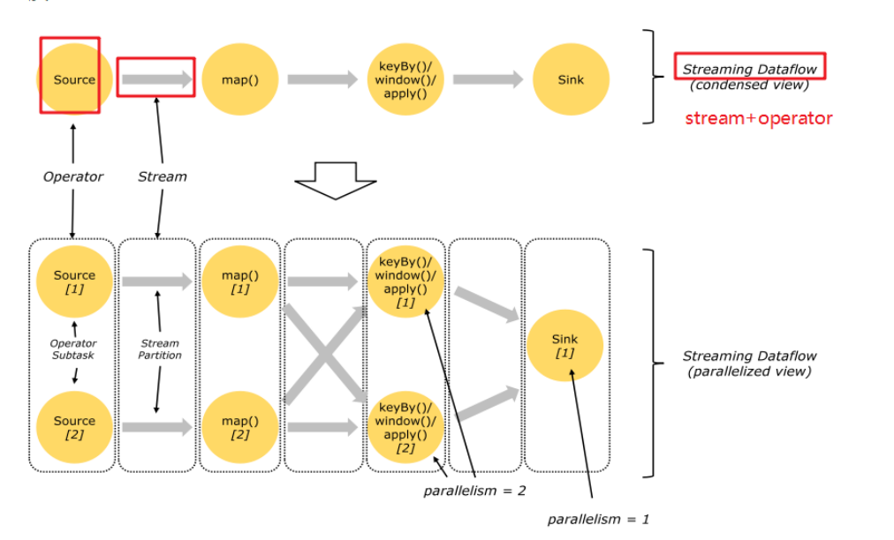
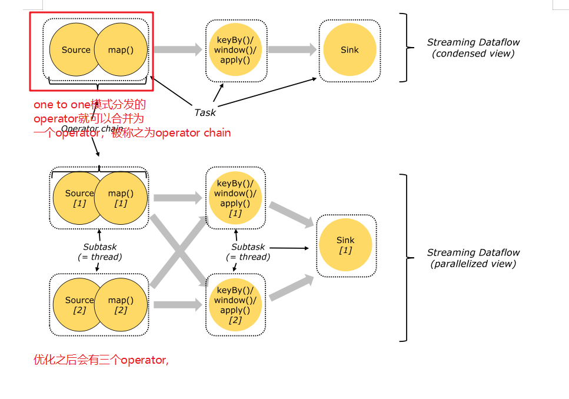
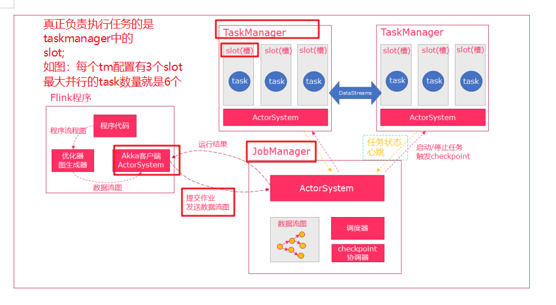
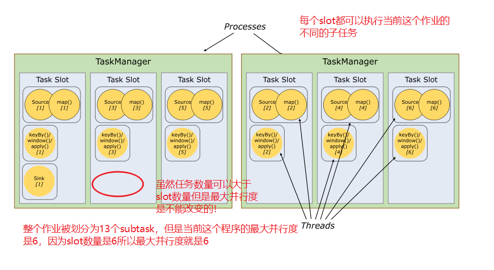

# flink基本概念

## 什么是flink

flink是一个分布式，高性能，随时可用的以及准确的流处理计算框架，

flink可以对**无界数据**（流处理）和**有界数据**（批处理）进行有**状态计算**（flink天生支持状态计算）的分布式，高性能的计算框架。

## flink的基石

flink的四大基石：**checkpoint,state,time,window**

- checkpoint:基于chandy-lamport算法实现分布式计算任务的一致性语义；
- state:flink中的状态机制，flink天生支持state,state可以认为程序的中间计算结果或者是历史计算结果；
- time:flink中支持基于事件时间和处理时间进行计算，spark streaming只能按照process time进行处理；基于事件时间的计算我们可以解决数据迟到和乱序等问题。
- window:flink提供了更多丰富的window,基于时间，基于数量，session window,同样支持滚动和滑动窗口的计算。

## flink流处理和批处理

- 流处理：无界，实时性有要求，只需对经过程序的每条数据进行处理
- 批处理：有界，持久，需要对全部数据进行访问处理；

spark vs flink
- spark：spark生态中是把所有的计算都当做批处理，spark streaming中流处理本质上也是批处理（micro batch）;
- flink：flink中是把批处理（有界数据集的处理）看成是一个特殊的流处理场景；flink中所有计算都是流式计算；

## flink架构体系

### flink中重要角色

JobManager:类似spark中master，负责资源申请，任务分发，任务调度执行，checkpoint的协调执行；可以搭建HA，双master。
TaskManager:类似spark中的worker，负责任务的执行，基于dataflow(spark中DAG)划分出的task;与jobmanager保持心跳，汇报任务状态。

### 无界数据和有界数据

- 无界数据流：数据流是有一个开始但是没有结束；
- 有界数据流：数据流是有一个明确的开始和结束，数据流是有边界的。

flink处理流批处理的思想是：

flink支持的runtime(core 分布式流计算)支持的是无界数据流，但是对flink来说可以支持批处理，只是从数据流上来说把有界数据流只是无界数据流的一个特例，无界数据流只要添加上边界就是有界数据流。

## flink集群搭建

### local模式

1.Flink程序由JobClient进行提交
2.JobClient将作业提交给JobManager
3.JobManager负责协调资源分配和作业执行。资源分配完成后，任务将提交给相应的TaskManager
4.TaskManager启动一个线程以开始执行。TaskManager会向JobManager报告状态更改,如开始执行，正在进行或已完成。 
5.作业执行完成后，结果将发送回客户端(JobClient)

### standalone HA集群搭建

1. client客户端提交任务给JobManager
2. JobManager负责申请任务运行所需要的资源并管理任务和资源，
3. JobManager分发任务给TaskManager执行
4. TaskManager定期向JobManager汇报状态

对于一个企业级的应用，稳定性是首要要考虑的问题，然后才是性能，因此 HA 机制是必不可少的；

从架构中我们可以很明显的发现 JobManager 有明显的单点问题(SPOF，single point of failure)。

JobManager 肩负着任务调度以及资源分配，一旦 JobManager 出现意外，其后果可想而知。

Flink 对 JobManager HA 的处理方式，原理上基本和 Hadoop/Spark 一样；对于 Standalone 来说，Flink 必须依赖于 Zookeeper 来实现 JobManager 的 HA(Zookeeper 已经成为了大部分开源框架 HA 必不可少的模块)。同时Flink将HA的信息存储在HDFS中，故也需要HDFS集群。

在 Zookeeper 的帮助下，一个 Standalone 的 Flink 集群会同时有多个活着的 JobManager，其中只有一个处于工作状态，其他处于 Standby 状态。当工作中的 JobManager 失去连接后(如宕机或 Crash)，Zookeeper 会从 Standby 中选一个新的 JobManager 来接管 Flink 集群。

### flink on yarn: 

session 会话模式

yarn-session.sh(开辟资源) + flink run(提交任务)
- 使用Flink中的yarn-session(yarn客户端)，会启动两个必要服务JobManager和TaskManager
- 客户端通过flink run提交作业
- yarn-session会一直启动，不停地接收客户端提交的作业
- 如果有大量的小作业/任务比较小，或者工作时间短，适合使用这种方式，减少资源创建的时间.

Job分离模式

- 直接提交任务给YARN
- 大作业，适合使用这种方式
- job分离方式一般适用于长时间工作的任务,实际生产环境中job分离方式使用较多.

1.Client上传jar包和配置文件到HDFS集群上
2.Client向Yarn ResourceManager提交任务并申请资源
3.ResourceManager分配Container资源并启动ApplicationMaster,然后AppMaster加载Flink的Jar包和配置构建环境,启动JobManager
4.ApplicationMaster向ResourceManager申请工作资源,NodeManager加载Flink的Jar包和配置构建环境并启动TaskManager
5.TaskManager启动后向JobManager发送心跳包，并等待JobManager向其分配任务
Seesion模式中是在Hadoop YARN环境下启动一个Flink cluster集群，里面的资源是可以共享给其他的Flink作业。

## flink 运行架构

### flink的编程模型

Flink 应用程序结构就是如上图所示：

Source: 数据源，Flink 在流处理和批处理上的 source 大概有 4 类：基于本地集合的 source、基于文件的 source、基于网络套接字的 source、自定义的 source。自定义的 source 常见的有 Apache kafka、RabbitMQ 等，当然你也可以定义自己的 source。

Transformation：数据转换的各种操作，有 Map / FlatMap / Filter / KeyBy / Reduce / Fold / Aggregations / Window / WindowAll / Union / Window join / Split / Select等，操作很多，可以将数据转换计算成你想要的数据。

Sink：接收器，Flink 将转换计算后的数据发送的地点 ，你可能需要存储下来，Flink 常见的 Sink 大概有如下几类：写入文件、打印出来、写入 socket 、自定义的 sink 。自定义的 sink 常见的有 Apache kafka、RabbitMQ、MySQL、ElasticSearch、Apache Cassandra、Hadoop FileSystem 等，同理你也可以定义自己的 sink。

### flink中的并行流

Flink程序在执行的时候，会被映射成一个Streaming Dataflow，一个Streaming Dataflow是由一组Stream和Transformation Operator组成的。在启动时从一个或多个Source Operator开始，结束于一个或多个Sink Operator。

Flink程序本质上是并行的和分布式的，在执行过程中，一个流(stream)包含一个或多个流分区，而每一个operator包含一个或多个operator子任务。操作子任务间彼此独立，在不同的线程中执行，甚至是在不同的机器或不同的容器上。operator子任务的数量是这一特定operator的并行度。相同程序中的不同operator有不同级别的并行度。

一个Stream可以被分成多个Stream的分区，也就是Stream Partition。一个Operator也可以被分为多个Operator Subtask。如上图中，Source被分成Source1和Source2，它们分别为Source的Operator Subtask。每一个Operator Subtask都是在不同的线程当中独立执行的。一个Operator的并行度，就等于Operator Subtask的个数。上图Source的并行度为2。而一个Stream的并行度就等于它生成的Operator的并行度。

数据在两个operator之间传递的时候有两种模式：

One to One模式：两个operator用此模式传递的时候，会保持数据的分区数和数据的排序；如上图中的Source1到Map1，它就保留的Source的分区特性，以及分区元素处理的有序性。

Redistributing （重新分配）模式：这种模式会改变数据的分区数；每个一个operator subtask会根据选择transformation把数据发送到不同的目标subtasks,比如keyBy()会通过hashcode重新分区,broadcast()和rebalance()方法会随机重新分区； 

#### flink中的task和operator chain

Flink的所有操作都称之为Operator，客户端在提交任务的时候会对Operator进行优化操作，能进行合并的Operator会被合并为一个Operator，合并后的Operator称为Operator chain，实际上就是一个执行链，每个执行链会在TaskManager上一个独立的线程中执行。

flink中把onetoone的operator可以合并为一个operator chain,operator chain他的某个并行度就是一个subtask，

flink中真正调度的任务就是operator chain的subtask.

#### flink 调度和执行

1.当Flink执行executor会自动根据程序代码生成DAG数据流图
2.ActorSystem创建Actor将数据流图发送给JobManager中的Actor
3.JobManager会不断接收TaskManager的心跳消息，从而可以获取到有效的TaskManager
4.JobManager通过调度器在TaskManager中调度执行Task（在Flink中，最小的调度单元就是task，对应就是一个线程）
5.在程序运行过程中，task与task之间是可以进行数据传输的

•Job Client
–主要职责是提交任务, 提交后可以结束进程, 也可以等待结果返回
–Job Client 不是 Flink 程序执行的内部部分，但它是任务执行的起点。 
–Job Client 负责接受用户的程序代码，然后创建数据流，将数据流提交给 Job Manager 以便进一步执行。 执行完成后，Job Client 将结果返回给用户

•JobManager 
–主要职责是调度工作并协调任务做检查点
–集群中至少要有一个 master，master 负责调度 task，协调checkpoints 和容错，
–高可用设置的话可以有多个 master，但要保证一个是 leader, 其他是standby; 
–Job Manager 包含 Actor System、Scheduler、CheckPoint三个重要的组件
–JobManager从客户端接收到任务以后, 首先生成优化过的执行计划, 再调度到TaskManager中执行

•TaskManager
–主要职责是从JobManager处接收任务, 并部署和启动任务, 接收上游的数据并处理
–Task Manager 是在 JVM 中的一个或多个线程中执行任务的工作节点。
–TaskManager在创建之初就设置好了Slot, 每个Slot可以执行一个任务

#### slot(槽)和slot sharing（槽共享）

slot:是flink中从资源层面进行调度的单位，

特点：slot是会平均划分当前tm中内存，flink程序的最大并行度就是所有tm中的slot的数量，（我们flink控制可以接收的任务数量就是通过slot数量来实现）

slot数量如何确定：保持和tm中的cpu核数一样，保证任务执行的性能。

slot实际是任务执行的真正角色。

slot sharing:槽共享，每个slot都可以接收当前作业的不同的子任务，这样充分利用了当前所有slot来提高并行度。

